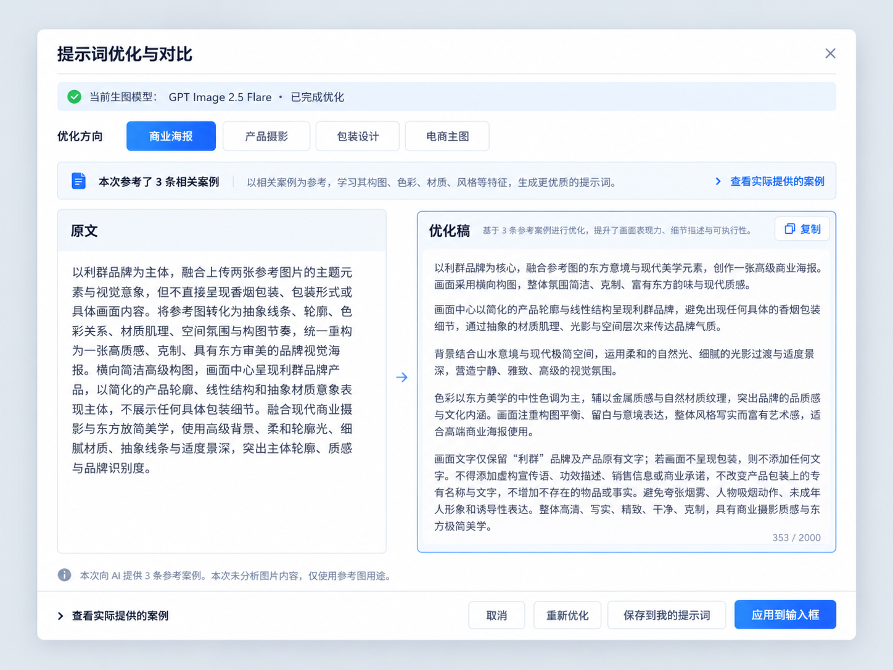

# UI Handoff｜优化对比与本次案例图文

**修订：R1｜业务权威：01-完整优化规格.md｜仅以本包两张已确认图为视觉依据**

## 1. 设计基线




两张原图均为 1448×1086 像素，本包不改变原图。图像是布局、视觉层级与组件位置的参考，不是把整图按比例缩成可点击背景，也不是固定窗口尺寸。

保留浅灰蓝遮罩、白色圆角弹窗、细边框、克制蓝色强调和大面积阅读区。正式实现优先复用项目已有颜色/字体 token、全局 CSS 与 Radix 组件，不引入 Tailwind 或新 UI 框架，不重画应用外壳。

## 2. 尺寸与阅读优先级

| 项目 | 参考值/规则 |
| --- | --- |
| 宽屏弹窗宽度 | `min(1320px, 100vw - 64px)` |
| 宽屏弹窗高度 | `min(920px, 100dvh - 64px)`；不使用固定 aspect-ratio |
| 圆角 | 14–18px，优先现有 token |
| 弹窗内边距 | 横向 24–28px；短高窗口 16–20px |
| 页面主标题 | 22–24px，600/700 字重 |
| 区域标题 | 17–18px |
| 正文 | 15–16px；行高 1.6–1.75；不得靠 10px 小字塞满 |
| 辅助说明 | 12–13px，保证对比度 |
| 按钮 | 高 36–40px；可点击区域至少 32px |
| 栏间距 | 16–20px；H01 箭头放间隔中，不占一整列宽 |
| 页脚 | 60–72px 固定占位；内容滚动时保持可见 |
| H01 比较区域 | 左 44% / 右 56%，同外高；实际编辑器占满右栏剩余空间 |
| H02 图文区域 | 左 52% / 右 48%；图片 contain，正文一层滚动 |

**响应式验收矩阵：**1440×900、1280×800、1024×768；Windows 100%、125%、150% 缩放。记录实际 CSS viewport，而非用截图像素冒充逻辑尺寸。

可用宽度不足 900px 时压缩边距、方向按钮换行，保持两栏可读；不足 760px 时两栏上下排列，内容区内部滚动，页脚按钮换行但始终可达。若项目最小窗口已大于此值，不擅自修改窗口限制，仍处理高 DPI 导致的短可视区。

正常高度下优先把剩余空间分给正文；短窗口压缩非关键间距，不压缩成小 textarea；极短高度允许对比主体容器单层滚动，不让整个桌面窗口出现外层和内层两条无意义长滚动条。

## 3. H01 组件交接

| 标记 | 组件 | 位置与要求 |
| --- | --- | --- |
| A01 | 标题与关闭 | 顶部一行；关闭不自动应用；运行中须取消当前请求 |
| A02 | 当前模型与状态 | 标题下浅蓝条；显示请求快照，不从变化后的全局配置伪装更新 |
| A03 | 优化方向按钮组 | 状态下方；单选，选中蓝底；原有模式保留，新增图中的包装设计/电商主图 |
| A04 | 案例信息栏 | 文件图标＋真实 N 条说明＋右侧案例入口；不是 checkbox |
| A05 | 原文卡 | 左侧只读，段落保留，独立滚动 |
| A06 | 优化稿卡 | 右侧更宽，header 与复制固定；正文填满；底部实数字数 |
| A07 | 图像使用说明 | 比较区下轻量一行，可换行，不额外放大卡片 |
| A08 | 页脚左入口 | 按图保留第二个案例入口，与 A04 行为相同 |
| A09 | 页脚动作 | 取消、运行中停止、首次开始优化/已有结果重新优化、保存到我的提示词、应用到输入框 |

### A03：方向按钮的完整口径

常用项首先显示：商业海报、产品摄影、包装设计、电商主图。既有其他模式继续以按钮接续：优化、扩写、简化、英文、双语、写实、插画；不通过图片示意隐藏旧功能。允许两行，不再用下拉。首次进入不预选方向，用户选定后点击「开始优化」才发起请求。

采用 `radiogroup`/`radio` 语义或等价可访问单选组件，提供 `aria-checked`；方向键移动焦点并改变选择，不产生 AI 请求。生成中只读/禁用，防止结果和新选项混淆。

### A04：复选框消除

删除巨大的裸 checkbox，使用现有线性资料图标。成功图标仅用于状态，不与「参考案例是否开启」混用。来源启停仍沿用现有设置；未启用时说明「参考案例已关闭」，不能移除 UI 后反而强制开启。

### A06：滚动修复的关键

外卡片、正文区域和 textarea 的 flex/grid 高度必须形成完整传递链。卡片固定 header 后，编辑器用 `flex:1; min-height:0` 获取剩余空间；正文的 overflow 只能在其自身出现。禁用鼠标拖动 resize 打破卡片等高，允许自动换行和文本选择。

流式有文字返回才显示文字，不做假打字动画。用户不在底部时不强制自动滚动；结束后可编辑。输入、模型或图片已变化时显示可理解提示，停止旧稿直接覆盖。

### A09：可用状态

| 状态 | 可用动作 |
| --- | --- |
| 查找/排队/生成中 | 停止、取消；复制已返回文字可保留但不得称完整；不允许应用和保存为正式稿 |
| 完整已完成/有效历史缓存 | 复制、重做、编辑、保存、应用 |
| 需核对 | 编辑、复制；通过本地必留项与长度校验后可应用；此状态不等同流式中断 |
| 失败/中断/停止 | 查看部分文本、重新优化、取消；无完成稿时禁止应用 |
| 输入冲突/旧模型 | 允许阅读、复制和保存完整稿；禁止静默覆盖新输入 |

## 4. H02 组件交接

| 标记 | 组件 | 位置与要求 |
| --- | --- | --- |
| B01 | 标题与关闭 | 「查看实际提供的案例」；关闭仅返回 H01 |
| B02 | 数量信息与返回 | 浅蓝横条；左真实数量，右「返回优化对比」 |
| B03 | 案例切换卡 | 顶部水平 1–3 卡，真实图/标题/标签；键盘可选中 |
| B04 | 大图查看 | 左侧占主体，不裁切；有多图才出现可用箭头 |
| B05 | 完整中文阅读区 | 右侧填满，中文/原文切换，复制可达；提示词全文只读 |
| B06 | 实际发送区 | 图文下方折叠块，展示原始记录，不动态编造优化理由 |
| B07 | 来源与说明 | 轻量出处和译文标记，放图文标题附近或原有说明行，不新造大卡片 |
| B08 | 页脚动作 | 关闭、保存到我的提示词、应用到输入框；保持图的位置与层级 |

### B03 与 B04：切换与放大

顶部卡片切换案例；大图左右箭头切换同一案例的多张样例图。两种行为不同，ARIA 名称明确。样例图 1/1 时禁用或隐藏箭头。点击大图进入既有查看器，退出只返回 H02，不连带退出 H01。

图片可保留适量背景留白，不为填满区域做 cover 裁切。横竖图切换时 B05 宽高不跳动。失败时固定占位说明，单张重试，不在 Toast 中循环弹错。

### B05：完整中文与未知状态

- 有中文：标题「中文提示词」＋来源/AI 译文轻标记；按钮「查看原文」「复制」。
- 查看原文：标题「原始提示词」；按钮改「查看中文」「复制」。复制对象跟随当前文字。
- 没有中文：同一阅读区内显示缺失说明，提供「翻译为中文」及费用提示，不新开第三个功能页面。
- 翻译中：只显示当前案例翻译状态，保留原文切换，用户可返回；其他案例不被串写。
- 原文缺失：显示缺失原因，禁用不可能完成的复制/保存/应用；不能拿摘要代替。
- 正文较长：只在 B05 内滚动，保留换行，不用 line-clamp 截正文。

### B06：展开方式

按图展示在大图/中文区下方。展开内容短时不让窗口整体增长；内容很长时该区域有受控高度。短窗口允许主体区整体单层滚动以读完，页脚始终在外层固定。

显示真实发送的字段。当前若只发送了「案例 ID（标题）：片段」，就按原样展示；图中的标签、摘要、风格关键词三行仅在真实请求确实包含对应内容时出现，不能根据图凭空补三行。

### B08：应用对象提示

保留按钮文字「应用到输入框」，在本页底部说明当前操作对象为案例中文/原文。点击时用项目已有确认交互说明将替换创作输入而非编辑页面一优化稿。默认不合并两个提示词、不添加案例图、不更换模型、不触发生图。

仅在用户主动应用时做覆盖确认，不给普通查看/返回增加强制确认。应用前主输入版本变化则中止覆盖并提示，不能覆盖其他窗口新稿。

## 5. 两页导航与焦点

页面一会话状态由父级或专用 store 保存，打开页面二只改变展示层，不调用清空候选的方法。页面二有自己完整布局与滚动；背景页面一保持 inert，只有最上层可操作。采用单活动 Dialog 控制焦点，避免两个 focus trap 互相争夺。

打开长文本 Dialog 时优先把焦点放到可聚焦标题或首个明确操作，不把整个巨大 Dialog 容器作为焦点。Tab 在当前 Dialog 内循环；Esc 仅关闭当前最上层；返回后焦点回到原案例入口。此行为参考 W3C APG 的 Dialog 指引，详见来源 S08。

关闭顺序：大图 → 案例页 → 优化页 → 原优化按钮。对非顶层不响应 Esc。背景遮罩点击默认不关闭，防止误点丢稿；保留明确关闭按钮。

## 6. 组件层级建议

```text
ImageStudioCreate
└─ OptimizationSessionController
   ├─ PromptOptimizeDialog（H01）
   │  ├─ StatusStrip / DirectionRadioButtons
   │  ├─ CaseInfoBar
   │  ├─ PromptComparePanels
   │  └─ FixedActionFooter
   └─ CaseDetailsDialog（H02）
      ├─ CaseTabs
      ├─ CaseImageViewer
      ├─ CasePromptReader
      ├─ SentContextEvidence
      └─ FixedActionFooter
```

这段结构的意思是：同一会话管理两张界面的数据；原文、优化稿和案例详情分工明确。关闭案例页只撤掉案例展示，不删除正在编辑的优化稿。它不是要求重写所有父组件。

## 7. 局部 CSS 参考

以下仅表达布局原则，开发前需核对现有 token 与计算样式，不是可绕过当前样式系统的整站补丁。

```css
/* 只约束新优化/案例弹窗，不影响反推和其他通用弹窗。 */
.image-studio-prompt-dialog {
  width: min(1320px, calc(100vw - 64px));
  height: min(920px, calc(100dvh - 64px));
  display: flex;
  flex-direction: column;
  overflow: hidden;
  min-height: 0;
}
.image-studio-prompt-dialog__body {
  flex: 1 1 auto;
  display: flex;
  flex-direction: column;
  min-height: 0;
}
.image-studio-prompt-dialog__compare {
  flex: 1 1 auto;
  min-height: 0;
  display: grid;
  grid-template-columns: minmax(0, .44fr) minmax(0, .56fr);
  gap: 18px;
}
.image-studio-prompt-dialog__panel {
  display: flex;
  flex-direction: column;
  min-width: 0;
  min-height: 0;
  overflow: hidden;
}
.image-studio-prompt-dialog__reader,
.image-studio-prompt-dialog__editor {
  flex: 1 1 auto;
  min-width: 0;
  min-height: 0;
  width: 100%;
  overflow: auto;
  overflow-wrap: anywhere;
  white-space: pre-wrap;
  box-sizing: border-box;
}
.image-studio-prompt-dialog__editor { resize: none; }
.image-studio-prompt-dialog__header,
.image-studio-prompt-dialog__footer { flex: 0 0 auto; }
@media (max-width: 760px) {
  .image-studio-prompt-dialog {
    width: calc(100vw - 24px);
    height: calc(100dvh - 24px);
  }
  .image-studio-prompt-dialog__compare {
    display: flex;
    flex-direction: column;
    overflow: auto;
  }
  .image-studio-prompt-dialog__panel { min-height: 240px; }
  .image-studio-prompt-dialog__footer { flex-wrap: wrap; }
}
```

通俗解释：先给弹窗一个受屏幕限制的整体空间；标题和底部不被挤走；中间剩余空间交给正文；右侧编辑器把这块空间全部用上，而不是在顶部放一个很小的框。小窗口才改为上下排列，不能一开始就把正常桌面压成竖长条。

须另外配置 padding、颜色、焦点和短高度策略，不能只复制上面片段就声称已与设计图一致。特别检查 `input` 通配样式，不让文本输入框宽度规则污染 radio/checkbox/图标按钮。

## 8. 视觉验收清单

| 验收点 | 通过标准 |
| --- | --- |
| 宽幅布局 | 同窗口下比原页面更适合横向阅读，标题和页脚同时可见 |
| 文本区利用 | 右侧编辑器底边接近右卡片底部，无卡片下半部人为大空白 |
| 单选按钮 | 有当前选择、焦点、禁用与未执行提示，不像下拉/复选框 |
| 案例栏 | 不出现孤立大勾；真实数量和入口在约定位置 |
| H02 图文 | 图片完整，中文可读，切换同步，无相邻案例内容混搭 |
| 所有按钮 | 不被截断、不遮住正文、不只有 hover 才能发现 |
| 键盘/缩放 | 指定尺寸及 DPI 下操作可达，焦点不跑到背景 |
| 真实数据 | 最终运行截图来自真实用例，不用设计稿贴图假装运行 UI |

实际 QA 报告须列出「已匹配/待修复/未验证」及截图路径，不把本 Handoff 当作已通过测试的证明。
