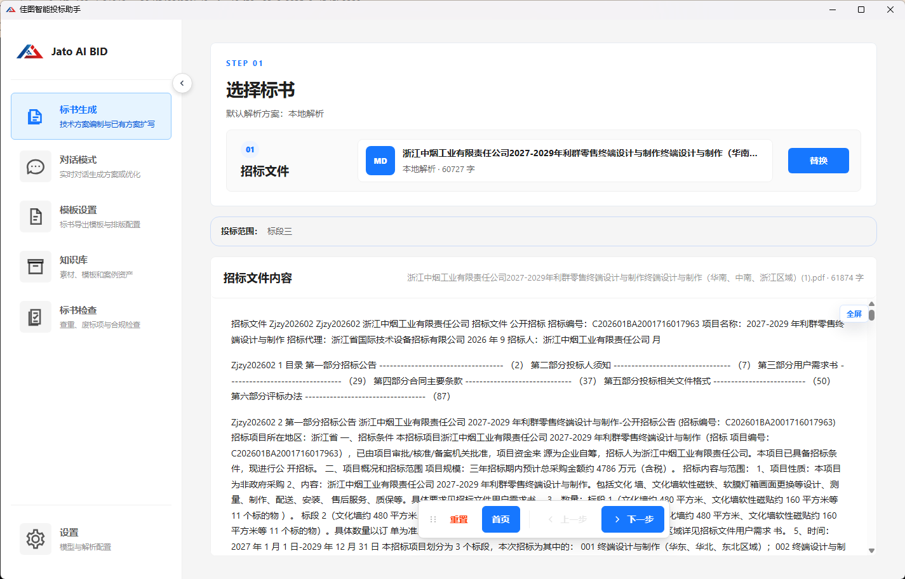
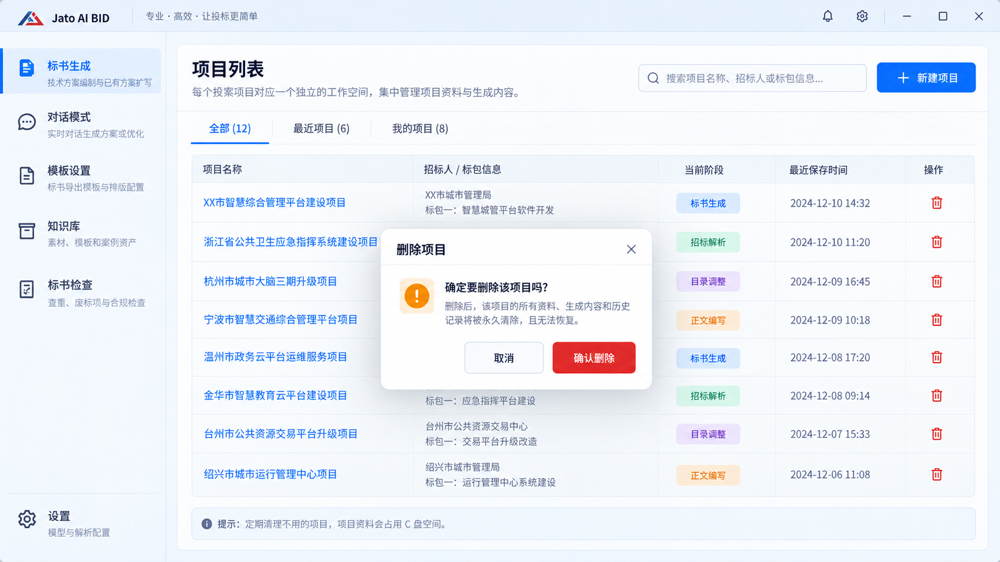
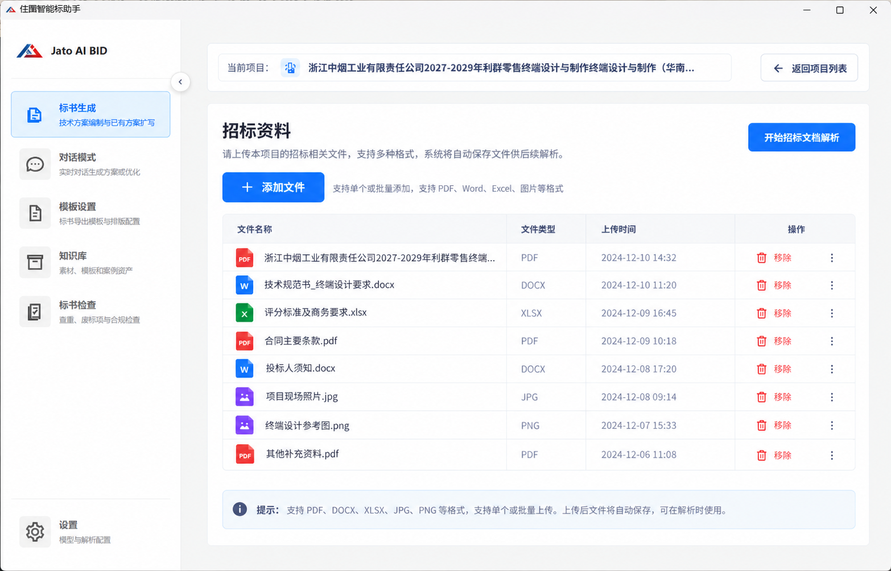
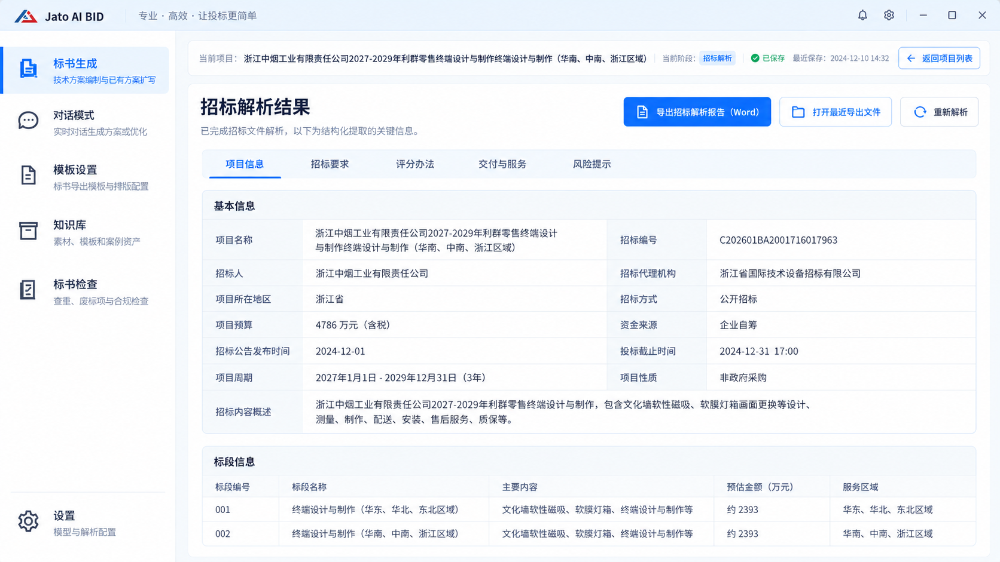
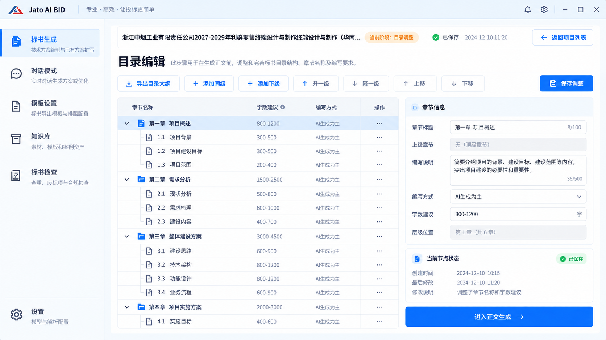

# v1.7.5 设计交接：轻量项目工作区与流程增强

> 配套主规格：[v1.7.5-spec.md](../../../v1.7.5-spec.md)。此文件定义高保真图的用途、四个页面的组件结构、交互状态和验收边界。不是新的需求提案；不新增 HTML 控制界面。

| 项目 | 说明 |
| --- | --- |
| 目标软件版本 | **v1.7.5**；客户端版本字段为 `1.7.5` |
| 交接文档修订 | 1.1，2026-09-25；本次为版本归属及交接同步，非重新设计 |
| 设计依据 | 用户提供的现有软件截图＋本包四张高保真图＋最后确认的文字修正 |
| 生产实现 | 复用现有 React、CSS、`--yb-*` 令牌及已采用的组件，不替换应用外壳 |
| 参考图状态 | 历次会话中生成的图片，按最终约束选入；不是运行中软件截图，也不是可直接运行的页面代码 |
| 核心裁决 | 文字规则优先；尤其 P03 只增加导出，不按参考图重写原有结果页面 |

## 0. v1.7.5 交接范围

主规格升级为 `docs/v1.7.5-spec.md`，本文件归入对应版本目录。四张高保真图和用户原软件截图原样保留；CSS参考不重写。主规格中的D01—D14继续生效。

图中出现的旧日期、示例字段或版本不代表v1.7.5生产取值。实现后的版本显示沿用已有入口，从客户端实际版本源读取1.7.5；不新增版本标牌、不移动解析按钮、不增减业务页。验收截图记录实测版本、提交和显示缩放。

本次没有新增或重画HTML控制页。P03仍然只加Word导出，P02仍然没有转换状态与转换按钮，一级导航和Logo仍然保持。更改对照见[版本修订说明](REVISION-NOTES.md)。

## 1. 冻结的页面架构

```text
既有 AppShell（保持）
  左侧一级导航（保持）
    标书生成 ← 本轮四页都在该模块内
    对话模式
    模板设置
    知识库
    标书检查
    设置
  右侧内容区
    P01 项目列表
      → P02 招标资料
      → P03 原解析结果查看页
      → P04 原目录生成／编辑页
      → 原全局事实、正文、配图及最终导出
```

项目列表是上传资料之前的独立内部页面，不是新增一级Tab，也不是任何业务页面的右边栏。业务页只显示当前项目及返回列表入口，不显示全项目切换下拉。不新增“HTML配图工作台”。

## 2. 资源交接清单

| ID | 包内文件 | 实际像素尺寸 | 应参照的范围 |
| --- | --- | --- | --- |
| REF-00 | `assets/00-current-app-reference.png` | 1425 × 912 | 用户真实软件截图：原生标题栏、侧栏、Logo、一级Tab、整体密度 |
| UI-01 | `assets/01-project-list-delete.png` | 1672 × 941 | 项目列表主体、红色删除和确认弹窗 |
| UI-02 | `assets/02-tender-files-final.png` | 1566 × 1005 | 最终资料页主体：四列表格、唯一添加、右上角启动解析 |
| UI-03 | `assets/03-analysis-export.png` | 1672 × 941 | 结果页上方 Word 导出入口的相对位置；结果主体以当前代码为准 |
| UI-04 | `assets/04-outline-editor.png` | 1672 × 941 | 目录树＋属性区，导出与层级工具栏 |

每个资源的 SHA-256、来源文件名、原会话文件标识和用途记录于 `assets/manifest.json`；清单另标注软件目标v1.7.5和文档修订1.1，图片哈希与上一包一致。文件均原样复制，不把生成图裁成生产界面，也不从截图提取字体或重画产品Logo。

### 用户当前UI外壳参考



### 重要差异裁决表

| 参考图可能带来的误读 | 实施裁决 |
| --- | --- |
| UI-01／03／04把Logo放进更大的自定义顶栏，或出现额外铃铛、口号、设置入口 | 不改当前AppShell；保留真实截图和仓库现有外壳、品牌资源与一级图标，不复制这些新增装饰 |
| 项目列表图中弹窗遮住表格 | 这是删除确认状态，正常进入页面不弹窗；项目名称可点击进入 |
| 图中“全部／最近／我的”数量不一致 | 数量来自真实本机数据；不得硬编码。未具备用户归属模型时不为了“我的”新建多用户体系；无对应数据的示意筛选不做成假功能 |
| UI-02说明里出现Excel、图片等格式 | 仅显示当前解析器真实支持格式；本轮不新增格式支持，不将图片占位行当成需求 |
| UI-02早期同名文件存在“转换状态”或底部开始解析 | 只能使用本包 `02-tender-files-final.png`，旧同名图片作废 |
| 图里有项目缩略图／小品牌图 | 项目没有自定义Logo功能，不引入图标生成；用现有通用文件图标或仅文本 |
| UI-03示范五个横向页签／双栏字段表 | 不替代现有解析项与查看布局；P03只添加Word导出按钮 |
| UI-03有“打开最近导出文件”常驻按钮 | 当前不存在时不额外新增；导出成功后复用既有打开文件反馈 |
| UI-04出现“AI生成为主”、字数区间或额外状态卡 | 编写方式使用现有真实枚举；字数机制不变；不从截图扩建新字数功能或审计面板 |
| UI-04按钮写“进入正文生成” | 原全局事实步骤不能跳过；沿用原导航与检查，仅表达目录完成后继续流程 |
| 示例项目名、招标编号、预算和日期看似真实 | 只作排版占位，不能写入用户项目或生产默认值；开发夹具用明确的项目A/B |

## 3. 全局样式与尺寸规则

### 3.1 复用已存在的令牌

以下值沿用上一版对 `client/src/styles/tokens.css` 的审查记录，本次没有重新核对远端。实施时先检查本地实际令牌，再优先引用变量；不因版本更新新建主题。

| 用途 | 现有令牌／值 |
| --- | --- |
| 主色 | `--yb-primary: #1677ff` |
| 主色悬停 | `--yb-primary-hover: #4096ff` |
| 主色浅底 | `--yb-primary-bg: #e6f4ff` |
| 危险操作 | `--yb-error: #ff4d4f` |
| 背景／卡片 | `--yb-bg: #f5f5f5`／`--yb-surface: #ffffff` |
| 分隔边框 | `--yb-border`／`--yb-border-soft` |
| 正文／辅助文字 | `--yb-text`／`--yb-text-soft`／`--yb-text-muted` |
| 字体 | `--yb-font-sans`，包含本机中文字体回退，不打包新增字体 |
| 正文字号／行高 | `--yb-font-size: 14px`／`--yb-line-height: 1.5715` |
| 控件高度 | `--yb-control-height: 32px`；主按钮可用现有大号40px |
| 圆角 | `--yb-radius: 6px`、`--yb-radius-lg: 8px`、`--yb-radius-xl: 12px` |
| 间距 | 4px倍数，使用 `--yb-space-2/3/4/6/8` |

### 3.2 布局约束

应用外壳、一级侧栏宽度、标题栏和原折叠行为保持现有实现，不从生成图按比例推算全局CSS。新增页面填充右侧内容区，`height:100%`、`min-height:0`，数据长时内部滚动。

内容页左右内边距优先复用现有技术方案页面；新增卡片内部以24px为参考，块间16px，控件间8–12px。P01、P02默认表格行高约56px，长项目名允许两行或省略并提供完整提示，不扩大到巨型卡片。

P04在空间允许时目录树约占60%，节点属性约占40%；比例是布局参考，不是锁死宽度。工具栏可在顶部换行，不能挡住表格第一行。属性区内容过长独立滚动，不能把“保存调整”推到无法触达的位置。

### 3.3 分辨率与窗口缩放

至少检查原截图附近的1425×912、1366×768和1920×1080；另检查Windows常见125%／150%显示缩放。以实际内容区宽度为准，不用CSS整体缩放压缩UI。

P01/P02窄窗口优先保留标题／文件名和操作可达，必要时表格内部横向滚动。P04属性区在不足以并排显示时可落到目录下面，但保持原有组件，不新增抽屉模式。左侧一级Tab仍采用原响应式规则。

**右上角解析按钮仍属于标题区域。**即使头部需要换行，也不得移至右下角、底部工具条或浮动面板。

## 4. P01 项目列表



### 4.1 页面结构

```text
ProjectListPage（新建内部页面，建议名，不是现有组件声明）
  PageHeader
    标题：项目列表
    简短说明
    搜索框
    新建项目
  ProjectTable
    项目名称（可点击）
    招标人／标包信息
    当前阶段
    最近保存时间
    操作：红色删除图标
  固定提示文案
  CreateProjectDialog（仅点击新建时）
  DeleteProjectDialog（仅点击删除时）
```

不增加运行状态列，不显示“打开项目”“继续工作”按钮，不显示暂停／恢复／归档。项目阶段来自保存的业务位置，不用百分比假装整个投标项目完成度。

### 4.2 组件交互

| 组件 | 操作结果 | 状态与限制 |
| --- | --- | --- |
| 项目名称 | 保存当前必要状态后载入目标项目，回到其已保存位置 | 忙时禁用；不是仅跳转页面、不加载项目上下文 |
| 新建项目 | 弹窗填写名称，确认后创建工作区并到资料页 | 名称必填；重复名称不覆盖；创建失败留弹窗 |
| 搜索 | 按项目名、已有招标人／编号／标包本地过滤 | 无结果显示空说明，不调用AI |
| 删除图标 | 先展示确认弹窗，不直接删除 | 红色；点击事件不冒泡触发项目打开；键盘焦点可达 |
| 删除确认 | 清目标项目，成功后刷新列表 | 执行中禁重复；失败保留行和错误，不假成功 |
| 底部提示 | 常态显示，不需要用户关闭 | 固定原文：定期清理不用的项目，项目资料会占用C盘空间。 |

### 4.3 删除弹窗

宽度约480px，最大不超过视口减32px；使用现有Dialog/AlertDialog。标题“删除项目”，展示真实目标名称，主要说明清空该项目在本应用中的全部资料、生成内容和记录，应用内不可恢复。

按钮为“取消”和红色“确认删除”。默认焦点在取消，ESC关闭等同取消；确认过程中禁用重复提交。不要使用浏览器 `alert/confirm`。

删除范围排除外部原件、公共资源、其他项目和工作区之外另存的导出副本。用户没有授权新建多用户功能，不为“我的项目”编造负责人／成员／权限系统。

### 4.4 空与故障

无项目时保留“新建项目”，表格区显示“暂无项目，请先新建项目”。列表读取失败通过原错误提示反馈，不能按“空列表”伪装正常。任务正在运行时不显示新增状态列，仅让受限入口禁用并按原方式提示原因。

## 5. P02 招标资料——最后确认版



### 5.1 页面结构

```text
TenderFilesPage / 改造现有DocumentAnalysisPage
  CurrentProject（仅当前名称＋返回项目列表）
  ContentCard
    Header
      左：招标资料＋简短说明
      右：现有开始招标文档解析入口
    Actions
      添加文件（唯一添加入口）
      当前解析器支持格式的简短说明
    Table
      文件名称 | 文件类型 | 上传时间 | 操作
      操作：移除；更多菜单内可替换
    原有必要提示／导航（不增加底部解析动作）
```

**不得出现：** 转换状态列、转换按钮、开始转换、批量添加按钮、第二个继续添加文件区、资料集状态卡片、统计卡片、大面积Markdown正文、结果查看右面板、右下角开始解析。

### 5.2 按钮与状态

| 操作 | 输入与结果 | 约束 |
| --- | --- | --- |
| 添加文件 | 原文件选择对话框，一次多选或再次追加 | 一次点击一次导入，不另做批量按钮 |
| 开始招标文档解析 | 当前项目文件集合 → 原设置／范围／启动链 | 保持标题右上角和既有逻辑；不因截图静态按钮跳过设置 |
| 移除 | 指定文件从当前项目解除并清理托管副本 | 不删外部原件，执行任务期间不可变更输入 |
| 更多→替换 | 选择一个新文件替换指定旧文件 | 新文件失败时旧文件还在；菜单里不放转换操作 |
| 返回项目列表 | 保存必要状态并到P01 | 当前任务未结束时不能切换；不新增主动暂停 |

添加过程中复用当前loading反馈。后台仍可转换和记录可用性，但不将状态变成表格字段。失败集中用现有Toast或简短错误说明反馈；不要因为要提示错误重建原状态仪表盘。

无文件时显示表格空状态，“添加文件”可用，“开始解析”禁用。至少一个有效文件且没有未结束准备任务时，才能触发原解析链。部分文件失败不能悄悄被当成已分析。

### 5.3 与旧流程的关系

这一页替换原“单文件＋MD大阅读区”，不是再加一步。后台格式转换可在原导入阶段完成，不改变用户对解析步骤的理解。下一阶段 P03只看分析结果，不重复显示文件表。

图片中的“Excel／图片等”文字是示例，不是格式承诺。实际支持范围来自当前解析器，不能为了对齐图片新增CAD、OCR、Excel或图片解析工程。

## 6. P03 现有解析结果页＋一个Word导出按钮



### 6.1 只改什么

在原结果查看页的上方操作区新增“导出 Word”或沿用现有命名风格的“导出招标解析报告（Word）”。位置在现有按钮组内，通常在原重新解析按钮左侧；不能挪动原解析主按钮到右下角。

不要依据参考图把当前结果项换成五个标签，不改原结果卡片、表格、Markdown查看、全屏、重试和解析配置。当前页面没有“打开最近导出”时，不为参考图额外增加常驻入口，导出成功后复用打开文档能力。

### 6.2 状态表

| 状态 | 导出按钮 | 用户反馈 |
| --- | --- | --- |
| 无任何已保存结果 | 禁用 | 暂无可导出的解析结果 |
| 当前分析任务执行中 | 禁用 | 等当前任务结束后导出，不输出在途半结果 |
| 部分结果已保存且任务已停 | 可用 | 报告标明部分完成／失败项，不能空白掩盖 |
| 正常结果 | 可用 | 保存Word；成功后按现有方式打开 |
| 来源已更新而结果旧 | 可用，但明确旧修订 | 报告标明待重新核对，不伪装新结果 |
| 导出中 | loading并防重复 | 不改变解析状态 |
| 用户取消保存 | 恢复可用 | 非错误，无业务数据变化 |
| 文件写出失败 | 恢复可用 | 明确失败，保留结果，允许重试 |

导出的是全体已选择解析项目的结果，不只导当前展开部分；不调用AI。本文不定义新的报告审阅平台。

## 7. P04 目录编辑与大纲导出



### 7.1 组件布局

目录树在左，选中节点属性在右；顶部工具栏使用现有样式，保留“导出目录大纲、添加同级、添加下级、升一级、降一级、上移、下移、保存调整”。不新增跨项目拖拽或全文结构迁移。

已实现的标题／说明／AI人工设置复用现有控件，不强行改成截图中的第三种编写方式。节点字数展示只有当前真实功能支持时才显示，不为参考图新建每节字数区间编辑器。

### 7.2 操作语义

升一级：整个子树放到原父节点之后，成为其同级。降一级：整个子树成为前一个同级的最后子节点。上移／下移：当前父级内重排。没有合法目标时禁用，不自动创建一个父标题来凑层级。

连续调整在草稿中即时显示，保存一次落盘；离开未保存页面时沿用保存／放弃提示，不静默丢草稿。显示编号与选中节点同步更新，不能让属性面板继续编辑错节点。

### 7.3 条件与提示

| 条件 | 处理 |
| --- | --- |
| 没有目录／目录生成中 | 结构操作禁用 |
| 正文尚未启动且没有既有正文 | 可用本轮结构调整 |
| 已开始正文或已有正文 | 本轮新增升降级禁用；不能清正文解锁 |
| 来源锁定／超深／非重点新增五级 | 操作禁用并说明具体原因 |
| 有未保存调整时导出 | 先保存，或取消本次导出 |
| 导出包含说明 | 一次性选项，默认关闭，不增加重复预览面板 |

底部原导航继续经过全局事实等步骤，不因图上“进入正文生成”直接启动AI。模型是否运行仍由原明确启动操作决定。

## 8. HTML 功能不对应第五张页面

本轮不交付HTML工作台设计，不新增图种／比例选择器、图片设置卡片、重新排版按钮或手动插入新流程。16:9／4:3在当前后台计划、生成与渲染中按默认规则生效。

可以用原有正文预览和导出检查成果；其现有错误／复核提示保留。历史工作台图片不得加入前端路由或作为“已确认界面”开发。

## 9. 事件与数据绑定交接

下表是语义契约，不是要求照这些名称创建一套新bridge。

| 语义事件 | 必须携带的上下文 | 保存／副作用 |
| --- | --- | --- |
| 创建项目 | 用户名称及可选基础信息 | 创建唯一ID与独立工作区；不调用AI |
| 进入项目 | 目标项目ID | 空闲检查、保存旧状态、加载目标数据与位置 |
| 删除项目 | 已确认的目标项目ID | 清目标托管数据；不触发项目进入事件 |
| 添加／替换／移除文件 | 项目ID、目标文件ID／候选文件 | 当前项目的来源修订变更，其他项目不动 |
| 启动解析 | 项目ID、完整资料修订、原有解析配置 | 调用原后台任务，不绕过选择范围 |
| 导出报告 | 项目ID、解析快照修订 | 生成Word，记录输出路径，不变更结果 |
| 保存目录 | 项目ID、原目录修订、新树与映射 | 原子保存；若已被别请求修改，拒绝过期保存 |
| 导出大纲 | 项目ID、已保存目录修订、是否附说明 | 纯大纲Word，无正文任务 |

点击项目A发出的请求不能在切到B后按B的ID保存。截图里显示哪个项目，不等于后台可以不绑定项目身份。UI不展示项目状态列，也不能删除内部必需的任务状态与错误处理。

## 10. 文案锁定与不新增项

| 区域 | 文案／规则 |
| --- | --- |
| 一级导航 | 现有名称与说明不改 |
| 新列表标题 | 项目列表 |
| 创建动作 | 新建项目 |
| 名称动作 | 点击名称进入，无额外打开／继续工作按钮 |
| 删除动作 | 红色图标，tooltip为“删除项目” |
| 删除确认 | 取消／确认删除，先确认后删除 |
| 列表底部 | 定期清理不用的项目，项目资料会占用C盘空间。 |
| 文件添加 | 添加文件（唯一入口） |
| 文件移除 | 移除；替换在既有更多菜单中 |
| 解析启动 | 保持当前动作与右上角位置；最终图称“开始招标文档解析” |
| 报告导出 | 导出 Word／导出招标解析报告（Word），使用一个一致名称 |
| 目录导出 | 导出目录大纲 |
| 目录层级 | 升一级／降一级；与上移／下移分开 |

不新增项目暂停、项目运行状态表、资料集状态卡片、格式转换状态列、转换按钮、批量添加按钮、HTML配图控制页。不得把页面改英文；产品英文名 `Jato AI BID` 不等于所有业务文案应英文。

## 11. 设计参考代码

见 [`design-reference/layout-reference.css`](design-reference/layout-reference.css)。它只示范标题行右侧动作、表格滚动、红色删除和目录双栏，使用现有令牌，无框架依赖。

代码不是应用功能补丁。Codex应映射到现有类或采用作用域类，不能覆盖全局 `.primary-action`、左侧菜单或原生标题栏。事件和按钮禁用须由真实项目状态驱动，不用示例数组冒充实现。

通俗解释：参考代码解决“东西放在哪里”，不解决“点了以后做什么”。解析、导出、项目删除仍必须接上实际服务和持久化，并通过数据测试。

## 12. UI验收记录要求

逐页提供v1.7.5实际运行截图，标明实测客户端版本／提交、视口、显示缩放、所在流程和测试状态。已有登录／关于页的版本核对仅作既有功能回归，不增加第五张产品设计页。至少包含：

- P01正常列表、空列表、删除确认、删除失败／任务忙禁用。
- P02多文件、空列表、添加失败提示、无转换状态的表头、右上角解析动作。
- P03原结果页与新增Word按钮对照，不能为了“统一美观”重做主内容。
- P04选中子树升降前后、锁定状态、未保存、目录导出选项。

自动化可以检查DOM和按钮边界，实际截图还应人工确认长中文、滚动、焦点与间距。没有真实登录或无法运行Electron时必须标记未验收，不拿高保真PNG当作软件完成截图。

### 设计完成判据

数据来源正确、主操作位置正确、用户撤销的控件不存在、已确认四页分开且流程不跳步，比静态图里每个阴影都一致更重要。生产截图与参考有必要差异时，在实施记录列出对应的文字规则，不悄悄扩展需求。
