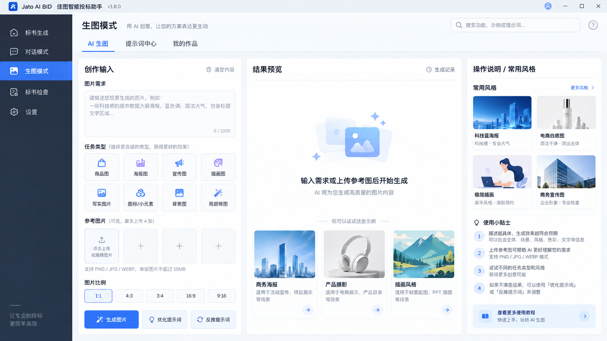
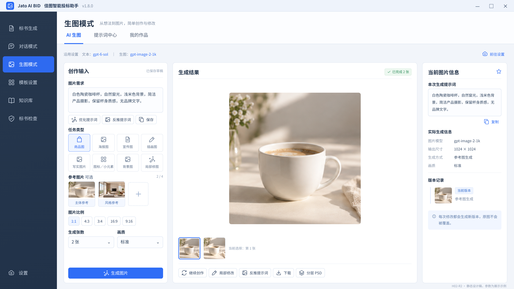
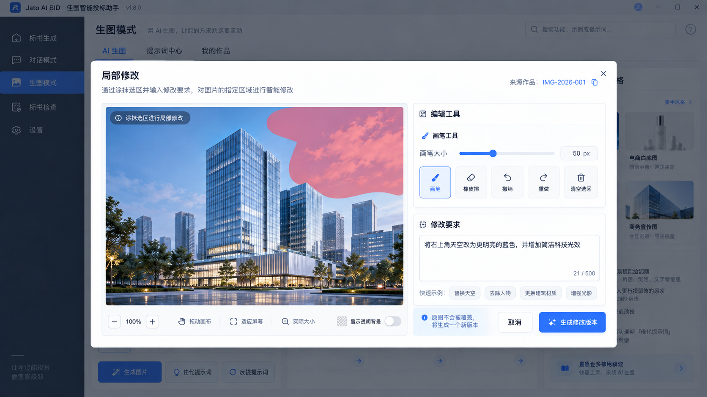
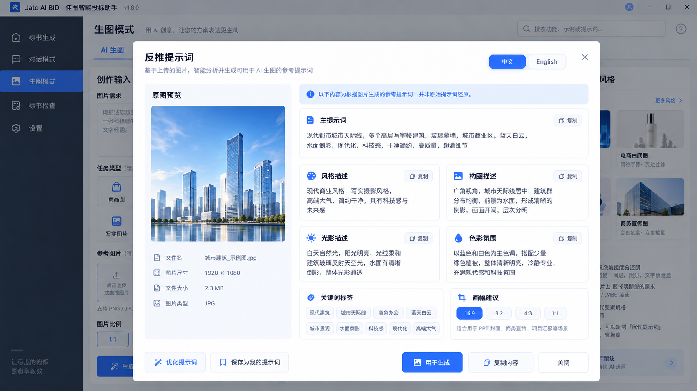
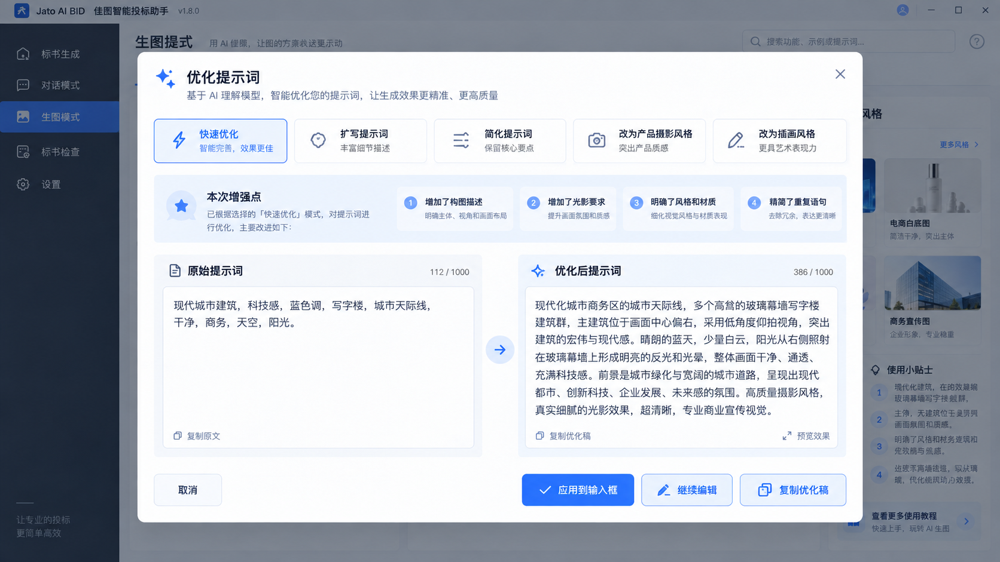
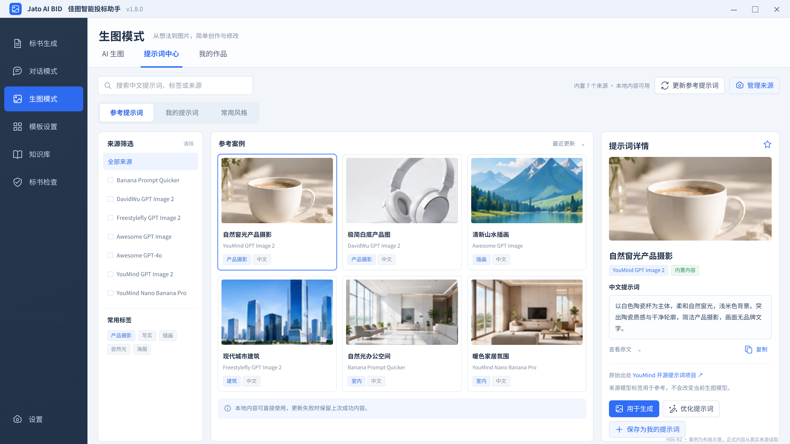
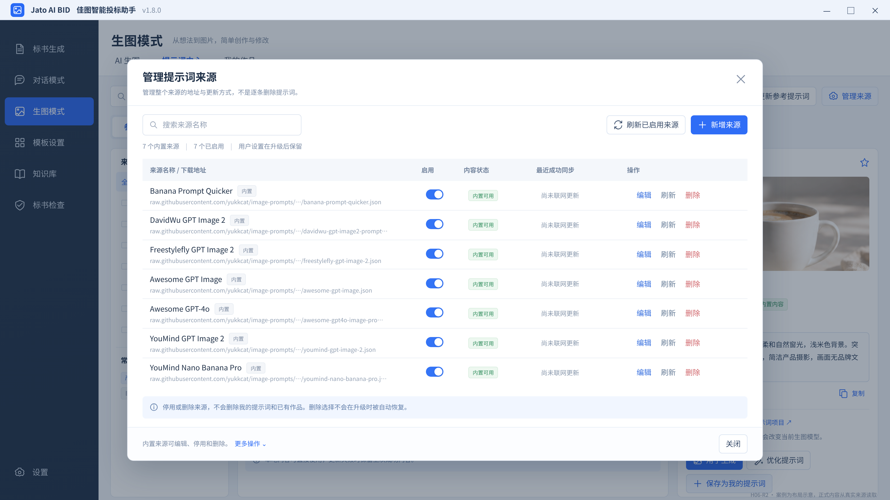
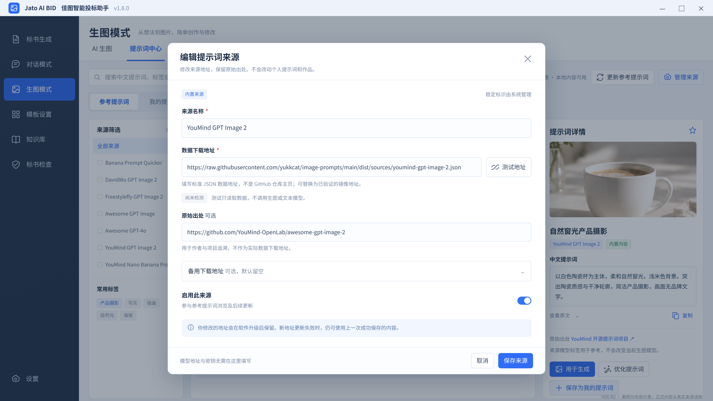
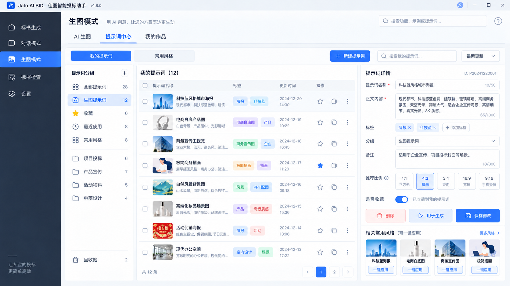
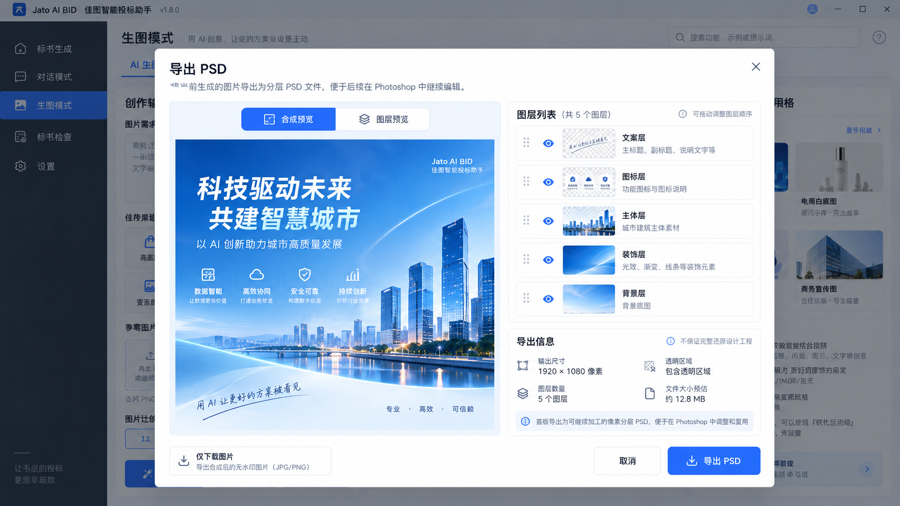

# OpenJatoBID v1.8.0 UI Handoff

**文档修订：R3｜2026-09-26｜对应已认可独立图稿的实施版**

> 配套业务权威：[`v1.8.0-spec-final.md`](v1.8.0-spec-final.md)。  
> 用户已基本认可前批九图风格。本版保留已认可主体布局、模型摘要与来源管理，不重新设计整个客户端。  
> 本包图片是设计稿，不是实际运行截图。按用户最新认可进入连续实施，不再设置逐图等待门；图中文字错误按本文件修正。

## 1. 如何读取设计资料

先读完整 Spec 的业务规则，再看本 Handoff 的组件与交互，最后对照图片。图中文字、演示数据、比例出现生成误差时，以本文件和 Spec 为准；不能把图片模型意外画出的功能当新增需求。

原图保留其已认可风格，不篡改成“全部文案已修正”。H02-R2 替代旧 H02；H06-R2 替代旧 H06；H10／H11 为来源管理。其他保留图稿按本文件修正示例文案。旧 H02 及所有多页概念海报不随包，避免选错基线。

### 1.0 本轮最终图稿的制作与取用

本次图片生成过程中出现的多页面汇总海报不作为实施基线，也不放入本交付包。请只按下方索引中的四张 R2／来源管理独立图，以及已认可原图使用。

为了使中文字段、七个真实源名称和按钮准确可读，四张最终增量稿用静态 HTML 精确排版渲染为 PNG，设计画面为 1680×945 逻辑像素、2 倍输出（3360×1890）。产品示意图来自本轮／前轮生成资产，不是用户的真实作品。`.preview.html` 和 `media/` 一并保留作为布局参考，不含业务逻辑，不能当作已完成的 Electron 页面。

已检查四张参考尺寸下关键按钮可见；未把该检查写成产品响应式或业务验收通过。实际产品仍须遵守本 Handoff 的多窗口尺寸要求，不能直接把静态稿固定宽高搬进应用。

### 1.1 图片文件索引

所有图片位于 `docs/assets/v1.8.0-r3/`。

| 图号 | 文件 | 使用方式 |
| --- | --- | --- |
| H01 | `H01-approved-reference.png` | AI 生图初始页，保留输入／结果／常用风格的组织 |
| H02-R2 | `H02-R2-model-workspace.png` | 真实模型摘要、无默认公司品牌的结果页 |
| H03 | `H03-approved-reference.png` | 局部修改弹窗，工具与图像空间 |
| H04 | `H04-approved-reference.png` | 图片反推结果，沿用文本模型 |
| H05 | `H05-approved-reference.png` | 优化前后对比，用户主动应用 |
| H06-R2 | `H06-R2-reference-library.png` | 参考库、更新与管理来源入口 |
| H07 | `H07-approved-reference.png` | 我的提示词与风格管理 |
| H08 | `H08-approved-reference.png` | 我的作品、真实参数与版本 |
| H09 | `H09-approved-reference.png` | PSD 分层预览，按文案表去掉原示例品牌 |
| H10 | `H10-source-manager.png` | 来源级增删改、启停、刷新和状态 |
| H11 | `H11-source-editor.png` | 新增／编辑来源表单与地址检测 |

本包只收录 11 张有效独立设计图：7 张已认可原图与 4 张已认可增量图。不收录旧 H02 或多页面概念海报。图片清单、实际分辨率与 SHA-256 在 `design-assets.json`，完整预览见包根目录 `UI-图稿索引.html`。

## 2. 布局和视觉规则

### 2.1 应用外壳

保留真实客户端标题栏、Logo、原有一级导航与设置位置，只增加／完善现有生图入口。不复制设计稿省略的菜单、全局搜索和教程卡为新功能；也不删实际已有菜单。一级图标跟现有线性灰色图标规范，激活沿用项目强调色。

全局 CSS＋现有 Radix 组件；不引入 Tailwind 或整套新 UI 库。优先 `--yb-*` 现有 token，不通过新图颜色重新设计全站。中文系统字体沿用原客户端，正文 14–16 逻辑像素、辅助文字不低于 12；不把 16:9 大图整体缩小成小字。

### 2.2 尺寸与响应式交付基准

原图为 1672×941 像素；四张增量图为 3360×1890 像素，对应 1680×945 的 2 倍输出；实际布局按逻辑像素实现，不锁定图片尺寸。验收至少覆盖 1440×900、1280×800、1024×768 窗口与 Windows 100%／125% 缩放，并验证现有最小窗口限制下无不可达按钮。

| 可用主内容宽度（不含全局侧栏） | 布局 |
| --- | --- |
| ≥1280 | 创作约 330–370，结果弹性，右侧信息约 260–300，间距 16–24 |
| 980–1279 | 创作约 310–340＋结果；右栏用“图片信息／常用风格”抽屉 |
| <980 | 输入与结果上下排列，工具换行；详情抽屉替代常驻第三栏 |

弹窗最大宽度 `min(1120px, 100vw - 48px)`，最大高度 `100vh - 64px`；更窄窗口缩小边距，底部动作始终可见，内容区内部滚动。禁止 body 级双滚动条、固定 300px 小预览、把生成按钮挤出可视区。输入框支持至少 10,000 字符；长 URL 允许局部滚动／截断，不撑开整个页面。

### 2.3 按钮层级

单个区域只突出一个主要动作：创作“生成图片”，优化“应用到输入框”，来源表单“保存来源”，分层“导出 PSD”。“保存”“应用”“生成”不能混同。按钮高度通常 36–40，图标操作点击区域至少 32；关键动作不全藏 hover。

## 3. 页面／容器地图

| 编号 | 页面／容器 | 必备内容 | 页面离开后的状态 |
| --- | --- | --- | --- |
| P01 | AI 生图 | 需求、任务预设、参考图、参数、模型摘要、结果 | 草稿／图像引用／选中结果保留，任务 Main 继续 |
| P02 | 提示词中心 | 参考／我的／风格三个内页，更新与管理来源 | 筛选／选中条目保留，未保存编辑提示 |
| P03 | 我的作品 | 搜索、收藏、网格、详情、版本 | 滚动与筛选保留 |
| D01 | 局部修改 | 画笔、橡皮、撤销重做、原图坐标、要求 | 原图保留；失败不丢选区 |
| D02 | 图片反推 | 来源图、中文描述、结构信息、复制／优化／应用／保存 | 来源与输出绑定 |
| D03 | 优化对比 | 原文、优化稿、变化、主动应用 | 未应用不覆盖输入 |
| D04 | 提示词／风格编辑 | 名称、正文、分组／标签、参数、备注 | 保存进入现有个人库 |
| D05 | 作品详情 | 实际模型、图像、父子版本、导出 | 不伪造元数据 |
| D06 | PSD | 待拆层、处理中、图层检查、导出 | 层结果保存为该作品派生资产 |
| D07 | 管理来源 | 七源及用户源、启停、编辑、刷新、删除 | 覆盖和删除标记持久化 |
| D08 | 新增／编辑来源 | 名称、数据 URL、出处、备用地址、检测 | 取消不保存，检测不替换已生效快照 |

## 4. H01／H02-R2：创作页

### 4.1 固定内容

标题“生图模式”，副标题改为“从想法到图片，简单创作与修改”。二级入口固定 AI 生图／提示词中心／我的作品，不增加专业模式。

左侧包含需求输入、八任务预设、参考图和角色、比例／张数／画质、优化／反推／保存，底部主生成动作。任务顺序可按已认可图，不能出现“品牌VI”“风格塑造”取代已确认八类的意外文案。八类为商品图、海报图、宣传图、插画图、写实图片、图标／小元素、背景图、局部修图。

模型摘要为只读小字：“沿用设置 · 文本：gpt-6-sol · 生图：gpt-image-2-1k”，后接轻量“前往设置”；运行时实际模型可能是 gpt-image-2，读取配置，不把示例硬编码。状态不足提示去原设置，不在此重复填写 Key。

示例作品用无商标陶瓷杯产品摄影等通用素材。参考图标签对应实际主体／风格／构图／色彩。任务为商品图就不能显示政企海报；比例选中值与输出示例一致，尺寸显示实际返回值。

### 4.2 结果交互

新生成完成默认选中本次新结果；用户在任务期间主动切换到其他作品时不抢焦点，显示“新结果已就绪”入口。旧图仍保留历史。多张结果保留缩略图条／网格，当前图上方显示“已完成 N 张／部分完成”等实际状态。结果主工具条按 H02-R2：继续创作、局部修改、反推提示词、下载、分层 PSD。“保存本图提示词”可在图片信息的提示词操作中保留；不要把结果保存与左侧当前草稿保存混淆。继续创作明确使用当前图，而不是只复制 prompt。

右栏仅显示真实提示词、实际模型／尺寸、版本关系，参数缺失显示“未记录”或隐藏。无分享链接、用于标书封面或自动公司水印按钮。普通下载通过原生保存对话框选择格式，不只修改扩展名。

## 5. H03／H04／H05：编辑与提示词工作流

### H03 局部修改

图片占主体；工具旁说明“涂抹需要修改的区域，再输入你想改成什么”。画笔、橡皮、大小、撤销重做、清空、缩放；提交“生成修改版本”，取消不改原图。编辑区与允许羽化范围可区分。没有选区时禁用提交并说明原因。没有透明内容不必常驻“透明背景”开关。

### H04 图片反推

左图右结果，主提示词可编辑；风格／构图／光影／色彩／标签折叠或紧凑卡片。说明“根据图片生成参考描述，不代表原始提示词”。顶部可简洁显示“文本模型：gpt-6-sol”。不再要求用户选择额外视觉模型。

“用于生成”只放入创作输入框并定位到该页，不自动提交。现有输入有内容时保留撤销／差异确认；保存与应用分开。

### H05 优化对比

左右原文与可编辑优化稿，变化说明控制为简短信息，不抢占半屏。可选优化／扩写／简化／翻译／风格改写，不展示“专业模式”。取消保持原文；主操作“应用到输入框”。旧图的“预览效果”若会触发额外生图，不作为本版入口。

字符上限遵守 Spec，至少支持 10,000 字符，不沿用旧图的“1000”；长输入不静默截断。原输入已修改时标记“输入已更新，请核对后应用”，不把延迟返回覆盖新草稿。

## 6. H06-R2：参考提示词中心

顶部：页面标题、中文搜索、来源／标签筛选、最近成功同步信息；右上“更新参考提示词”“管理来源”。内部 tabs 为“参考提示词／我的提示词／常用风格”。

左侧来源列表可列七源与自定义源，名字保留真实署名，可多选筛选。中间案例卡片展示封面或明确占位、中文名称、摘要、来源标签、缓存／翻译状态。右侧详情展示中文与可展开原文、出处、模型适用提示和“用于生成／优化提示词／保存为我的提示词”。

源是第三方社区来源，不能标“OpenAI 官方”或“佳图官方精选”。不显示未经实测的“国内高速稳定镜像”。首次用的是内置快照时写“内置内容可用”，不能伪装成今天远程同步成功。

删除来源不在卡片上逐条删提示词；进入管理来源做来源级动作。更新失败用非阻塞状态条：“更新未成功，仍可使用上次内容”，保留已显示卡片。不能整页错误或转圈挡住已缓存数据。

## 7. H10：管理来源弹窗

宽屏大弹窗，标题“管理提示词来源”，副标题“管理来源地址，不逐条删除提示词”。顶部“新增来源”和“刷新已启用来源”，支持名称搜索；不新增独立一级／二级 tab。

### 7.1 行布局

表格列为来源名称（含内置／自定义标记与地址摘要）、启用、内容状态、最近成功同步、操作。不要把长原始 URL 和备用 URL 拆成两列挤满表格；地址截断有 tooltip／复制。

每行操作“编辑”“刷新”“删除”；删除为低强调红色，不把所有按钮做醒目实心。七个内置源也有删除，不能禁用。启停开关立即保存并留痕；网络状态与开关是不同概念，停用不等于下载失败。

状态文案：内置可用／已同步／更新中／使用上次内容／未取得内容／已停用。仅在真实检测后显示成功。表格脚注：“停用或删除来源，不会删除我的提示词和已有作品。”

底部有关闭；需要恢复内置来源时通过更多菜单进入明确的选择恢复，不自动恢复。

### 7.2 删除确认

文案：“删除「来源名称」？该来源将从参考提示词中移除，后续升级不会自动恢复。已保存到我的提示词的内容和已有作品不受影响。”

按钮“取消”“删除来源”。不出现“删除全部作品”“清空模型配置”等无关动作。确认后取消同源未提交请求，晚返回结果不得重新展示源。

## 8. H11：新增／编辑来源弹窗

使用一套表单，新增显示“新增提示词来源”，编辑显示“编辑提示词来源”。内置源可编辑且标识“已自定义”，稳定 ID 不暴露为普通用户必填项。

| 字段 | 是否必填 | 展示与校验 |
| --- | --- | --- |
| 来源名称 | 是 | 1–80 字符；重名提示，不凭名称覆盖已有源 |
| 数据下载地址 | 是 | HTTPS 标准 JSON URL；两行输入可完整查看；检测按钮在旁 |
| 原始出处 | 否 | 作者／项目主页，用于追溯，不作为实际下载地址 |
| 备用下载地址 | 否 | 折叠可选字段；默认空，不自动填未验证代理 |
| 启用此来源 | 是，有默认 | 新增默认启用 |
| 检测结果 | 系统 | 网络是否成功、格式是否支持、条目数；来源未给版本则写版本未知 |

表单示例使用已核对的 YouMind GPT Image 2 原地址，而不是杜撰国内域名。精确字段值见来源配置 JSON，图片可省略但 handoff 不省略。

检测成功不等于国内长期稳定。返回 HTML 登录页、403、空数组、超限、解析失败分别给简短中文原因，输入全部保留。下载地址不得附带模型 API Key。用户修改 URL 后旧检测结果标记失效。

底部“取消”“保存来源”。新地址未经可用结构检测时允许保存为停用草稿以便修正，但不能自动替换现有可用源快照；新增即用必须先校验成功。编辑已有源遇网络暂不可用可保存配置并继续用旧缓存，明确标“地址待验证”，不能显示已同步。

## 9. H07：我的提示词与常用风格

复用原库：保存、编辑、删除、分组、标签、备注、收藏。添加“用途”元数据隔离生图列表，不只按“生图提示词”中文组名过滤，用户重命名分组后仍可找到。

来源条目另存才形成个人副本，保留原始出处与原版本，个人编辑后不被源同步改回。常用风格只追加风格与确认的默认参数，不清空主体、参考图或切换模型。多字段表单保留底部主要动作。

旧图中的项目投标分组、回收站等仅当现有产品有对应功能才复用，不因样图新增完整回收站模块。风格卡常见示例可用产品棚拍、极简插画、自然光摄影、科技蓝；不把某行业作为默认约束。

## 10. H08：作品与版本

列表按真实元数据筛选。卡片图像占主要空间，文字摘要不超过两行，hover 可显示次要动作但下载／继续创作可直接找到。详情中版本按列表展示，不变成节点画布。

当前模型读取生成快照；`gpt-6-sol` 是文本分析模型，不应错标为生成该图的图片模型。旧图中的虚构种子／步数／Jato Vision 删除。日期和数量为运行时数据，不硬编码 2024 或示例张数。

删除保留被引用资产；提示删除什么、是否释放空间。当前仅软删除时不显示已释放磁盘容量。PSD 状态按是否已有有效层数据计算，不因为按钮存在标“可导出 PSD”。

## 11. H09：真实图层与导出

进入先显示“拆分图层”，运行时显示任务状态，完成后才有真实图层列表和导出。若原图已有可用派生层，直接进入检查。

左侧原图／合成／单层预览，右侧显隐、名称、缩略图和顺序；图层名例“背景像素层”“主体像素层”“文字像素层”，不默认每张图都有五层或文案层。透明区真实显示棋盘格，合成图来自待导出层。

说明：“导出为像素分层 PSD；不等于原始设计工程，文字像素层不可直接改字。”可见像素拆层另示：“未补全被遮挡背景，移动图层后可能出现透明区域。”有本地边缘修正入口复用画笔，不新建专业模式。

底部“取消”“导出 PSD”。输出尺寸、图层数和估算文件大小以真实数据为准；估算明确带“约”。不用内置公司宣传图作为用户产物。

## 12. 状态与键盘要求

| 状态 | 应展示 | 不应发生 |
| --- | --- | --- |
| 无模型配置 | 当前配置摘要及前往原设置 | 新增第二套凭据字段 |
| 首次打开参考库 | 内置内容可用，后台检查可选 | 空白、必须先连 GitHub 才显示 |
| 更新失败 | 旧内容仍可用与真实错误 | 清空库、把缓存显示成新同步 |
| 优化／反推中 | 进度状态，取消等待，原内容不变 | 旧结果覆盖用户新输入 |
| 多图部分成功 | 成功图、失败数量、可操作结果 | 全部隐藏或自动无限重试 |
| 任务结果未知 | 提示核对，保留任务ID与材料 | 自动重复计费提交 |
| 地址已修改 | 上次检测失效、需要检测 | 用旧成功标记验证新地址 |
| 作品文件丢失 | 本地文件不可用，保留历史说明 | 显示下载成功 |
| 窗口变窄 | 收起右栏、按钮换行、内容可滚动 | 横向挤压导致主按钮消失 |

Tab 可达所有关键操作；Esc 关闭最上层非不可中断提示，不擅自取消已发出的计费请求；弹窗焦点限制与返回触发按钮；图标按钮提供中文名称；Toast 在弹窗上方且不过度覆盖内容。

## 13. 视觉验收与实施证据

逐页对照设计与真实 Electron 截图，记录窗口尺寸、缩放、当前版本、场景与操作。截图进入 `docs/secondary-development/test-reports/` 对应证据目录，与本包设计稿分开，不复用设计稿冒充运行证据。

重点：三个二级入口、同一模型配置、全流程可达、来源管理真实可用、长文本／长 URL、错误与空状态、灰蓝层级一致、窄窗口布局、实际图层数据。已有业务外壳不因生图重做。

## 14. 统一勘误表：必须修正，但不重新设计

| 图稿中的示例／歧义 | 正式实现 |
| --- | --- |
| 模型名 Jato Vision、SDXL、虚构版本、seed／steps／CFG | 仅展示真实配置与实际返回字段；生图模型为实际选中的 ID |
| 图片需求／库文案默认“投标配图”、生成作品中有佳图品牌 | 通用图片创作，不注入招标或公司品牌；应用壳继续使用真实品牌 |
| 原图全局侧栏漏画菜单、额外教程／搜索／分享 | 以现有应用壳为准，只增加生图入口；不删菜单，不新增无关功能 |
| “官方提示词”“官方精选” | “参考提示词”“内置来源”；显示真实作者与出处 |
| 源卡片示例数量、图案、时间 | 演示数据，不是实际抓取／生成结果；正式必须来自真实数据 |
| 1k 一律等于正方形、选中比例与图片尺寸矛盾 | 请求遵循能力，显示实际返回尺寸，不按模型后缀推断 |
| 多张一次生成图被画成连续版本 | 同任务兄弟结果与 parent 修改版本分开 |
| PSD 固定五层、文字层可编辑暗示 | 真实语义层数、明确“像素层”，透明孔洞／限制如实提示 |
| 新增源可以选择“内置／自定义” | 类型由系统确定；新增即自定义，编辑内置源保留内置身份及覆盖标记 |
| 静态图中长地址省略 | hover／复制／编辑可见全址，不能实际存省略号 |

## 15. 组件合同与跨页面传递

| 组件 | 输入 | 用户动作产生的输出 | 不允许 |
| --- | --- | --- | --- |
| 创作表单 | 当前草稿修订、参考资产、可用参数、配置摘要 | 保存草稿／明确创建任务 | 未点击生成就出图、覆盖历史 |
| 参考图卡 | assetId、角色、顺序 | 删引用／改角色／重新排序 | 删除用户原文件、只改 UI 不改请求 |
| 结果预览 | workId、taskId、兄弟结果、状态 | 继续创作／修改／反推／下载／分层 | 把选择图片当成自动发请求 |
| 优化对比 | sourceRevision、原文、候选文本、变化说明 | 应用编辑稿／撤销／另存 | 延迟结果覆盖新草稿 |
| 反推结果 | inputAssetId、描述和结构化字段 | 应用／优化／另存 | 换图后展示上张图结果 |
| 来源列表 | sourceId、配置修订、状态和缓存元数据 | 新增编辑／启停／刷新／删除 | 前端虚构连接成功 |
| 来源表单 | 内置／自定义身份、用户覆盖字段、检测修订 | 已验证配置或明确待验证状态 | 测试地址触发模型／全量翻译 |
| 图层检查 | layerSetId、原尺寸、各层实际像素与顺序 | 修改遮罩／显隐排序／确认导出 | 只改预览而不改输出图层 |

应用提示词到已有输入时，展示可撤销的替换候选；不静默删除原描述。跨页面带稳定 ID 与快照，而不是只传标题／数组下标。来源更新不改变用户正在输入的内容。

## 16. 需要补齐但不新增视觉审批门的状态

源新增态沿用 H11 空表单；检测中、格式错误、地址待验证、已停用和删除确认沿用 H10／H11 组件。个人提示词新增和常用风格编辑沿用 H07 表单；新建、修改、取消、保存成功和冲突不得缺失。

H09 覆盖尚未拆层、候选生成中、候选失败、边缘修正、已检查可导出、文件写入失败。不是所有图片直接显示“导出成功”；用户不应在没有图层时看到伪造的五层列表。

没有单独 PNG 的异常／空状态由本 Handoff 的组件规则实现，不再要求用户逐个确认；实际完成后保存运行截图作为验收证据。设计稿本身不能成为运行截图。

## 一句话总结

这份 Handoff 把已认可的视觉风格转成具体组件、状态和来源管理规则，降低 Codex 自行补界面、错误参数或增加无关功能的风险。
