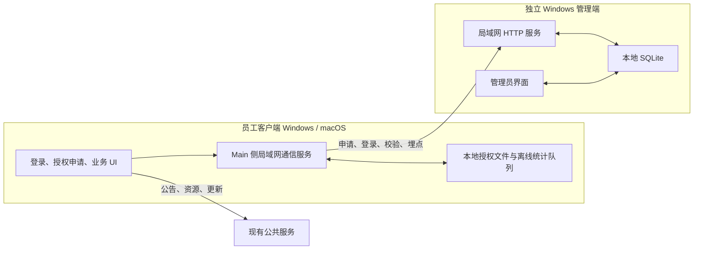

# OpenJatobid 二次开发实施计划

> 历史依据：`docs/secondary-development/prd/openjatobid-phase2-ui-lan-management-prd.md`（v0.5 批准稿）
> 历史状态：管理员认证修订计划已批准并完成 T32—T36/CP7；T30/CP6 实体双机验收仍未关闭。
> 当前增量：T47—T61“招标解析、格式驱动目录与受控写作”计划已于 2026-07-13 通过 CP8；真实文件回归后批准 T65，以来源锚点修复格式解析并合并采购与报价任务。
> 历史范围：保留已完成的客户端 UI、局域网授权与统计成果，只重做独立 Windows 管理端的管理员认证、首次设置和交付验证。

## 1. 目标与完成标准

本轮交付必须同时满足以下结果：

1. 保持客户端现有菜单、页面结构、功能流程和主要布局，仅将视觉语言统一替换为 Ant Design System v6 风格；不引入 Ant Design React，不重写现有 Radix 组件体系。
2. 文本模型、生图模型的“金龙中转站”名称和 API 获取链接按 PRD 修改；“关于”页隐私声明全文按 PRD 落地。
3. 客户端启动后先进入登录页；已授权员工使用姓名、手机号登录，新用户通过左下角“授权申请”打开独立弹窗并填写姓名、手机号、服务器 IP。
4. 姓名 + 手机号 + 当前设备构成授权主体；每台设备单独审批，每名员工最多 3 台有效设备；授权期 1 年；本地授权可离线使用，但至少每 30 天成功连接管理端校验一次。
5. 客户端的授权请求和埋点完全改为连接登录页配置的局域网管理端，不再向 `analytics.agnet.top` 发送 `/track` 或授权请求；公告、资源、更新检查仍沿用现有公共服务。
6. 独立 Windows 管理端继续支持授权审批/撤销、客户端与 AI 用量统计；管理员认证改为私有构建配置注入内置初始凭据、首次登录强制改密、登录后主动改密，不提供注册、SMTP 或忘记密码。
7. 不迁移历史统计和授权记录；第二轮上线前的旧数据不导入管理端。
8. 客户端继续支持 Windows/macOS；管理端仅支持 Windows。
9. 所有授权规则、时间规则、设备上限、统计传输和管理员认证状态都有自动化测试；管理端重新构建和打包，并完成受影响的运行时验收。

## 2. 约束与不在范围内事项

- 不改变客户端现有信息架构、导航位置、页面内容组织和业务工作流。
- 不在客户端引入 `antd` 依赖；通过设计令牌、全局 CSS 和现有 Radix 基础组件实现 Ant Design v6 视觉语言。
- 不将管理端嵌入客户端，也不复用同一个安装包或用户数据目录。
- 不迁移 Cloudflare Analytics 中的历史数据、历史授权或离线激活记录。
- 不删除公告、资源、更新检查等仍需访问公共服务的能力。
- 不添加 PRD 未要求的组织架构、角色权限、多管理员、云同步或公网穿透能力。
- 不保留 SMTP、恢复邮箱、临时密码或忘记密码入口；不添加新的自助恢复或技术支持后门。
- 不实现公司网络识别、第二管理端检测或外部运行技术阻断；单管理端和禁止外带由公司负责人通过人防制度执行。
- 不执行 `git pull`、`git push`、`git merge`、`git rebase`、`git reset` 等受保护 Git 操作。

## 3. 当前代码基线

- 客户端位于 `client/`，Electron Main/preload 使用 CommonJS，Renderer 使用 React + TypeScript + Vite。
- 客户端 UI 使用全局 CSS 与 Radix；现有布局样式包含较多硬编码渐变、阴影和尺寸，需要先建立令牌，再按页面分批替换。
- 当前授权服务位于 `client/electron/services/licenseService.cjs`，包含公共授权接口、离线激活导入和本地签名授权文件。
- 当前埋点分散在 Renderer、AI 服务和 OpenCode Runtime 服务中，并直接调用公共 `/track` 地址。
- `analytics/` 是 Cloudflare Worker + Dashboard，不能直接作为离线 Windows 管理端打包；需保留其统计维度和查询含义，在新管理端中实现本地等价能力。
- 仓库没有客户端 lint/test 脚本；现有强制验证入口为 `client/npm run build`，Electron CJS 使用 `node --check`。
- 根目录已有旧的 `task_plan.md` 和 `progress.md`，本轮不覆盖，使用 `tasks/` 目录独立维护。
- 修订实施前的管理端曾实现被 PRD 0.5 否决的 SMTP 发件配置、固定恢复邮箱、邮件临时密码和仅密码登录；当时 `admin_auth` 没有用户名，系统设置入口仍禁用。
- 修订实施前 `nodemailer` 是正式依赖，SMTP 授权码保存在 SQLite 设置中；T32—T36 已同步清除代码、依赖、持久配置和 UI 中的旧方案，并仅在迁移清理与回归测试中保留旧字段名。
- 当前 LAN API、员工授权、统计、托盘和打包能力不因管理员认证修订改变；本轮不得重写这些已通过的链路。

## 4. 待确认的实施假设

以下选项用于把 PRD 中仍开放的设计点收敛为可编码方案。批准本计划即视为同意这些默认值；若需调整，请在批准前指出。

| 编号 | 默认方案 | 影响 |
|---|---|---|
| A1 | 管理端采用纯 Electron 托盘应用；Windows 用户退出登录或系统关机后不继续服务，重新登录后由开机自启动恢复。 | 若要求“用户注销后仍服务”，必须改为 Windows Service + 管理界面双进程，工作量和安装权限显著增加。 |
| A2 | 管理端产品名为“Jato AI BID 管理端”，内部目录 `management/`，建议 appId `com.jiatu.aibid.management`。 | 决定安装包、进程和配置目录命名。 |
| A3 | 登录/申请页的服务器地址使用单一“服务器 IP”输入框，兼容 `IP` 与 `IP:端口`；默认端口 `47821`，管理端首次设置可修改。 | 避免额外增加端口字段，同时支持非默认端口。 |
| A4 | 管理端首次启动生成本地 ECDSA P-256 签名密钥；客户端首次获得有效授权时绑定该管理端公钥，后续更换公钥必须清除本机授权并重新申请。 | 保留本地离线验签能力，避免内置所有企业共用私钥。 |
| A5 | 设备标识沿用“系统机器标识 + 网卡信息 + 客户端持久 ID”的组合；重装系统或清除客户端数据可能被视为新设备，管理员可撤销旧设备后重新申请。 | 不新增复杂设备迁移功能。 |
| A6 | 老版本公共授权、离线激活码在升级后不继续有效，员工需向局域网管理端重新申请；现有 `analytics_client_id` 保留，以减少同一安装实例被误识别为全新客户端。 | 符合“不迁移历史数据”，同时保留客户端本地连续性。 |
| A7 | 管理员续期行为为“从续期成功时起再授权 1 年”；拒绝申请无需填写原因。 | 决定授权状态机和管理端操作。 |
| A8 | 在线客户端定义为最近 10 分钟内有登录、校验或埋点心跳；离线埋点本地队列最多保存 30 天或 10,000 条，先达到任一限制即丢弃最旧记录。 | 控制统计口径和本地存储增长。 |
| A9 | 管理端统计数据默认保留 24 个月，管理员可手动清理指定日期之前的数据；授权主体和设备记录不随统计清理自动删除。 | 决定数据库清理能力与磁盘容量。 |
| A10 | 管理端 UI 与客户端使用同一套 Ant Design v6 视觉令牌，但代码与构建保持独立。 | 保持两套软件视觉一致。 |
| A11 | 单一管理员账号；内置初始凭据首次登录后强制改密，登录后可用当前密码主动改密；不提供注册、SMTP、忘记密码或自助恢复。 | 决定管理员认证状态与界面。 |
| A12 | 不单独采集定时“心跳”事件；在线状态由登录、授权校验和已有业务埋点共同刷新。 | 避免新增无业务价值的高频请求。 |
| A13 | 初始用户名和密码从被 Git 忽略的私有构建配置注入；生成模块只包含用户名、随机盐、密码摘要和凭据版本，缺失配置时开发启动和打包失败。 | 安装包内置凭据，但公开仓库不保存明文密码。 |
| A14 | 同一公司局域网只部署一个管理端；安装包、凭据和服务器由公司负责人保管，外部运行风险采用人防，不增加网络或设备技术封锁。 | 明确部署边界和已接受残余风险。 |

## 5. 目标架构



关键边界：

- 客户端 Renderer 不直接访问网络或 Node；登录、授权和埋点统一通过 preload/IPC 进入 Electron Main。
- 管理端 Renderer 不直接读写 SQLite、签名密钥或管理员密码摘要；全部由管理端 Main 服务负责。
- 局域网接口只承担健康检查、授权申请/查询/登录校验和埋点接收。
- 管理端私钥和管理员密码摘要只存放在管理端服务器本地，不返回客户端；私有构建配置不进入仓库和普通构建输出。
- 客户端只保存服务器地址、员工身份信息、管理端公钥、签名授权和有界离线埋点队列。

## 6. 局域网接口草案

接口最终在任务 T10 中形成独立契约文档并冻结；下表仅用于确定任务边界。

| 方法与路径 | 用途 | 主要结果 |
|---|---|---|
| `GET /api/v1/health` | 测试服务器可达性 | 管理端版本、服务状态、服务器时间 |
| `POST /api/v1/authorization/applications` | 新用户/新设备提交申请 | 申请 ID、当前状态 |
| `GET /api/v1/authorization/applications/:id` | 客户端查询审批状态 | pending/approved/rejected |
| `POST /api/v1/authorization/login` | 已授权员工登录当前设备 | 签名授权、到期日、下次最晚校验日 |
| `POST /api/v1/authorization/verify` | 定期或联网触发校验 | 有效/撤销/过期状态及新签名授权 |
| `POST /api/v1/analytics/events` | 批量提交埋点 | 已接收事件 ID 列表 |

所有请求使用 JSON；客户端只在输入层校验姓名、手机号、服务器地址，软件内部数据层遵循项目“本地层级相互信任”的约束。埋点事件携带客户端生成的唯一事件 ID，便于离线重试时去重。

## 7. 分阶段任务

### 阶段 0：决策冻结与基线

#### T00 确认计划与记录架构决策 — S

- 内容：历史阶段确认 A1–A12；PRD 0.5 追加确认 A13–A14，并修订管理员认证 ADR。
- 验收：PRD 与 ADR 无互相冲突的开放项；所有后续任务都能引用明确决定。
- 预计文件（≤3）：
  - `docs/secondary-development/prd/openjatobid-phase2-ui-lan-management-prd.md`
  - `docs/secondary-development/adr/phase2-lan-management.md`
  - `tasks/todo.md`
- 验证：人工逐项核对 A1–A14 与 PRD 0.5、ADR 和任务计划；检查 Markdown 链接有效。
- 依赖：人工批准本计划。

#### T01 建立可复现的视觉基线与令牌映射 — M

- 内容：记录当前关键页面固定尺寸截图；将 Figma Ant Design v6 参考中的颜色、字号、圆角、间距、阴影映射为项目 `--yb-*` 令牌；列出必须保留的布局尺寸。
- 验收：至少覆盖启动/主壳、模型配置、关于、技术方案、知识库；令牌表明确现值、目标值和适用组件。
- 预计文件（≤4）：
  - `docs/secondary-development/design/phase2-visual-baseline.md`
  - `docs/secondary-development/design/phase2-ant-v6-token-map.md`
  - `client/src/styles/tokens.css`
  - `tasks/todo.md`
- 验证：`cd client; npm run dev` 后按清单人工截图；`cd client; npm run build`。
- 依赖：T00。

### 阶段 1：低风险客户端内容与视觉基础

#### T02 修改模型配置文案、链接与隐私声明 — S

- 内容：更新文本/生图模型供应商名称、API 获取链接、隐私声明 01–04；删除关于页离线激活入口文案，但授权逻辑移除留到 T18。
- 验收：两类模型配置均显示“金龙中转站”；获取按钮跳转新链接；隐私声明逐段与 PRD 一致且排版可读。
- 预计文件（≤3）：
  - `client/src/features/settings/SettingsPage.tsx`
  - `client/src/styles/feature-settings.css`
  - `tasks/todo.md`
- 验证：`cd client; npm run build`；开发环境逐项点击链接并核对页面文案。
- 依赖：T00。

#### T03 实现客户端全局 Ant v6 视觉令牌与主壳样式 — L

- 内容：替换全局颜色、排版、圆角、阴影、控件状态和主壳视觉；保持现有侧栏宽度、菜单顺序、内容区结构和工具条位置。
- 验收：主壳无旧渐变/重阴影；所有页面继续保持内部滚动；键盘焦点和禁用态清晰；布局尺寸与 T01 基线一致。
- 预计文件（≤5）：
  - `client/src/styles/tokens.css`
  - `client/src/styles/layout-app-shell.css`
  - `client/src/styles/shared-components.css`
  - `client/src/app/AppShell.tsx`
  - `client/src/app/Sidebar.tsx`
- 验证：`cd client; npm run build`；在 1440×900 与 1920×1080 检查主壳、菜单、滚动、焦点态。
- 依赖：T01。

#### T04 统一共享弹窗、表单、提示与 Markdown 视觉 — M

- 内容：对现有 Radix Dialog/Select/Toast、表单控件、空状态、Markdown 展示应用统一 Ant v6 风格，不改变组件接口。
- 验收：共享控件在设置、知识库、检查页呈现一致；错误/警告/成功状态可区分；无 `alert`。
- 预计文件（≤5）：
  - `client/src/styles/shared-dialog.css`
  - `client/src/styles/shared-toast.css`
  - `client/src/styles/shared-markdown.css`
  - `client/src/styles/shared-components.css`
  - `tasks/todo.md`
- 验证：`cd client; npm run build`；逐类打开 Dialog、Select、Toast、长 Markdown 内容。
- 依赖：T03。

### 阶段 2：独立管理端基础

#### T05 创建管理端独立工程与构建配置 — M

- 内容：建立 `management/` 独立 package、TypeScript、Vite、Electron Builder 配置和入口，不引用 `client/` 构建产物。
- 验收：管理端可单独安装依赖、构建 Renderer 和启动 Electron；产品名/appId/用户数据目录与客户端不同。
- 预计文件（≤5）：
  - `management/package.json`
  - `management/package-lock.json`
  - `management/tsconfig.json`
  - `management/vite.config.ts`
  - `management/src/main.tsx`
- 验证：`cd management; npm ci; npm run build`。
- 依赖：T00。

#### T06 实现管理端窗口、preload 与托盘生命周期 — M

- 内容：创建 Main 窗口、托盘菜单、关闭到托盘、显式退出、单实例和 preload 最小 API；按 A1 配置 Windows 登录后自启动。
- 验收：关闭窗口后服务进程继续运行；托盘可打开/退出；二次启动聚焦已有窗口；Renderer 无 Node 权限。
- 预计文件（≤5）：
  - `management/electron/main.cjs`
  - `management/electron/preload.cjs`
  - `management/src/shared/ipc.ts`
  - `management/assets/tray.ico`
  - `management/package.json`
- 验证：`node --check management/electron/main.cjs`; `node --check management/electron/preload.cjs`; `cd management; npm run build`; 手工验证托盘生命周期。
- 依赖：T05。

#### T07 实现管理端本地数据库与迁移 — M

- 内容：建立 SQLite 连接、schema 版本、事务和迁移；包含管理员配置、服务配置、员工、设备、申请、授权、统计事件和去重键。
- 验收：空目录首次启动自动建库；重复启动迁移幂等；授权主体与最多 3 台有效设备规则具备数据库约束/事务保护。
- 预计文件（≤5）：
  - `management/electron/services/databaseService.cjs`
  - `management/electron/services/migrations.cjs`
  - `management/electron/services/databaseService.test.cjs`
  - `management/package.json`
  - `tasks/todo.md`
- 验证：`cd management; node --test electron/services/databaseService.test.cjs`; `npm run build`。
- 依赖：T05。

#### T08/T09 原管理员认证实现 — 历史记录，已被 PRD 0.5 否决

- T08/T09 曾实现 SMTP 配置、固定恢复邮箱、邮件临时密码和强制改密 UI。
- 该历史实现不再是目标状态；不得以其已完成状态证明 PRD 0.5 通过。
- 新认证方案由 T32—T36 完整取代，并要求删除旧服务、依赖、持久配置、IPC、界面和测试。

### 阶段 3：局域网授权纵向闭环

#### T10 冻结局域网 API 契约并实现 HTTP 服务骨架 — M

- 内容：形成请求/响应/错误码契约；实现 bind IP/端口、健康检查、JSON 路由、优雅停止和端口占用错误反馈。
- 验收：局域网另一台机器可访问健康检查；管理端界面显示真实监听地址和失败原因；接口契约可供客户端与管理端共同测试。
- 预计文件（≤5）：
  - `docs/secondary-development/api/lan-management-v1.md`
  - `management/electron/services/httpServerService.cjs`
  - `management/electron/services/httpRouter.cjs`
  - `management/electron/services/httpServerService.test.cjs`
  - `management/electron/main.cjs`
- 验证：`cd management; node --test electron/services/httpServerService.test.cjs`; `node --check` 相关 CJS；从第二台设备调用 `/api/v1/health`。
- 依赖：T07、T08。

#### T11 实现授权申请、审批、拒绝、撤销与续期领域服务 — L

- 内容：实现员工去重、设备绑定、3 台上限、申请状态机、1 年授权、撤销、续期、签名授权生成和事务一致性。
- 验收：并发审批不能突破 3 台；每台设备必须独立审批；撤销/过期/拒绝状态准确；签名载荷包含员工、设备、签发/到期/最晚校验时间和管理端标识。
- 预计文件（≤5）：
  - `management/electron/services/authorizationService.cjs`
  - `management/electron/services/signingService.cjs`
  - `management/electron/services/authorizationService.test.cjs`
  - `management/electron/services/signingService.test.cjs`
  - `management/electron/services/httpRouter.cjs`
- 验证：`cd management; node --test electron/services/authorizationService.test.cjs electron/services/signingService.test.cjs`; `npm run build`。
- 依赖：T10。

#### T12 实现管理端授权管理界面 — L

- 内容：实现待审批申请、员工、设备、授权状态、到期时间、批准、拒绝、撤销、续期和筛选；展示 3 台上限占用情况。
- 验收：管理员可完成全部授权操作并看到即时结果；危险操作有确认；拒绝不要求原因；无历史迁移入口。
- 预计文件（≤5）：
  - `management/src/features/authorization/AuthorizationPage.tsx`
  - `management/src/features/authorization/ApplicationTable.tsx`
  - `management/src/features/authorization/EmployeeDeviceDrawer.tsx`
  - `management/src/features/authorization/authorization.css`
  - `management/src/App.tsx`
- 验证：`cd management; npm run build`; 手工覆盖第 1–4 台设备、拒绝、撤销、续期和过期状态。
- 依赖：T09、T11。

#### T13 建立客户端局域网配置与授权 IPC 契约 — M

- 内容：在 Main 侧保存服务器地址、姓名、手机号和管理端公钥；定义 Renderer 可用的申请、查询、登录、校验、状态和服务器测试 IPC；不暴露 Node/文件系统。
- 验收：配置写入 Electron `user_config.json`；preload 与 TS 类型一致；服务器输入标准化兼容 `IP`/`IP:端口`。
- 预计文件（≤5）：
  - `client/electron/services/configStore.cjs`
  - `client/electron/ipc/licenseIpc.cjs`
  - `client/electron/preload.cjs`
  - `client/src/shared/types/ipc.ts`
  - `client/electron/services/lanServerAddress.cjs`
- 验证：对所有修改的 CJS 执行 `node --check`; `cd client; npm run build`；为地址标准化运行 `node --test`（测试文件在 T14 一并加入）。
- 依赖：T10。

#### T14 重写客户端授权服务与本地离线校验 — L

- 内容：用局域网申请/登录/校验替换公共授权与离线激活；验证管理端签名；保存授权和最后成功校验时间；实现 1 年到期、30 天离线、撤销与 3 台上限响应。
- 验收：只有管理端成功响应才刷新 `lastVerifiedAt`；断网 30 天内可用，超过 30 天暂停；撤销后下次成功联网立即失效；服务器不可达与未授权状态可区分。
- 预计文件（≤5）：
  - `client/electron/services/licenseService.cjs`
  - `client/electron/services/lanManagementClient.cjs`
  - `client/electron/services/licenseService.test.cjs`
  - `client/electron/services/lanServerAddress.test.cjs`
  - `client/electron/ipc/licenseIpc.cjs`
- 验证：`cd client; node --test electron/services/licenseService.test.cjs electron/services/lanServerAddress.test.cjs`; 对 CJS 执行 `node --check`; `npm run build`。
- 依赖：T11、T13。

#### T15 实现客户端启动登录页与授权申请弹窗 — L

- 内容：新增启动门禁；登录页显示姓名、手机号、服务器 IP 与“登录”；左下角“授权申请”打开同页独立弹窗，弹窗字段为姓名、手机号、服务器 IP，主按钮“提交授权申请”。
- 验收：未登录不能进入主应用；申请弹窗不跳转页面；登录和申请互不混用；手机号、必填和服务器地址错误在输入层提示；授权通过后可登录。
- 预计文件（≤5）：
  - `client/src/features/auth/StartupAuthPage.tsx`
  - `client/src/features/auth/AuthorizationRequestDialog.tsx`
  - `client/src/features/auth/startup-auth.css`
  - `client/src/App.tsx`
  - `client/src/styles.css`
- 验证：`cd client; npm run build`; 手工覆盖未授权登录、申请、待审批、拒绝、批准后登录、错误 IP 和手机号。
- 依赖：T03、T14。

#### T16 实现授权生命周期触发与状态提示 — M

- 内容：在登录、应用启动、网络恢复、系统休眠恢复时触发校验；展示离线剩余天数、即将到期、已过期、已撤销和服务器不可达状态。
- 验收：触发器不会并发重复请求；失败不错误延长离线期；在线校验成功后即时更新；暂停使用时仍可返回登录页修改服务器地址。
- 预计文件（≤5）：
  - `client/electron/main.cjs`
  - `client/electron/services/licenseService.cjs`
  - `client/electron/ipc/licenseIpc.cjs`
  - `client/src/shared/ui/LicenseStatusPrompt.tsx`
  - `client/src/App.tsx`
- 验证：对 CJS 执行 `node --check`; `cd client; node --test electron/services/licenseService.test.cjs`; `npm run build`; `npm run dev` 手工测试断网/恢复/休眠恢复。
- 依赖：T15。

#### T17 清除旧公共授权与离线激活界面/接口 — S

- 内容：删除 `importOfflineLicense`、`activateOffline` 及相关 UI/IPC；确保代码中不再出现公共授权 URL 和旧离线激活入口。
- 验收：Renderer 类型、preload、IPC、设置页均无离线激活；全仓搜索不再存在旧授权端点；保留新的本地签名授权文件机制。
- 预计文件（≤5）：
  - `client/src/shared/ui/LicenseStatusPrompt.tsx`
  - `client/src/shared/types/ipc.ts`
  - `client/electron/preload.cjs`
  - `client/electron/ipc/licenseIpc.cjs`
  - `client/src/features/settings/SettingsPage.tsx`
- 验证：`rg "activateOffline|importOfflineLicense|license/activate" client`; 对 CJS 执行 `node --check`; `cd client; npm run build`。
- 依赖：T16。

### 阶段 4：局域网统计等价迁移

#### T18 建立客户端 Main 侧统一埋点服务与离线队列 — L

- 内容：将端点、批量提交、事件 ID、失败重试、队列上限和 30 天清理集中到 Main 服务；Renderer 只经 IPC 发送事件。
- 验收：服务不可达不阻塞业务；恢复后按顺序批量补发且管理端可去重；队列边界符合 A8；不记录文档原文、文件名、路径、API Key 或用户输入。
- 预计文件（≤5）：
  - `client/electron/services/analyticsService.cjs`
  - `client/electron/services/analyticsQueueStore.cjs`
  - `client/electron/services/analyticsService.test.cjs`
  - `client/electron/ipc/analyticsIpc.cjs`
  - `client/electron/preload.cjs`
- 验证：`cd client; node --test electron/services/analyticsService.test.cjs`; 对 CJS 执行 `node --check`; `npm run build`。
- 依赖：T13、T14。

#### T19 迁移 Renderer 埋点到统一 IPC — M

- 内容：保留现有事件名、页面维度、配置维度和资源点击维度，将 `fetch /track` 改为 preload IPC；删除 Renderer 中公共统计端点。
- 验收：`app_open`、`page_view`、`config_usage`、`resource_click` 等维度保持；Renderer 无直接 `/track` 请求；公告/资源下载地址不受影响。
- 预计文件（≤4）：
  - `client/src/shared/analytics/analytics.ts`
  - `client/src/shared/types/ipc.ts`
  - `client/electron/preload.cjs`
  - `client/electron/main.cjs`
- 验证：`rg "analytics\.agnet\.top|/track" client/src`; 对 CJS 执行 `node --check`; `cd client; npm run build`；管理端查看页面访问事件。
- 依赖：T18。

#### T20 迁移 AI 与 Agent Runtime 埋点到统一服务 — M

- 内容：让 AI 请求与 OpenCode Runtime 复用 Main 侧埋点服务，保留模型、Token、成功失败、耗时、Agent Runtime 等现有统计字段。
- 验收：AI/Agent 不再直接访问公共 `/track`；失败不会影响模型调用；原统计维度可在管理端还原。
- 预计文件（≤5）：
  - `client/electron/services/aiService.cjs`
  - `client/electron/services/opencodeRuntimeService.cjs`
  - `client/electron/services/analyticsService.cjs`
  - `client/electron/services/analyticsService.test.cjs`
  - `client/electron/main.cjs`
- 验证：`rg "analytics\.agnet\.top|/track" client/electron`; 对 CJS 执行 `node --check`; `cd client; node --test electron/services/analyticsService.test.cjs`; `npm run build`；实际发起一次文本模型和 Agent 请求。
- 依赖：T18。

#### T21 实现管理端埋点接收、去重、聚合与清理 — L

- 内容：接收批量事件，按事件 ID 去重，保存原有非涉密维度，提供时间范围/客户端/IP/模型/配置/Agent 聚合查询和 24 个月清理。
- 验收：重复批次不重复计数；查询口径与现有 Analytics Dashboard 对齐；IP 使用管理端实际看到的局域网来源地址；无业务涉密字段落库。
- 预计文件（≤5）：
  - `management/electron/services/analyticsIngestService.cjs`
  - `management/electron/services/analyticsQueryService.cjs`
  - `management/electron/services/analyticsService.test.cjs`
  - `management/electron/services/httpRouter.cjs`
  - `management/electron/ipc/analyticsIpc.cjs`
- 验证：`cd management; node --test electron/services/analyticsService.test.cjs`; 对 CJS 执行 `node --check`; `npm run build`。
- 依赖：T10、T18。

#### T22 实现管理端统计总览与客户端/IP 页面 — L

- 内容：实现总览、在线客户端、客户端列表、局域网 IP、访问趋势与时间范围筛选；沿用现有统计含义。
- 验收：管理员可查看活跃频次、在线客户端总数、IP 和趋势；在线口径在界面说明为最近 10 分钟；空数据与加载失败状态明确。
- 预计文件（≤5）：
  - `management/src/features/analytics/AnalyticsOverviewPage.tsx`
  - `management/src/features/analytics/ClientAnalyticsPage.tsx`
  - `management/src/features/analytics/analytics.css`
  - `management/src/shared/ipc.ts`
  - `management/src/App.tsx`
- 验证：`cd management; npm run build`; 用固定测试数据核对总数、去重客户端、IP 和时间筛选。
- 依赖：T09、T21。

#### T23 实现管理端 AI、配置、Agent 与最新事件统计 — L

- 内容：实现 AI 请求数、Token、模型、配置使用、Agent Runtime 和最新事件页面；支持 PRD 要求的无业务内容统计。
- 验收：模型/Token 聚合结果与测试数据一致；最新事件不展示文档原文、文件名、路径、API Key、用户输入或业务产出。
- 预计文件（≤5）：
  - `management/src/features/analytics/AiUsagePage.tsx`
  - `management/src/features/analytics/ConfigUsagePage.tsx`
  - `management/src/features/analytics/AgentRuntimePage.tsx`
  - `management/src/features/analytics/LatestEventsPage.tsx`
  - `management/src/features/analytics/analytics.css`
- 验证：`cd management; npm run build`; 用固定事件集核对 Token、模型、配置、Agent 和敏感字段缺失。
- 依赖：T21、T22。

#### T24 验证公共统计/授权完全切断且公共内容服务保留 — S

- 内容：全仓审计并移除客户端对公共 `/track` 和授权接口的访问；明确保留公告、资源、更新检查的公共端点；记录“不迁移历史数据”的上线行为。
- 验收：抓包时客户端授权/埋点只访问配置的局域网地址；公告/资源/更新仍可用；升级后无历史导入任务。
- 预计文件（≤4）：
  - `client/electron/services/licenseService.cjs`
  - `client/electron/services/analyticsService.cjs`
  - `docs/secondary-development/phase2-migration-notes.md`
  - `tasks/todo.md`
- 验证：`rg "analytics\.agnet\.top" client`; 逐一判断剩余命中只能属于公告/资源/更新；使用网络面板/代理观察运行时请求。
- 依赖：T17、T19、T20、T21。

### 阶段 5：完整 UI 换肤

#### T25 迁移技术方案与工作区页面视觉 — M

- 内容：应用已冻结令牌，替换技术方案步骤、卡片、进度、编辑器和导出状态的旧视觉，不改变步骤流或数据权威来源。
- 验收：Step01–04 功能、滚动、生成进度、Markdown/Mermaid 预览和工具条位置不变；视觉与主壳一致。
- 预计文件（≤3）：
  - `client/src/styles/feature-technical-plan.css`
  - `client/src/styles/shared-markdown.css`
  - `tasks/todo.md`
- 验证：`cd client; npm run build`; 手工完成导入、生成、编辑、预览、导出主流程。
- 依赖：T04。

#### T26 迁移查重与废标检查页面视觉 — M

- 内容：统一上传区、检查结果、风险级别、筛选、详情和操作按钮视觉，不改变检查算法和内容。
- 验收：查重/废标结果层级清晰；颜色不仅作为唯一状态信息；长列表内部滚动正常。
- 预计文件（≤3）：
  - `client/src/styles/feature-duplicate-check.css`
  - `client/src/styles/feature-rejection-check.css`
  - `tasks/todo.md`
- 验证：`cd client; npm run build`; 使用已有样例覆盖空态、运行中、成功、警告、失败和长列表。
- 依赖：T04。

#### T27 迁移知识库、模板、资源、设置与开发者页面视觉 — L

- 内容：分区统一剩余页面的列表、表单、标签、表格、空态和详情视觉；保持模型配置和关于页内容修改。
- 验收：所有主菜单页面都使用同一令牌体系；无旧紫色渐变/玻璃拟态残留；页面布局和功能入口不变。
- 预计文件（≤5）：
  - `client/src/styles/feature-knowledge-base.css`
  - `client/src/styles/feature-resources.css`
  - `client/src/styles/feature-export-format.css`
  - `client/src/styles/feature-settings.css`
  - `client/src/styles/feature-developer.css`
- 验证：`cd client; npm run build`; 按菜单逐页检查表单、弹窗、空态、长内容与滚动。
- 依赖：T02、T04。

#### T28 完成客户端响应式、可访问性与视觉回归 — M

- 内容：修复换肤后在支持尺寸下的溢出、焦点、对比度和键盘操作问题；按 T01 固定视口做前后对比。
- 验收：1440×900 与 1920×1080 无非预期布局变化；登录页 1280×720 可完整操作；Tab 顺序和焦点环可见；主内容区无 body 滚动依赖。
- 预计文件（≤5）：
  - `client/src/styles/layout-app-shell.css`
  - `client/src/styles/tokens.css`
  - `client/src/features/auth/startup-auth.css`
  - `docs/secondary-development/design/phase2-visual-regression.md`
  - `tasks/todo.md`
- 验证：`cd client; npm run build`; 固定视口截图；键盘走查登录、申请、设置和至少一个业务主流程。
- 依赖：T15、T25、T26、T27。

### 阶段 6：集成、打包与交付

#### T29 管理端打包、安装与数据目录验证 — M

- 内容：完成 Windows NSIS 安装包、图标、版本信息、自启动、卸载行为和本地数据保留策略；不影响客户端打包配置。
- 验收：生成独立管理端安装包；与客户端可同时安装运行；升级保留数据库和配置；卸载行为在文档中说明。
- 预计文件（≤5）：
  - `management/package.json`
  - `management/assets/icon.ico`
  - `management/electron/main.cjs`
  - `management/README.md`
  - `tasks/todo.md`
- 验证：`cd management; npm run build; npm run dist:win`; 在干净 Windows 环境安装、升级、卸载并验证客户端共存。
- 依赖：T12、T23。

#### T30 完成局域网双机端到端验收 — L

- 内容：在一台 Windows 服务器运行管理端，另一台 Windows/macOS 运行客户端，覆盖管理员登录/改密、员工申请、审批、登录、离线、恢复、撤销、续期、3 台上限和埋点补发。
- 验收：PRD 第 13 节所有验收条件通过；断网 30 天边界用可控时钟自动测试，手工环境验证短时断网与恢复；没有公共 `/track`/授权流量。
- 预计文件（≤4）：
  - `docs/secondary-development/test-reports/phase2-integration-test-report.md`
  - `management/electron/services/authorizationService.test.cjs`
  - `client/electron/services/licenseService.test.cjs`
  - `client/electron/services/analyticsService.test.cjs`
- 验证：运行两端全部自动测试、构建和双机手工用例；保存关键截图与网络请求证据。
- 依赖：T24、T28、T29、T36。

#### T31 完成最终构建、代码审查与交付文档 — M

- 内容：执行客户端/管理端全量构建、CJS 语法检查、依赖审计、Windows 打包；按正确性、安全边界、性能、可维护性和 PRD 一致性进行代码审查；更新使用/部署说明。
- 验收：无 P0/P1 审查问题；所有验收项有证据；管理端部署、私有凭据构建、初始登录、主动改密、端口、防火墙、备份、恢复和员工使用流程有文档。
- 预计文件（≤5）：
  - `docs/secondary-development/test-reports/phase2-final-test-report.md`
  - `docs/secondary-development/phase2-client-guide.md`
  - `docs/secondary-development/phase2-management-guide.md`
  - `docs/secondary-development/prd/openjatobid-phase2-ui-lan-management-prd.md`
  - `tasks/todo.md`
- 验证：
  - `cd client; npm ci; npm run build; npm audit; npm run dist:win`
  - 对所有改动的 `client/electron/**/*.cjs` 执行 `node --check`
  - `cd management; npm ci; npm test; npm run build; npm audit; npm run dist:win`
  - 对所有改动的 `management/electron/**/*.cjs` 执行 `node --check`
- 依赖：T30。

### 阶段 6A：PRD 0.5 管理员认证修订（当前增量）

> T08/T09 的 SMTP 方案保留为历史实施记录，但已被 PRD 0.5 否决。T32—T36 已按批准范围实施完成，未修改客户端、LAN API、授权领域或统计口径。

#### T32 私有构建凭据注入与产物边界 — M / 高风险

- 目标：让负责人提供的初始用户名和密码在构建时进入管理端，但公开仓库、文档、普通日志和生成模块均不保存明文密码。
- 内容：新增被 Git 忽略的私有凭据文件入口和无真实值示例；准备脚本读取私有配置，生成用户名、随机盐、密码摘要和凭据版本；生成模块写入 `electron/generated/`，并由 electron-builder `files` 显式包含；根目录私有配置不进入 `files`；开发启动与 Windows 打包在缺失/无效配置时失败，不使用默认凭据回退；移除打包过程中可能输出凭据的日志。
- 预计范围：
  - `.gitignore`
  - `management/initial-admin.private.example.json`
  - `management/scripts/prepare-initial-admin-credential.cjs`
  - `management/scripts/prepare-initial-admin-credential.test.cjs`
  - `management/package.json`
- 验收：私有文件和生成模块均被 Git 忽略；生成模块不含明文密码；缺失、字段为空、密码不足 8 位时准备步骤失败；有效输入可供开发启动和打包；打包后的 ASAR 包含生成摘要模块但不包含私有配置文件。
- 验证：使用临时测试凭据运行脚本测试；`node --check`；`git status --short`；检查 electron-builder 文件清单/ASAR；对源码、文档、构建日志和打包清单扫描真实明文密码，结果为 0。
- 决策门：T32 通过前不得修改运行时登录流程或生成正式安装包。

#### T33 内置凭据接管与旧认证数据迁移 — L / 高风险

- 目标：空数据库和现有 SMTP 认证数据库都进入一次性初始凭据接管状态，同时保留员工、设备、授权、统计和签名身份。
- 内容：新增管理员用户名和凭据状态；认证服务接收生成的摘要材料；空库初始化为必须改密；旧认证数据首次升级时替换旧管理员摘要、清空临时密码并删除 SMTP 设置；负责人完成改密后标记为已接管，后续启动不得被安装包初始摘要覆盖。
- 预计范围：
  - `management/electron/services/migrations.cjs`
  - `management/electron/services/databaseService.cjs`
  - `management/electron/services/adminAuthService.cjs`
  - `management/electron/services/adminAuthService.test.cjs`
  - `management/electron/services/databaseService.test.cjs`
- 验收：用户名错误、密码错误均拒绝；初始凭据正确时返回强制改密；改密后初始密码与旧密码均失效；当前密码校验和主动改密正确；迁移重复执行幂等；业务数据和签名设置不丢失。
- 验证：固定时钟/内存数据库测试覆盖空库、旧 SMTP 数据库、已接管数据库、重复启动和改密；相关 CJS `node --check`。
- 恢复：执行迁移前备份完整管理端 `userData`；迁移失败时停止启动，不创建第二套数据库、不清空业务表。

#### T34 首次登录—强制改密—服务器设置纵向流程 — L

- 目标：公司负责人首次启动时先用内置用户名和密码登录，完成强制改密后才能设置服务器并进入管理界面。
- 内容：调整 setup/auth IPC 和 preload 类型；登录输入改为用户名 + 密码；拆分“凭据已接管”和“服务器已配置”状态；首次强制改密只接受新密码/确认密码；首次设置页只保留监听地址和连通性，不再包含管理员密码或 SMTP。
- 预计范围：
  - `management/electron/ipc/adminIpc.cjs`
  - `management/electron/preload.cjs`
  - `management/src/shared/ipc.ts`
  - `management/src/App.tsx`
  - `management/src/features/auth/AdminLoginPage.tsx`
  - `management/src/features/setup/SetupPage.tsx`
- 验收：未登录、未改初始密码时不能进入设置或业务页；强制改密成功后进入服务器设置；服务器设置成功后进入管理端；重启后使用当前用户名/密码登录；没有忘记密码入口。
- 验证：管理端服务/IPC 聚焦测试、`npm run build`、Electron 开发运行逐步操作并记录状态截图和控制台结果。
- 依赖：T32、T33。

#### T35 登录后主动改密与 SMTP 全量移除 — M

- 目标：负责人可在系统设置主动修改密码，且旧 SMTP/找回密码方案在产品、依赖和持久状态中完全消失。
- 内容：启用“系统设置”并加入修改密码表单；要求当前密码、新密码、确认密码；成功后旧密码立即失效；删除 forgot-password IPC、SMTP 服务/测试和 Renderer 类型；删除 `nodemailer` 依赖与锁文件记录；迁移/启动清理旧 `smtp_config`。
- 预计范围：
  - `management/src/features/settings/SystemSettingsPage.tsx`
  - `management/src/App.tsx`
  - `management/electron/ipc/adminIpc.cjs`
  - `management/electron/services/smtpService.cjs`（删除）
  - `management/electron/services/smtpService.test.cjs`（删除）
  - `management/package.json`、`management/package-lock.json`
- 验收：错误当前密码不能改密；新密码不足 8 位或两次不一致不能提交；成功后旧密码不能登录、新密码可以；源码、IPC、UI、依赖和数据库设置中不再有 SMTP、恢复邮箱、临时密码或忘记密码能力。
- 验证：认证服务/IPC 测试、`npm test`、`npm run build`、`npm audit`；目标 `rg` 扫描；Electron 运行时主动改密后退出并重新登录。
- 依赖：T34。

#### T36 认证修订交付、打包与回归证据 — M

- 目标：用私有构建配置生成新的管理端安装包，并证明管理员认证改动没有破坏 LAN 授权、统计、托盘和数据。
- 内容：更新管理端 README、部署/备份说明、迁移说明和测试报告；重跑管理端全部测试、构建、依赖审计、CJS 检查、Windows 打包和解包运行；更新产物哈希；回归真实本机 HTTP 集成链路。
- 预计范围：
  - `management/README.md`
  - `docs/secondary-development/phase2-management-guide.md`
  - `docs/secondary-development/phase2-migration-notes.md`
  - `docs/secondary-development/test-reports/phase2-integration-test-report.md`
  - `docs/secondary-development/test-reports/phase2-final-test-report.md`
  - `tasks/todo.md`
- 验收：两套软件仍独立；管理端新安装包通过解包运行；LAN 申请—审批—登录—埋点—撤销链路通过；打包产物不含私有明文密码文件；工作树无生成凭据、测试数据库或 SMTP 凭据。
- 验证：`cd management; npm ci; npm test; npm run build; npm audit; npm run dist:win`；全部相关 CJS `node --check`；打包运行时冒烟；SHA-256；`git diff --check` 和凭据/SMTP 静态扫描。
- 依赖：T35。

## 8. 依赖顺序与检查点

主路径：

历史主路径：`T00 → … → T29/T31`。PRD 0.5 当前路径：

`T32 → T33 → T34 → T35 → T36 → T30 → CP6`

建议检查点：

- CP1（T00）：需求和架构冻结，允许开始编码。
- CP2（T04 + T09）：客户端视觉基础与管理端首次设置可演示。
- CP3（T17）：申请—审批—登录—离线校验—撤销形成授权闭环。
- CP4（T24）：统计迁移闭环且公共内容服务边界验证完成。
- CP5（T28）：客户端所有页面 UI 换肤与视觉回归完成。
- CP6（T30）：在 CP7 后完成实体双机验收、安装/升级/卸载验证、抓包和最终发布确认。
- CP7（T36）：管理员认证修订、SMTP 全量移除、迁移、管理端新打包和本机回归完成，允许进入实体双机最终验收。

每个检查点完成后才进入下一高风险阶段；若验收失败，只修复该阶段相关文件，不顺带重构。

## 9. 风险与应对

| 风险 | 应对 |
|---|---|
| 管理端纯托盘应用在 Windows 用户注销后停止 | 在 T00 明确 A1；若必须持续运行，先改架构计划，不在实现中临时加 Service。 |
| 客户端首次绑定错误或伪造的管理端公钥 | 首次登录/批准时显示管理端标识；服务器变更和公钥变更必须重新申请，不静默替换。 |
| 同一员工并发审批突破 3 台 | 在 SQLite 事务内完成计数与审批，使用并发测试验证。 |
| 离线时钟被修改导致 30 天校验错误 | 签名载荷保存服务端时间与本地最后成功校验时间；自动测试覆盖回拨/快进，具体策略在 ADR 固定。 |
| 埋点补发导致重复计数 | 客户端生成事件 ID，管理端唯一索引去重；测试重复批次。 |
| UI 全量替换引入布局回归 | 先固定基线和令牌，分页面迁移，每阶段固定视口截图与业务流程走查。 |
| 私有凭据文件误入仓库或构建日志 | `.gitignore` + 构建前检查 + 明文扫描；生成模块只保留随机盐和摘要。 |
| 旧 SMTP 数据库升级后重复覆盖负责人密码 | 一次性凭据状态迁移；负责人接管后后续启动不得重新播种初始摘要。 |
| 负责人忘记修改后密码 | 不提供技术后门；执行前建立凭据保管和完整 `userData` 备份制度，重新初始化必须提示数据与签名影响。 |
| 管理端被复制到外部网络或重复部署 | 用户已选择人防；由负责人保管安装包、凭据和指定服务器，软件不作无法兑现的技术阻断承诺。 |
| 管理端数据库损坏或服务器迁移 | 文档化关闭应用后备份整个管理端数据目录；本轮不增加云备份或自动迁移工具。 |

## 10. Definition of Done

本轮只有同时满足以下条件才算完成：

- PRD 0.5 所有必须项和批准后的 A1–A14 均实现，无未说明偏差。
- 客户端布局/流程不变，全部主页面完成 Ant v6 风格统一并通过固定视口回归。
- 管理端和客户端是两个可独立安装、运行、升级、卸载的软件个体。
- 授权与统计只连接配置的局域网管理端；公告、资源、更新公共能力保留。
- 自动化测试覆盖授权状态机、3 台上限、1 年期、30 天离线、撤销、签名、埋点队列/去重、内置凭据接管、首次强制改密和主动改密。
- 客户端和管理端构建、相关 CJS 语法检查、依赖审计、Windows 打包全部通过。
- 局域网双机验收报告、客户端使用说明、管理端部署说明齐全。
- 最终代码审查无 P0/P1 问题；工作树中没有本任务生成的私有凭据、生成凭据模块、测试数据库、密钥或 SMTP 配置。

## 11. 阶段 6B：第三轮调试、关于页与图标优化

#### T37 两端浏览器调试入口与真实 Electron 调试命令 — M

- 目标：浏览器可独立检查两端登录页及指定页面，真实 Electron 可从授权门禁开始调试。
- 内容：客户端增加开发预览入口和关于页直达参数；管理端增加开发态内存桥接；两端增加 `dev:browser`、`dev:inspect`，客户端增加 `dev:licensed`。
- 验收：5173 不再无限读取授权；5174 不再报告桥接缺失；浏览器模拟不进入生产数据链路；Electron 远程调试端口可用。

#### T38 关于页登录账号与退出登录 — S

- 目标：员工可在关于页查看当前账号和授权期限，并退出当前界面会话。
- 内容：增加第三张账号卡片，贯通 App—Router—Settings 的退出回调。
- 验收：退出后返回登录页，不删除、不撤销本机授权。

#### T39 隐私声明响应式横向布局 — S

- 目标：消除三列换行导致的失衡留白。
- 内容：宽屏四列、中屏两列、小屏一列，卡片顶部对齐。
- 验收：正文不变，固定视口布局符合 PRD。

#### T40 Windows 应用身份与托盘图标 — S

- 目标：任务栏、窗口和托盘使用公司 Logo。
- 内容：设置 AppUserModelID；管理端托盘改读 ICO；管理端构建包含运行时图标。
- 验收：开发运行和打包运行均显示正确图标。

#### T41 构建与运行验收 — M

- 目标：为第三轮改动形成可复核证据。
- 验证：两端构建、CJS 语法检查、浏览器页面检查、Electron 授权门禁检查及图标截图。

## 12. 招标解析、格式驱动目录与受控写作增量计划

> 历史计划：本节记录 T47—T69 的原结构化格式、来源锚点和固定模板实现。CHG-001 已于 2026-07-13 替代其目标行为；本节不再作为后续 Build 的执行依据。当前计划见第 13 节。

### 12.1 需求基线与阶段边界

- 冻结需求：`D:\download\OpenJatoBID_招标解析_格式驱动目录与写作改造_最终需求.md`
- SHA-256：`386F8FD5CD1A83A3BC1601061CA0C663186D6B9D2558904D879CC7ED5ABA365D`
- 子系统：仅 `client/`。
- 当前模式：Build。CP8 已于 2026-07-13 批准；后续实测修订 T65 已获批准，完成后仍由四个真实样本约束 T61/CP11。
- 架构决策：`docs/secondary-development/adr/format-driven-technical-plan.md`。
- 数据/IPC 契约：`docs/secondary-development/api/technical-plan-format-contract-v1.md`。
- UI 基线：`docs/secondary-development/design/format-driven-technical-plan-ui.md`。

本计划不修改依赖、`package-lock.json`、管理端、Analytics、发布工作流、自动更新或 Word/OOXML 编辑能力。

### 12.2 当前代码基线

1. Main 与 Renderer 各维护 18 项/5 必选的解析清单和 Prompt，已经发生实际漂移。
2. JSON 解析结果只做非空判断；现有 `aiService` 已有可复用的 JSON 解析、normalizer、validator 和修复链路。
3. `technical_plan_bid_items.content` 可继续保存规范化 JSON；v17 目录表没有格式约束、模板或响应状态。
4. 生产目录任务只读取项目概述和技术评分，完整树会被 Main 与 Renderer 按位置重编号。
5. 目录 UI 和 Store 对所有节点开放改名、删除、排序和加子节点，Agent 与知识库补目录也可改写整棵树。
6. Step05 的所有叶子节点进入同一自由 Markdown 生成及后处理链；固定正文和表格没有任何绕过保护。
7. 技术方案导出信任 Renderer payload，并只根据 `item.id` 编号。
8. 当前分支为 `opt/jiexihemulu`；工作树已有用户修改 `client/doc/1.2.0.md`，本轮不触碰。

### 12.3 审批口径

批准 CP8 即同时批准 ADR 中的七项口径：

1. SQLite v18 使用解析项 `normalized_hash`、`format_constraints_json`、`response_state_json` 和模板表；
2. 格式任务读取全部原始招标文件以输出多 profile；“采购与报价”读取当前投标范围工作副本；
3. profile 不唯一时用户选择，禁止猜测；
4. 已有方案扩写也服从格式优先；
5. 未确认模板可进入 Step03，但阻止对应写作和导出；
6. 缺少强制证明材料可在明确确认风险后导出，其他完整性错误硬阻断；
7. 证明材料 v1 只生成 Markdown 索引和知识条目引用，不嵌入附件。

若任一口径需要改变，应先修订 ADR、契约和本计划，再进入 Build。

### 12.4 Phase A：解析层

#### T47 冻结运行时契约并完成 SQLite v18 基础 — L / 高风险

- 需求：第 5—8、14—15 节；为 Phase A—D 提供唯一持久化契约。
- 目标：旧 v17 工作区无损升级，新结构能保存 profile 选择、节点约束、响应状态和固定模板。
- 主要范围：
  - `client/electron/services/sqliteDatabase.cjs`
  - `client/electron/services/technicalPlanStore.cjs`
  - `client/src/shared/types/outline.ts`
  - `client/src/features/technical-plan/types.ts`
  - `client/src/shared/types/ipc.ts`
  - `sql/workspace_schema.sql`
- 实现边界：
  - 新增 v18 migration、节点两个 JSON 字段、模板表、profile ID/Hash；
  - `technical_plan_bid_items` 增加 `normalized_hash`，格式任务 Hash 覆盖完整 result + templates；
  - 旧节点按 `auto + freeform-markdown + 无锁` 计算默认值；
  - 非空损坏 JSON 失败关闭；
  - Main 保存时不得因 Renderer 漏字段清空既有约束；
  - 不新增第三方依赖。
- 验证：
  - 纯 normalizer/序列化测试；
  - Electron native smoke 构造 v17 数据库并升级；
  - 检查升级备份、重复打开幂等和 schema 文件一致性；
  - `node --check` 相关 CJS；`npm run build`。
- 验收：旧目录标题、正文、任务状态无损；新字段可往返；旧节点不被误判为模板。

#### T48 建立 Main 单一任务目录与 18/7 完成门禁 — M

- 需求：第 2.1、4.2、12.1、13.1、15.1 节。
- 目标：Main、Store、Renderer、UI 和完成判断严格使用同一套 18 项/7 必选定义。
- 主要范围：
  - `client/electron/services/bidAnalysisTask.cjs`
  - `client/electron/services/technicalPlanStore.cjs`
  - `client/src/features/technical-plan/services/bidAnalysisWorkflow.ts`
  - `client/src/features/technical-plan/pages/BidAnalysisPage.tsx`
  - `client/src/features/technical-plan/pages/TechnicalPlanHome.tsx`
  - `client/src/features/developer/pages/DeveloperTestPage.tsx`
- 实现边界：
  - `loadTechnicalPlan()` 返回只读任务元数据；
  - Renderer 删除生产任务和 Prompt 副本；
  - 关键项顺序为项目概述、技术评分要求、格式要求、采购与报价、项目信息、甲方信息、交货和服务要求；
  - `bidDocumentFormatRequirements` 只改 UI 名称，不改代码 ID；`quotationRequirements` 从活跃目录移除；
  - 所有 JSON 项统一进入 `requestJson` / `parseJsonResponseContent`；
  - 非法 JSON 不得通过 Renderer 代码块降级为成功；
  - 保留现有任务组、中断恢复、预热后并发和单项重试能力。
- 验证：任务总数、顺序、必选集合、Main/Renderer 门禁、失败恢复和单项重试的纯逻辑测试；CJS 检查与构建。
- 验收：7 项未成功且合法前，任何入口都不能进入新目录生成。

#### T49 格式要求纵向切片 — XL / 高风险

- 需求：第 2.2—2.8、3、4.2、5、8—9、12.1、15.1 节。
- 目标：从全部原始招标文件产生可追溯的多 profile、固定目录节点和模板注册表，并在 Step02 可视化。
- 主要范围：
  - 新增 `client/electron/services/bidAnalysisResultSchemas.cjs`
  - `client/electron/services/bidAnalysisTask.cjs`
  - `client/electron/services/technicalPlanStore.cjs`
  - `client/src/features/technical-plan/pages/BidAnalysisPage.tsx`
  - `client/src/features/technical-plan/types.ts`
- 实现边界：
  - 读取全部原始招标 Markdown，不使用已裁剪工作副本代替多 profile 输入；
  - Main 先将普通 Markdown 内容与 HTML 表格 `<tr>` 行生成为稳定来源锚点；第一阶段模型只返回锚点 ID，Main 再确定性回填源文件、1-based 行区间和原始片段；
  - 第一阶段提取 profile、递归树、响应模式和模板描述；只有固定承诺函或固定表格存在时，才用对应锚点原文启动小上下文第二阶段模板编译；
  - Main 复核 locked segments、表头、固定单元格和固定说明均由锚点原文支持；
  - normalizer 生成稳定 profile/node/template ID；
  - 强制“如有/其他”必留和必响应；
  - 无明确格式返回合法 `none` profile；
  - 模板与格式结果同事务落盘；
  - Step02 显示 profile、递归树、来源和模板“待核对”状态；确认/重确认操作在 T55 随模板服务落地；
  - 相同完整分析 Hash 保留已确认模板和下游；模板正文、slot 或表结构变化会改变 Hash、重置确认并按 ADR 清理。
- 验证：strict、fixed-roots、none、多包、未知/跨文件锚点、普通 Markdown 锚点、单物理行 HTML 表格的 `<tr>` 锚点、确定性来源回填、非法 response mode、空模板、如有/其他、仅固定模板触发第二阶段、固定内容不受锚点支持时拒绝、模板注册去重与未确认状态、固定正文标点/slot/表结构变化导致 Hash 变化和确认重置测试；Electron Store smoke；UI 运行检查。
- 验收：结构不合法或来源不可追溯时该项为 error；合法结果可完整恢复。

#### T50 采购与报价纵向切片与技术正文隔离 — M

- 需求：第 2.9、6、13.1、15.1、16 节。
- 目标：用一个必选 Markdown 项合并采购清单和报价要求，同时证明其中的价格信息不会默认进入技术目录、全局事实或正文 Prompt。
- 主要范围：
  - `client/electron/services/bidAnalysisTask.cjs`
  - `client/src/features/technical-plan/pages/BidAnalysisPage.tsx`
  - 目录/正文上下文构建函数的隔离测试
- 实现边界：
  - `procurementList` 改为必选关键项，UI 名称为“采购与报价”，继续输出 Markdown；
  - 覆盖采购清单、规格数量、交付验收，以及报价方式、范围、限价、税务、发票、价格组成、精度/舍入、公式、表单、平台、一致性、优先级、无效报价、异常低价、结算和外部依赖；
  - `quotationRequirements` 从活跃目录删除；旧 SQLite 行隐藏保留，不迁移、不映射成采购结果。
- 验证：任务元数据、采购与报价提示词、历史报价行隐藏、缺失采购项补跑，以及“采购与报价内容不进入技术 Prompt”的回归测试；CJS 检查、构建和 UI 展示。
- 验收：“采购与报价”为合法 Markdown 结果；除固定格式节点自身明确要求外，不影响技术正文。

#### T51 旧工作区补跑、步骤恢复与解析失效闭环 — L / 数据风险

- 需求：第 14 节。
- 目标：保留旧成功结果，只补跑当前 7 个关键项中的实际缺失项；旧工作区不会停留在一个可绕过 7 项门禁的后续页面。
- 主要范围：
  - `client/electron/services/technicalPlanStore.cjs`
  - `client/electron/services/bidAnalysisTask.cjs`
  - `client/electron/services/taskService.cjs`
  - `client/src/features/technical-plan/pages/BidAnalysisPage.tsx`
  - `client/src/features/technical-plan/pages/TechnicalPlanHome.tsx`
- 实现边界：
  - 旧 `responseFileRequirements` 不冒充新格式结果，也不破坏性删除；
  - 旧 `quotationRequirements` 不冒充“采购与报价”结果，也不破坏性删除；
  - 仅旧 5 项成功时，默认 task IDs 只包含“格式要求”和“采购与报价”；其他工作区按实际缺失项补跑；
  - 旧工作区从 Step03/05 回到 Step02；
  - 补充格式解析可能清空旧目录/正文前明确确认；
  - 格式 Hash 变化事务性失效下游，相同结果保留；
  - 保留中断恢复的可重试 error 行为。
- 验证：构造旧 5 项、旧后续步骤、旧目录正文、无效历史 JSON、失败重试和异常关闭 fixtures；Electron smoke。
- 验收：旧结果不丢、缺失项不漏跑、后续状态不与新格式结果并存。

#### CP8A Phase A 验收门

- T47—T51 的纯逻辑测试、Electron smoke、CJS 检查、`npm run build` 和 Step02 真实窗口检查全部通过。
- 本门只要求固定模板已注册并以“待核对”只读展示；确认、重确认、locked Hash 和专用 IPC 属于 T55/CP10，不在 CP8A 提前宣称完成。
- 在 Phase B 完成前，本切片不得作为可发布功能，因为生产 Step03 仍可能是评分驱动。
- 四个真实样本尚未提供时，只能记录 fixtures 通过，不能勾选四样本验收。

### 12.5 Phase B：格式驱动目录

#### T52 profile 解析与格式优先目录纵向切片 — XL / 高风险

- 需求：第 2.2—2.4、4.3、7、11、13.2、15.2、16 节。
- 目标：唯一/人工选定 profile 驱动固定骨架；只有 `none` 才走评分回退。
- 主要范围：
  - 新增 `client/electron/services/outlineFormatConstraints.cjs`
  - `client/electron/services/outlineGenerationTask.cjs`
  - `client/electron/services/globalFactsTask.cjs`
  - `client/electron/services/technicalPlanStore.cjs`
  - `client/src/features/technical-plan/pages/OutlineEditPage.tsx`
- 实现边界：
  - 无明确格式时自动选择唯一全局 technical/none profile；显式格式按 ID 优先与 specificity 匹配，零个或最高分并列多个时要求用户选择；
  - 格式 profile 只允许 technical，商务/报价/资格 profile 在 Schema 门禁失败；
  - 复制完整 strict/fixed-roots 骨架，保留“如有/其他”；
  - `format_node_id` 稳定，内部 ID 仍可重排；
  - 评分项映射到固定节点，只有 `allow_ai_children` 处可新增子目录；
  - 默认不读取“采购与报价”结果；
  - `globalFactsTask.cjs` 可读取选中格式 profile 中的项目名、标段、包号和招标人等固定字段，但不注入具体报价；
  - 已有方案扩写也服从格式优先。
- 验证：无明确格式全局回退、strict、fixed-roots、显式 scope 的 none、唯一/多/零匹配、通配与 specificity、非法非技术 profile、国网式完整骨架、南网式多 profile、四川烟草式固定根可展开 fixtures。
- 验收：明确格式不会被评分大类替代，也不会混入其他标包或采购报价目录。

#### T53 格式门禁、评分门禁与受控修复 — L / 高风险

- 需求：第 4.3、15.2 节。
- 目标：任何 AI、Agent、知识库或已有方案修复都不能破坏固定骨架。
- 主要范围：
  - `client/electron/services/outlineFormatConstraints.cjs`
  - `client/electron/services/outlineGenerationTask.cjs`
  - `client/electron/services/contentGenerationTask.cjs` 的补目录入口
- 执行顺序：
  1. 复制骨架；
  2. 应用评分映射与允许的子目录；
  3. 格式门禁；
  4. 评分覆盖门禁；
  5. 必要时应用受控 Agent patch；
  6. 再执行两道门禁；
  7. 通过后才保存。
- 验证：Agent 删除、改名、重排、换层级、改源编号、向禁用节点加子目录均被拒绝；合法可变区 patch 成功；评分覆盖不足不落盘。
- 验收：不存在“修复后绕过门禁”路径。

#### T54 目录 Store 锁定、编辑器状态与编号预览 — L

- 需求：第 7、11、12.2 节。
- 目标：UI 可见并禁止非法操作，直接 IPC 绕过同样失败；预览按三类编号策略一致显示。
- 主要范围：
  - `client/electron/services/technicalPlanStore.cjs`
  - `client/src/features/technical-plan/pages/OutlineEditPage.tsx`
  - `client/src/shared/utils/outlineNumbering.ts`
  - `client/src/styles/feature-technical-plan.css`
- 实现边界：
  - Main 依据数据库约束比较保存前后树，不信任 Renderer 回传锁字段；
  - 拒绝删除必留、改锁定标题/顺序/层级/源编号和非法子节点；
  - 未锁定节点保留现有操作；
  - 内部 ID 改变后正文映射仍正确；
  - `preserve-source` 只显示源编号一次，`none` 不显示。
- 验证：纯 Store 绕过测试、Renderer 行为测试、ID 映射测试、固定视口运行检查。
- 验收：锁定节点在 UI 和 Main 两层都不可破坏。

#### CP9 Phase B 验收门

- Phase A—B 自动化、构建和真实 Electron Step02→Step03 运行链路通过。
- 目录生成后的固定骨架、评分覆盖、编号和编辑门禁均有可复核证据。

### 12.6 Phase C：受控写作

#### T55 固定模板服务与承诺函纵向切片 — XL / 高风险

- 需求：第 8、12.3、13.3—13.4、15.4 节。
- 目标：固定承诺函只允许核对原文和填写 slot，完整 Markdown 始终由 Main 确定性生成。
- 主要范围：
  - 新增 `client/electron/services/fixedMarkdownTemplateService.cjs`
  - `client/electron/services/technicalPlanStore.cjs`
  - `client/electron/ipc/technicalPlanIpc.cjs`
  - `client/electron/preload.cjs`
  - `client/src/shared/types/ipc.ts`
  - `client/src/features/technical-plan/pages/BidAnalysisPage.tsx`
  - `client/src/features/technical-plan/pages/ContentEditPage.tsx`
- 实现边界：
  - Main 确认模板、计算 locked Hash、保存模板版本；
  - 专用 `saveLockedTemplateValues` 只接收 slot；
  - 未确认或缺必填 slot 为 `needs-manual-input`；
  - 普通保存和任何完整 Markdown 回写均拒绝；
  - UI 固定正文只读、slot 表单可写，无扩写/改写/润色入口。
- 验证：标点、条款顺序、固定片段、Hash、未知 slot、缺必填 slot、Renderer 伪造全文和重复保存测试。
- 验收：只有 slot 值能改变，导出的固定正文与确认基线逐字一致。

#### T56 固定 Markdown 表格纵向切片 — XL / 高风险

- 需求：第 9、12.3、15.3 节。
- 目标：固定表头、列、说明和锁定单元格不变，只编辑允许区域。
- 主要范围：T55 的模板服务、Store、IPC/preload/type 与 `ContentEditPage.tsx`。
- 实现边界：
  - 专用 `saveFixedTableValues`；
  - repeatable region 才能增删行并遵守行数；
  - Main 根据结构化值渲染 Markdown；
  - 无偏差仍保留完整表格；
  - 不允许切换自由 Markdown。
- 验证：列数、列顺序、固定单元格、说明、未知 slot、非法重复行、多个重复区的确定插入位置、固定尾行/尾注前插入、零行、最大行数、空响应和普通保存绕过测试。
- 验收：全局“不要表格”和其他后处理不能把固定表格改为正文。

#### T57 response_mode 调度、证明材料和明确无内容 — XL

- 需求：第 4.5、10、15.3 节。
- 目标：正文任务先分流，再只把自由正文送入现有 AI 流程。
- 主要范围：
  - `client/electron/services/contentGenerationTask.cjs`
  - `client/electron/services/fixedMarkdownTemplateService.cjs`
  - `client/electron/services/technicalPlanStore.cjs`
  - 知识库服务的既有读取接口
  - `client/src/features/technical-plan/pages/ContentEditPage.tsx`
- 实现边界：
  - 分区 freeform、commitment、table、evidence、explicit-none、container；
  - commitment/table 的 Agent 分支只返回专用契约中的 slot、cell 和 repeatable row 值，并交给模板服务渲染；
  - 证明材料 Agent workspace 只提供所选知识库索引/内容，返回已知 ID；
  - 证明材料 Agent 与自由正文批量生成串行分阶段执行，不和大批量正文争抢运行资源；
  - Main 丢弃未知 ID 并确定性生成材料索引；
  - 无材料写“无。”并设置 `missing-required-evidence` 与风险；
  - `explicit-none` 确定性写入；
  - 执行成功与合规待处理分开统计并恢复。
- 验证：未知知识 ID、无材料、强制/非强制风险、container、explicit-none、暂停恢复和两个工作流测试。
- 验收：不虚构证明材料，待处理节点不会被静默当成合规完成。

#### T58 受保护节点的全链路绕过封堵与缓存失效 — L / 高风险

- 需求：第 8.5、14.3、15.3—15.4 节。
- 目标：固定节点不进入任何普通生成或后处理，所有内部写入路径都经过 Store 约束。
- 主要范围：
  - `client/electron/services/contentGenerationTask.cjs`
  - `client/electron/services/technicalPlanStore.cjs`
  - `client/electron/services/taskService.cjs`
  - 配图计划/生成上下文入口
- 必查路径：
  - 全量与单小节重新生成；
  - 原方案恢复、替换与扩写；
  - 最低字数补写和补目录；
  - 普通/Agent 一致性修复；
  - 表格清理；
  - 全文图片编排与回写；
  - `updateTechnicalPlan({ outlineData, contentGenerationSections })`。
- 验证：逐路径证明固定承诺函和固定表格未被选中、未被写回；模板/profile/response mode 变化按规则失效。
- 验收：不存在 IPC-only、UI-only 或任务内部的锁定绕过。

#### CP10 Phase C 验收门

- 六种 response mode 均有自动化证据和真实 Electron 页面证据。
- 两个技术方案入口均能启动、恢复、保存和显示合规状态。

### 12.7 Phase D：导出、回归与审查

#### T59 权威导出、编号和风险确认 — L / 高风险

- 需求：第 11、13.5、15.3—15.4 节。
- 目标：技术方案导出回读 Store，重新渲染/校验模板，并按编号策略复用现有 DOCX 链路。
- 主要范围：
  - `client/electron/services/exportService.cjs`
  - `client/electron/ipc/index.cjs`
  - `client/electron/ipc/exportIpc.cjs`
  - `client/src/features/technical-plan/pages/TechnicalPlanHome.tsx`
  - `client/src/shared/types/ipc.ts`
- 实现边界：
  - `source = technical-plan` 时忽略 Renderer 替代 outline，回读 Store；
  - 硬阻断模板/slot/结构/待人工问题；
  - 仅缺证据允许 Radix 风险确认；
  - `auto/preserve-source/none` 与 Renderer 预览一致；
  - 通用导出预览保持原路径。
- 验证：伪造 Renderer payload、Hash 变化、固定表损坏、缺 slot、缺证据确认；解压 DOCX 检查 `word/document.xml` 的标题与固定原文。
- 验收：源编号只出现一次，固定正文逐字一致，旧 Markdown → Word 能力无回归。

#### T60 自动化、迁移与真实运行验收 — L

- 需求：第 16、18 节。
- 目标：形成可重复的纯逻辑、SQLite/Electron、构建和 UI 证据。
- 命令基线：

  ```powershell
  cd client
  npm ci
  node --test electron\services\bidAnalysisResultSchemas.test.cjs electron\services\outlineFormatConstraints.test.cjs electron\services\fixedMarkdownTemplateService.test.cjs electron\services\contentGenerationTask.responseModes.test.cjs
  node --check electron\services\bidAnalysisResultSchemas.cjs
  node --check electron\services\outlineFormatConstraints.cjs
  node --check electron\services\bidAnalysisTask.cjs
  node --check electron\services\outlineGenerationTask.cjs
  node --check electron\services\globalFactsTask.cjs
  node --check electron\services\contentGenerationTask.cjs
  node --check electron\services\fixedMarkdownTemplateService.cjs
  node --check electron\services\technicalPlanStore.cjs
  node --check electron\services\taskService.cjs
  node --check electron\services\exportService.cjs
  node --check electron\ipc\index.cjs
  node --check electron\ipc\exportIpc.cjs
  node --check electron\ipc\technicalPlanIpc.cjs
  node --check electron\preload.cjs
  npm run build
  .\node_modules\.bin\electron.cmd scripts\technical-plan-format-smoke.cjs
  npm run dev:inspect
  ```

- 运行证据：Vite 200、Electron 进程/窗口、Step02—Step05 操作、IPC、Store 状态、日志和 DOCX 输出共同证明，不以单一 build 代替。
- 报告：`docs/secondary-development/test-reports/format-driven-technical-plan-test-report.md`。
- 验收：所有已具备输入的自动化与运行检查无未解释失败。

#### T61 四样本验收与独立 Review — L / 外部输入门

- 需求：第 16、18 节。
- 样本：建行珠海、国网湖北、南网超高压、四川烟草。
- 前置：用户提供四个实际样本文件；当前仓库和 `D:\download` 未找到这些文件。
- Verify：
  - 按冻结矩阵完成真实 AI 解析、profile、目录、固定模板、采购与报价隔离、正文和导出人工回归；
  - 将文件标识、命令、运行证据、失败和残余风险写入 T60 测试报告。
- Review：
  - 使用只读 `openjatobid_reviewer` 或独立 Reviewer 对需求、ADR、契约、计划、diff、测试与运行证据做 findings-first 审查；
  - 必查数据迁移、锁定绕过、Agent 越权、“采购与报价”价格信息泄露和导出前校验。
- 验收：四样本全部达到冻结预期；无新增 P0/P1；P2 有明确处理结论。

#### T65 实测修订：来源锚点、采购与报价合并及配置布局 — L / 高风险

- 触发：真实招标 Markdown 中存在整张 HTML 表格位于单个物理行的情况，模型返回的可见文本摘录无法在带 HTML 标签的原文中唯一定位，既有行号二次校验与无源修复均不能解决。
- 目标：让“格式要求”不再依赖模型反推原文行号和摘录；删除重复的独立报价任务，并修复 7 个关键项下配置 Dialog 的分组叠字。
- 主要范围：
  - `client/electron/services/bidAnalysisTask.cjs`
  - `client/electron/services/bidAnalysisResultSchemas.cjs`
  - 来源锚点辅助服务及相关纯逻辑测试
  - `client/src/features/technical-plan/pages/BidAnalysisPage.tsx`
  - `client/src/styles/feature-technical-plan.css`
- 实现边界：
  - 活跃任务 18 项、关键项 7 项；`procurementList` 为“采购与报价”必选 Markdown 项，`quotationRequirements` 退役为隐藏历史行；
  - `bidDocumentFormatRequirements` 代码 ID 不变，UI 名称为“格式要求”；
  - 普通 Markdown 内容和 HTML `<tr>` 生成稳定锚点，模型返回锚点 ID，Main 确定性回填持久化来源；
  - 仅固定承诺函/固定表格使用锚点原文执行小上下文第二阶段模板编译；不以缺少原文的通用修复请求改写来源；
  - 配置 Dialog 由内容自然撑高关键项分组，“其他项”位于关键项网格之后，超出时在 Dialog 内滚动；
  - 不迁移或删除历史 SQLite 行，不修改依赖、管理端、Analytics、打包与发布流程。
- 验证：来源锚点及单行 HTML 表格/同一行 HTML 段落 fixture、标题层级保留、连续锚点约束、任务目录/历史行回归、固定模板二阶段触发条件、canonical evidence 固定内容覆盖、承诺函 slot 与留空位一一对应、表格逐格 slot 绑定及 rowspan/colspan 展开、CJS 检查、Renderer 构建与配置 Dialog 运行检查。未执行的检查不得写为已通过。
- 验收：格式结果来源由 Main 可重复定位；固定模板只由锚定原文编译；7 个关键项与“其他项”无叠字；旧工作区不会把历史报价行误判为当前关键项完成。

#### T67 现场回归：格式来源职责收敛 — M / 高风险

- 触发：真实模型在正确提取目录编号 `2.10` 和标题后，将编号拼成不存在的 `source-anchor-2.10`；同一原始响应还把分散规则来源聚合到一个引用，并漏选固定表格中的一行。逐类放宽错误会在下一道确定性校验继续失败。
- 根因：当前第一阶段同时要求模型理解业务结构并复写长上下文中的不透明锚点 ID，模型身份字段被错误当作业务输出；`upstream-main` 原“响应文件要求”只让模型提取业务语义，不存在这类身份耦合。
- 实现边界：
  - 普通目录节点以 `source_number + source_title` 为业务定位键，Main 从全部真实锚点中选择唯一目录行；模型锚点只用于无编号或同名候选消歧；
  - `result.sources` 只作为规则来源集合，Main 按源文件与真实锚点顺序拆成连续来源记录；未知锚点继续失败；
  - 固定模板仍严格使用模型选择的真实来源范围，只允许补齐同一 HTML 表格内部被跳过的 `<tr>` 行，不跨表格、不补普通正文；
  - 不恢复旧 Markdown 任务，不改变 Step03/Step05、Store、导出和模板确认契约，不打包。
- 验证：现场伪锚点、目录来源缺省、分散规则来源、HTML 表格漏行、未知汇总来源和跨正文模板来源回归；最新现场原始响应离线重放必须进入第二阶段；CJS 检查、相关测试和客户端构建。
- 验收：最新现场响应不再在第一阶段确定性来源校验失败；无法唯一定位的目录、未知模板来源和跨正文模板来源仍阻断。

#### CP11 最终验收门

- T47—T61 与 T65—T67 全部完成；
- `cd client; npm run build` 退出 0；
- 相关 CJS、纯逻辑测试、Electron smoke、真实窗口、DOCX 和四样本证据齐全；
- 独立 Review 通过；
- 未执行未经授权的 Git 同步、提交、推送、发布或部署。

### 12.8 依赖顺序

```text
CP8（本计划审批）
  → T47 → T48 → T49 → T50 → T51 → CP8A
  → T52 → T53 → T54 → CP9
  → T55 → T56 → T57 → T58 → CP10
  → T59 → T60
  → T65 → T66 → T67
  → 四样本到位 → T61 → CP11
```

原计划首个可执行任务为 T47；当前现场修订已推进至 T67。T49 与 T50 在原计划中可于 T48 后按共享契约并行，但同一文件有重叠时应顺序落地，避免冲突。四样本缺失不阻止 T65—T67，但仍阻止 T61/CP11。

### 12.9 风险与回滚

| 风险 | 处理与回滚 |
| --- | --- |
| v18 migration 破坏旧工作区 | 沿用升级前数据库备份；Electron smoke 先验证 v17 fixture；失败不得继续打开写入。 |
| 格式结果变化清空已有正文 | 启动前明确提示；同 Hash 不清；清理在事务中完成。 |
| Renderer 或后台任务绕过锁定 | 门禁放在 Store 写入缝，不只放 UI/IPC。 |
| Agent 修改完整固定树或正文 | 只接受受控 patch/结构化值；Main 应用并复检。 |
| 固定表格被表格清理改写 | 特殊模式在进入通用目标集合前过滤。 |
| “采购与报价”中的价格信息泄露到技术标 | 上下文构建 allowlist + 回归测试证明未注入。 |
| profile 误选 | 唯一才自动；零/多匹配阻断并要求用户选择。 |
| 四样本缺失 | fixtures 只用于开发；T61 保持未完成，不宣称 E2E 通过。 |

### 12.10 非目标

- Agent 直接编辑 Word；
- DOCX OOXML 模板复制、修改或视觉复刻；
- 把 Word 标题样式当业务目录；
- 自动虚构业绩、合同、发票、证书、人员或评价；
- 自动删除“如有”或“其他”；
- 把“采购与报价”默认写入技术正文；
- 让 Agent 返回固定承诺函完整正文；
- 嵌入或复制知识库原附件；
- 新增依赖、测试框架、发布流程或管理端能力。

## 13. CHG-001：格式要求、一级目录来源与人工填写简化计划

### 13.1 已批准需求与阶段边界

- 需求变更：`docs/secondary-development/changes/format-requirements-simplification-change.md`。
- 架构决策：`docs/secondary-development/adr/format-driven-technical-plan.md`。
- 数据/行为契约：`docs/secondary-development/api/technical-plan-format-contract-v1.md`。
- UI 基线：`docs/secondary-development/design/format-driven-technical-plan-ui.md`。
- 子系统：仅 `client/`。
- 当前模式：Plan。CP12 批准前禁止修改生产业务逻辑。
- 不修改依赖、SQLite schema 版本、管理端、Analytics、发布流程、自动更新或 Word/OOXML 编辑能力。
- 当前工作树已有 T68/T69 未提交代码和测试改动；Build 时必须按 CHG-001 外科手术式退役，不使用 `git reset`、`git checkout` 或整提交回退覆盖其他成果。

### 13.2 目标调用链

```text
当前投标范围 Markdown
  → responseFileRequirements（UI：格式要求，关键项，Markdown）
  → 读取首行“技术文件目录状态：明确/未明确”
  → 明确：格式要求生成一级目录
  → 未明确：所选知识库文档目录生成一级目录
  → 技术评分项只映射/补充二级及以下
  → 固定表格/承诺函标记 manual_input_required
  → AI 正文跳过人工节点
  → 用户用普通 Markdown 编辑器填写
  → 空白人工节点阻止导出
```

### 13.3 保留与退役边界

保留：

- Main 单一解析任务目录与 Renderer 元数据消费；
- 7 个关键项 UI、“采购与报价”和配置 Dialog 布局修复；
- 后台任务生命周期、当前任务防旧响应覆盖、Store 权威状态；
- 当前投标范围工作副本、多标段选择、知识库选择；
- 普通目录生成、正文生成、Markdown 编辑和 Word 导出；
- SQLite v18 列、表和旧记录，避免破坏性迁移。

退役：

- 活跃 `bidDocumentFormatRequirements` 任务、结构化格式 Schema 和专属 JSON 请求；
- AnchorCatalog、来源锚点验证、格式重放与固定模板第二阶段；
- profile 选择、格式 Hash、固定目录锁定和新目录的旧 `response_mode` 分流；
- 固定模板确认、slot/cell/repeatable region、模板 Hash 和专用保存 UI/IPC；
- 无明确格式时评分大类或通用目录作为一级目录来源。

### 13.4 T70 需求与规划重基线 — M

- 状态：完成后等待 CP12。
- 范围：CHG-001、ADR、契约、UI 基线、`tasks/plan.md`、`tasks/todo.md`。
- 目标：让业务规则、技术边界和任务状态只有一套当前口径；原 T47—T69 保留为历史记录但明确不再驱动 Build。
- 验收：文档不再要求 profile、来源锚点、固定模板编译或评分大类一级目录回退；明确记录无格式/无知识库阻断和人工填写节点。

### 13.5 T71 恢复 Markdown“格式要求”关键项 — M

- 目标：恢复 `responseFileRequirements` 代码 ID、Markdown 请求和关键项状态，删除格式专属运行分支。
- 主要生产范围：
  - `client/electron/services/bidAnalysisTask.cjs`
  - `client/src/features/technical-plan/pages/BidAnalysisPage.tsx`
  - `client/src/features/technical-plan/pages/TechnicalPlanHome.tsx`
  - `client/src/features/technical-plan/services/bidAnalysisWorkflow.ts`
  - `client/src/features/technical-plan/types.ts`
- 实现边界：
  - Main 任务 ID 为 `responseFileRequirements`、名称“格式要求”、`required: true`、`output: markdown`；
  - Prompt 沿用 upstream 原响应文件要求范围，增加稳定首行 `【技术文件目录状态】：明确/未明确`；
  - 只读取当前投标范围工作副本；
  - 首行缺失或非法时该项失败，不猜测；
  - 移除 `runBidDocumentFormatAnalysis`、source catalog、模板编译和格式专属 diagnostic 运行分支；
  - Step02 使用通用 Markdown 结果视图，删除 profile/模板核对和格式重跑清理专属 UI；
  - 历史 `bidDocumentFormatRequirements` 行隐藏保留，不迁移为成功结果。
- 测试：任务目录顺序、7 项门禁、Markdown 首行、当前投标范围输入、单项重试、历史行隔离、模型调用次数为 1。
- 验收：真实格式项不再出现 JSON、锚点或固定模板编译错误。

### 13.6 T72 重建一级目录来源与评分下级映射 — L / 高风险

- 目标：一级目录只来自明确格式或所选知识库文档，技术评分项只能生成二级及以下。
- 主要生产范围：
  - `client/electron/services/outlineGenerationTask.cjs`
  - `client/electron/services/outlineFormatConstraints.cjs`（删除或缩减为新目录纯逻辑）
  - `client/electron/services/technicalPlanStore.cjs`
  - `client/src/features/technical-plan/pages/OutlineEditPage.tsx`
  - `client/src/features/technical-plan/types.ts`
- 实现边界：
  - 读取 `responseFileRequirements` 和稳定状态首行；
  - 明确格式：一级目录由格式要求生成，知识库只能参考二级及以下；
  - 未明确：目录请求前确认至少选择一份知识库文档，并只加载已选文档的目录结构；
  - 未明确且知识库为空：在任何目录 AI 请求前返回批准错误，调用次数为 0；
  - 多份知识库由一个目录请求综合；
  - 评分分组、知识库补充、Agent 修复和最终审查都只能返回一级目录内部 patch；
  - “生成技术方案”和“已有方案扩写”执行相同一级目录规则；原方案只能补充下级目录和正文；
  - 删除 profile 选择器、`selectedFormatProfileId/Hash` 活跃读写和 `original-only` 的格式 profile 特例。
- 测试：明确格式、未明确单知识库、未明确多知识库、未明确无知识库、评分项企图新增一级目录、未选知识文档隔离、两个工作流。
- 验收：不存在评分大类一级目录回退，也不读取未选知识库。

### 13.7 T73 人工填写节点与正文/导出门禁 — L

- 目标：固定表格和承诺函保留目录但完全由用户人工填写，不再建立固定模板。
- 主要生产范围：
  - `client/electron/services/technicalPlanStore.cjs`
  - `client/electron/services/contentGenerationTask.cjs`
  - `client/electron/services/exportService.cjs`
  - `client/src/shared/types/outline.ts`
  - `client/src/features/technical-plan/types.ts`
  - `client/src/features/technical-plan/pages/OutlineEditPage.tsx`
  - `client/src/features/technical-plan/pages/ContentEditPage.tsx`
  - 必要的 preload/IPC 类型删除，不新增专用 IPC
- 实现边界：
  - 新目录节点只使用 `manual_input_required?: boolean`；
  - 复用 `format_constraints_json` 持久化该布尔值，不新增 migration；
  - 目录生成默认标记固定表格和承诺函，用户可在 Step03 修正；
  - AI 编写目标、单节重生成、扩写、一致性修复、最低字数、表格清理和配图改写均过滤人工节点；
  - 人工节点使用普通 Markdown 编辑和现有保存接口；
  - 移除活跃模板确认、slot/cell 编辑和专用保存入口；
  - 导出只检查人工节点内容是否非空，不比较招标原文和模板 Hash。
- 测试：人工节点各 AI 入口调用次数 0、普通保存、状态恢复、空内容阻断导出、非空导出、普通节点无回归。
- 验收：用户可以完成固定表格/承诺函内容，系统不生成、不改写、不做逐字校验。

### 13.8 T74 旧架构退役与兼容清理 — M

- 目标：删除不再可达的旧格式业务代码和测试，保留数据库兼容，不留下两套活跃行为。
- 候选删除或收缩范围，以引用审计为准：
  - `client/electron/services/bidAnalysisSourceAnchors.cjs`
  - `client/electron/services/fixedMarkdownTemplateService.cjs`
  - 格式专属 replay fixtures/tests、template tests、旧 response mode tests
  - `client/electron/services/bidAnalysisResultSchemas.cjs` 中仅属于旧格式的 Schema/normalizer
  - preload、IPC、Renderer 中固定模板专用接口和类型
- 必须保留：
  - 其他 JSON 解析项 normalizer/validator；
  - 通用任务 stale response 保护；
  - SQLite v18 schema 与旧数据加载容错；
  - “采购与报价”、UI 布局及其他非格式功能。
- 验收：全仓库生产引用中不存在活跃 `bidDocumentFormatRequirements`、AnchorCatalog、profile 选择或固定模板编译入口；历史文档和迁移字段可保留。

### 13.9 T75 聚焦验证与现场验收 — M

- 自动化只运行相关最小测试文件，不调用真实模型：
  - 任务目录与 Markdown 状态首行；
  - 两种一级目录来源；
  - 无格式/无知识库零目录调用；
  - 评分项只能补充二级及以下；
  - 人工节点 AI 调用次数为 0；
  - 旧 v18 工作区兼容。
- CJS：对实际修改的 Main/preload/IPC 文件执行 `node --check`。
- Renderer：`cd client; npm run build`。
- 运行验收：重启 Electron Main，分别验证明确格式、无格式+知识库、无格式+无知识库、人工填写和导出阻断。
- 真实模型：仅在用户提供样本并明确开始现场验收后执行；不得用自动重试掩盖失败。
- 不打包、不提交、不推送，除非用户另行明确要求。

### 13.10 CP12 实现审批门

CP12 批准后才进入 Build，并按顺序执行：

```text
T71 → T72 → T73 → T74 → T75
```

批准 CP12 即确认以下技术口径：

1. Markdown 首行使用固定“明确/未明确”状态，不引入 JSON；
2. 无明确格式且未选知识库时在目录 AI 请求前阻断；
3. 技术评分项在两个分支都不能创建一级目录；
4. 人工填写使用 `manual_input_required` 和普通 Markdown 保存；
5. SQLite v18 保留，不降级、不删列；
6. 旧 profile/模板数据不迁移、不驱动新流程；
7. Build 可删除确认无生产引用的旧锚点和固定模板代码，但不得回退其他有效成果。

### 13.11 风险与回滚

| 风险 | 处理 |
| --- | --- |
| AI 未按格式要求正确生成一级目录 | 明确状态首行只负责选分支；使用 fixture 和真实样本校验目录 Prompt，失败回到 Prompt/目录逻辑，不恢复锚点体系。 |
| 多份知识库目录冲突 | 只综合用户选中的文档并在 UI 明示来源；不隐式读取全部知识库。 |
| 评分补充产生新一级目录 | 所有评分 patch 只接受已有一级目录 ID，Main 拒绝根级 addition。 |
| 人工节点被自动处理 | 在目标集合入口统一过滤，并为每个自动处理入口建立零调用测试。 |
| 旧 v18 数据影响新流程 | 任务 ID 和新目录字段作为活跃判定；旧 profile/template 只读保留。 |
| 大范围回退覆盖有效功能 | 不回退整个提交；逐文件引用审计后使用外科手术式删除。 |

## 14. v1.5.0：目录、重点章节与人工编制规则实施计划

> 权威需求：`docs/v1.5.0-spec.md`。本计划只实现规格的 R1—R6 和第 6 节删除项；不改两段式提示词、解析、图片、知识库、管理端、更新或发布能力。

### 14.1 T136 目录与重点标签

- 目录生成时不再自动产生人工编制责任。
- 保留招标格式优先的一级目录来源；技术规范书和知识库不得覆盖已明确的一级目录。
- 以实际目录为目标，标记服务方案、最高可解析分值和下一档不同可解析分值对应章节；同一节点只保留最高优先级。
- 删除评分主承载、增值锚点、深度写作、第五级目录和人工/重点互斥的有效业务规则。

### 14.2 T137 人工编制确认

- 使用既有 `manual_input_required` 表示最终编制责任，不新增平行责任字段。
- 目录完成后默认全部为 AI 编制；一级至三级提供人工编制复选框。
- 勾选或取消一级、二级时，对整个子树同步应用相同责任；正文阶段只读取结果。

### 14.3 T138 正文与导出收敛

- 保留正文两段式生成；AI 只生成最终叶子节点。
- 删除旧响应模式对正文、配图、状态与导出的分流；人工叶子跳过所有自动写入。
- 人工叶子未填写时导出其编制说明；AI 节点不输出编制说明作为正文。

### 14.4 T139 验证

- 为重点优先级、人工子树切换、正文零调用和人工说明导出补充聚焦回归。
- 对实际修改的 CJS 文件执行 `node --check`，并运行相关 Node 测试和 `cd client; npm run build`。
- 完整重启 Electron 后人工验证目录确认、正文跳过和 Word 导出；未执行真实模型调用、打包、提交或远程 Git 操作。

## 15. 图片编排确认与生成上下文 P0

> 权威需求：[技术方案配图规划与生成优化 Spec](../docs/secondary-development/prd/image-illustration-optimization-spec.md)。本阶段只实现 Spec 2.1—2.5；P1 的视觉节奏、模板、图文衔接和 AI 视觉复核不得提前实施。

### 15.1 当前基线与约束

- 图片计划由 `contentIllustrationPlanning.cjs` 生成并持久化到 `contentIllustrationPlan`；正文任务保存计划后直接进入图片生成。
- 图片生成的现有执行上下文只带计划项和章节正文，未完整传入视觉作用、目的、比例、评分项、价值锚点与全文风格。
- 计划、正文任务状态和运行期相位均由 Main 侧 SQLite Store 权威持久化；Renderer 通过既有 preload/IPC 访问。
- 不新增 SQLite migration、依赖、Analytics 字段、管理端、发布或导出改动。旧计划在重新编排时按新版本生成；旧工作区不能绕过确认直接进入新图片生成。

### 15.2 T157 图片计划确认状态与保存契约 — M

- 范围：`contentIllustrationPlanning.cjs`、`technicalPlanStore.cjs`、`technicalPlanIpc.cjs`、`preload.cjs`、`ipc.ts`、技术方案类型与聚焦测试。
- 目标：在现有 `contentIllustrationPlan` 中持久化确认状态、AI 推荐/用户选择的视觉风格，以及用户筛选、标题/类型修改后的计划；不保存“最小图片比例”。
- 规则：图片计划生成后状态为待确认；保存计划不启动任务；只允许 HTML/AI 类型及该类型允许的 `image_type`；确认后仍按现有有效锚点、人工节点保护和事实约束执行。
- 验收：保存后重新加载仍保留修改；旧计划或无确认计划不能作为新图片生成输入。

### 15.3 T158 正文任务确认停点与恢复 — H

- 范围：`contentGenerationTask.cjs`、`taskService.cjs`、`contentGenerationGuard.cjs` 及相邻聚焦测试。
- 目标：全文图片编排完成后，将正文任务持久化停在 `illustration-confirmation`，不调度 HTML/AI 生成；确认后只继续已保存计划的图片生成。
- 规则：取消确认不写正文；取消全部图片时允许任务完成且不插图；重新配图必须重新编排并再次确认；暂停/恢复、失败重试和原有人工节点保护保持有效。
- 验收：确认前图片模型、HTML Agent 和本地渲染调用次数均为 0；确认后只运行勾选项目。

### 15.4 T159 图片编排确认界面 — M

- 范围：`ContentEditPage.tsx`、`TechnicalPlanHome.tsx`、技术方案类型、`feature-technical-plan.css`。
- 目标：按已选高保真基线，在正文生成阶段展示内部滚动、固定操作区的“图片编排确认”弹窗。
- 内容：只读汇总（预计图片、HTML、AI、配额剩余、目录最低字数阈值）；可编辑图片标题和 HTML/AI 类型；可取消图片；展示章节/锚点、具体类型、视觉作用、评分项/价值锚点、比例、优先级；不显示最小图片比例。
- 视觉风格：不设默认；由 AI 根据全文与计划推荐七种预设之一，用户可改选；保存与确认均持久化最终选择。
- 验收：用户可保存、关闭、重新打开、取消全部、确认继续；长计划只在弹窗内容区滚动。

### 15.5 T160 受确认计划驱动的 HTML/AI 提示词 — M

- 范围：`contentIllustrationGeneration.cjs`、必要的计划/生成聚焦测试。
- 目标：让 HTML、普通 AI 和 HTML Agent 提示词均接收最终计划的视觉作用、目的、比例、评分项、价值锚点、锚点上下文、具体类型和全文视觉风格。
- 规则：渐变不作为生成限制或质量检查项；不加入 P1 模板、图号/图注、图后说明或 AI 视觉复核。
- 验收：聚焦提示词测试证明确认后的字段进入两类生成上下文，且原 HTML 布局质检规则不变。

### 15.6 T161 P0 验证与用户测试门 — M

- 自动化：计划确认持久化、确认停点/恢复、取消全部、类型约束、提示词字段与既有 HTML 保护测试。
- 静态：受改 CJS `node --check`、Renderer `npm run build`、`git diff --check`；`npm audit` 仅报告，不自动修复。
- 运行：完整重启 Electron，在正文生成完成后的真实界面确认计划弹窗、保存后恢复、取消全部与确认生成；记录控制台/任务状态/截图。
- 用户门：P0 通过用户测试后，才将 P1 加入新的计划与 `tasks/todo.md`；本次不实现 P1。

## 16. 图片生成质量优化 P1 实施计划

> 权威需求：[技术方案配图规划与生成优化 Spec](../docs/secondary-development/prd/image-illustration-optimization-spec.md)。用户已完成 P0 测试并要求进入 P1。本计划只实现 Spec 2.6—2.9：视觉节奏诊断、HTML 图表模板、图号/图注与图后说明、条件式 AI 图视觉复核；不恢复 Mermaid，不增加市场经验知识库，不实现 P2，也不把“渐变”作为限制或检查项。

### 16.1 当前基线与技术结论

- 图片计划已经是 Main 侧持久化 JSON，P1 可在既有计划中增加版本化的诊断、图后说明和视觉复核结果，不需要 SQLite migration。
- 现有 HTML/AI 生成提示词已经接收确认后的图片计划和全文视觉风格；P1 只补充七类 HTML 图表的类型化模板约束，继续沿用既有本地截图、布局诊断和修复链路。
- 现有插图 Markdown 会写入一条“为便于理解……如下图所示”的引导句，图注为斜体“图：标题”；P1 将移除该引导句，并由稳定排序产生章节内图号，图注仅包含图号和标题。
- 现有模型配置只区分文本模型与生图模型，没有可验证的视觉理解模型配置或图片输入调用链。因此 P1 不猜测某个生图模型具备视觉理解能力：只有既有文本模型实际支持图片输入时才执行复核；否则明确写入“待人工复核（未配置视觉模型）”，不阻断图片生成，也不新增模型设置、依赖或外部服务。

### 16.2 T162 视觉节奏诊断与确认页建议 — M

- 范围：`contentIllustrationPlanning.cjs`、`ContentEditPage.tsx`、技术方案类型、`feature-technical-plan.css` 与聚焦测试。
- 目标：图片计划生成后，根据正文长度、评分/价值锚点覆盖、图片角色重复和章节位置，生成只读的视觉节奏诊断；提示“高价值章节无有效图”“长段纯文字”“视觉作用重复”“开篇/核心实施/保障环节覆盖不足”等可行动建议。
- 规则：诊断只建议，不自动新增、删除、移动或勾选图片；不改变用户已确认的数量、标题、类型和视觉风格。确认弹窗在汇总区下方显示紧凑建议列表，长文本仍仅在弹窗内部滚动。
- 持久化：计划版本升级，旧计划进入重新编排路径，避免诊断结果与旧正文/锚点混用。

### 16.3 T163 七类 HTML 图表模板约束 — M

- 范围：`contentIllustrationGeneration.cjs`、必要的 HTML Agent 提示词与聚焦测试。
- 目标：为流程图、时间轴、矩阵图、鱼骨图、组织架构图、循环图、金字塔图提供类型化布局契约：层级方向、节点数量与标签长度、留白、对齐、连线、色彩分组和最小可读字号。
- 规则：仅当计划项为对应 HTML 图表类型时注入该模板；其他 HTML/AI 图片继续使用现有通用质量规则。渐变是否使用由模型按内容判断，不新增禁止、偏好或验收检查。既有文字倒置、叠压、截断、裁切、溢出、固定/粘性定位等 HTML 质检与两轮修复保持原样。
- 验收：聚焦测试断言每类图表只收到其模板约束，且原有 HTML 质量提示和修复触发条件仍存在。

### 16.4 T164 稳定图号、图注与必要图后说明 — M

- 范围：`contentIllustrationGeneration.cjs`、必要的导出聚焦测试。
- 目标：按目录章节和插入稳定顺序为成功图片生成图号；重新生成同一计划时图号稳定。图注只输出“图 {章节号}-{序号} {图片标题}”，不写真实来源、不重复标题、不使用前置引导句。
- 图后说明：在图片计划阶段由模型仅在图表不能自明、需解释阅读顺序/关键结论时生成一条基于已有正文事实的简短说明；无必要时为空。插入正文的说明作为普通 Markdown 正文，因而自然计入既有字数统计；不得重复图中文字、编造事实或添加套话。
- 导出：复用既有 Word 图片/图注样式；仅在现有 Markdown 导出解析不能保持图注独立段落时做最小修正，不改导出格式配置。
- 验收：覆盖同章多图、跨章、锚点回退、重新应用和无图后说明的 Markdown 快照；人工节点仍零写入。

### 16.5 T165 条件式 AI 图片视觉复核 — M

- 范围：`contentIllustrationGeneration.cjs`、`aiService.cjs` 的既有调用边界、计划结果类型与聚焦测试。
- 目标：图片生成完成后，只有当前已配置且实际支持图片输入的文本模型可用时，按项目既有 AI 队列对 AI 图片做一次非阻断视觉复核：异常中文、虚假 Logo、虚构人员/证书/设备/客户、风格不一致、主体裁切和构图失衡。
- 规则：复核只标记 `passed / needs-manual-review / unavailable` 及简短原因；不自动篡改图片、不重新生成、不扩大到 HTML 图，也不将“允许竖排文字”作为异常。当前没有视觉模型能力时写入 `unavailable`，保留已有人工复核状态，图片生成正常完成。
- 验收：以 mock 覆盖可用、无视觉能力、模型失败三条路径；确认没有视觉模型时不发送图片请求、不影响正文与图片落盘。

### 16.6 T166 P1 验证与用户测试门 — M

- 自动化：视觉节奏仅建议、七类模板提示词、图号/图注稳定性、图后说明字数计入、人工节点保护、视觉复核三条能力路径。
- 静态：受改 CJS `node --check`、Renderer `npm.cmd run build`、`git diff --check`；既有 `BidAnalysisPage.tsx:402` 的 TypeScript 基线错误单独记录，不借 P1 修改。
- 运行：完整重启 Electron，使用一个含多章节、多图片的技术方案验证确认页建议、风格选择保留、HTML 图表、图号/图注、图后说明及视觉模型不可用时的非阻断提示。
- 不运行真实模型、不打包、不提交、不推送；视觉模型真实复核仅在用户另行配置兼容模型并授权现场验收后执行。

### 16.7 CP13 实现审批门

确认本计划后，按顺序执行：

```text
T162 → T163 → T164 → T165 → T166
```

批准 CP13 即确认：视觉节奏诊断只建议；图号采用“章节号-章节内序号”；图注只包含图号和标题；图后说明只在必要时生成并计入正文；未配置可验证视觉模型时不新增设置或模型调用，只保留非阻断人工复核状态。

### 16.8 T167 HTML 图片本地渲染故障修复 — H

- 现象与证据：现场计划的 30 张 HTML 图片均在本地截图前以 `pathToFileURL is not defined` 失败，未生成 `asset_url`，故没有正文插图可供 Word 导出；Word 导出不是根因。
- 范围：`localImageRenderService.cjs`、本地渲染与图片编排聚焦测试。
- 修复：补齐 `node:url` 的 `pathToFileURL` 导入，通过单一文件 URL 帮助函数供临时 HTML 文档加载使用；不修改图片计划、导出协议或资产目录。
- 人工保护：人工编辑章节继续不进入图片计划、覆盖统计和视觉节奏诊断，并以回归测试锁定。
- 验收：本地文件 URL 测试、图片计划测试、HTML 图片生成测试和 Electron 实际生成一张 HTML 图片后导出 Word。

### 16.9 T168 图片数量语义与正文完成统计修订 — M

- 范围：图片规划服务、正文生成配置、技术方案类型/Store、正文统计 UI 与聚焦测试。
- 规则：删除 AI/HTML 图片数量字段和 20/30 硬上限；图片数量仅由模型按正文价值决定，程序不填满也不压缩。AI/HTML 候选不因另一类图片数量、跨类型优先级或程序配额被挤占。
- UI：按已确认高保真稿删除数量行，保留一致性修复方式原有选项文案、生图开关和图表类型；增加“图片由系统根据正文价值自动规划，生成前可在图片编排确认中筛选和调整。”说明。
- 正文：人工章节计入完成统计而不计入 AI 已生成；任务成功后显示“重新生成正文”。
- 验收：旧数量配置清理、AI/HTML 独立候选保留、人工完成统计、成功按钮文案与 Vite/Electron 回归。

## 19. 上游局部扩写与 HTML 质检性能优化

> 来源：用户确认吸收 `OpenBidKit_Yibiao` 的 `f04eabc` 与 `7cb3512`，但仅按本项目已确认的人工编制保护、字数控制、HTML 质量 Gate 和 Word 导出链路实施，不直接复制上游行为。

### 19.1 T170 局部精确扩写 — H

- 范围：`contentGenerationTask.cjs` 与既有 `contentGenerationTask.contentPlanV5.test.cjs`。
- 目标：最低字数补足的 AI 小节可一次返回多个局部 insert/replace 操作，按精确、唯一锚点以范围编辑方式写入；继续使用既有章节目标字数驱动扩写，不引入整节覆盖式扩写。
- 保护：人工编制节点不进入候选；图片、代码块、表格和其他受保护 Markdown 范围不得作为插入锚点或替换范围；锚点不精确唯一命中、操作重叠或无有效改动时拒绝整批修改并进入现有 JSON 修复链路。
- 兼容：保留当前单操作 JSON 的解析兼容；原方案覆盖修复继续使用其当前单 patch 契约，不扩大改动范围；不改 SQLite、IPC、模型配置、图片计划或 Word 导出。
- 验收：多插入/替换的稳定顺序、重复或未命中锚点拒绝、受保护范围拒绝及人工章节排除的聚焦测试；受改 CJS 语法检查、完整客户端构建和 Electron 真实扩写验收。

### 19.2 T171 HTML 质检与最终截图分离 — M

- 前置：T170 的用户测试通过后开始。
- 范围：`localImageRenderService.cjs`、`contentIllustrationGeneration.cjs` 与既有本地渲染/HTML 图片聚焦测试。
- 目标：每轮 HTML 修复只运行不落盘的布局探测；仅在诊断通过后生成一次最终 PNG，减少重复截图和临时图片开销。
- 保护：探测必须覆盖当前文字倒置/变形、叠压、遮挡、截断、裁切、溢出和固定/粘性布局诊断；两轮修复后仍不合格时继续保留 HTML 源文件、拒绝保存 PNG 和标记失败，绝不吸收上游“达到次数直接成功”的行为。
- 验收：修复一次时探测两次、最终 PNG 一次；连续失败时 PNG 零保存；HTML 图片实际生成、Word 导出及现有人工章节排除逻辑回归。

## 20. CHG-002：目录叶子归类与可选五级正文节点

> 权威需求：[CHG-002](../docs/secondary-development/changes/outline-leaf-grouping-change.md)。本阶段只改变模型新增目录的层级归类；格式要求和知识库来源既有下级层级、人工编制节点与已保存目录均不自动重组。

### 20.1 T173 目录来源边界、重点章与首次生成归类 — H

- 范围：`outlineGenerationTask.cjs`、目录生成聚焦测试。
- 目标：首次目录生成在保留来源骨架的前提下，要求模型自行补充的同主题或同评分点内容采用“三级主题 + 四级叶子”；重点章节可选择性增加五级叶子。
- 规则：同一二级目录下新增的无子节点三级目录最多 5 个；第 6 个触发结构修复。新增三级主题必须包含至少两个四级叶子，且不得使用空泛兜底标题。四级仅在重点章节中可继续展开为至少两个五级叶子；重点章节沿用现有服务方案、最高分档和次高分档标识。来源节点按现有来源骨架校验原样保留。
- 验收：来源下级节点不移动；模型新增的归类结构、6 个并列三级叶子拒绝/修复、重点章节五级允许与非重点章节五级拒绝、评分点优先落到叶子节点均有聚焦测试。

### 20.2 T174 字数规划、知识库与正文补目录保持归类 — H

- 范围：`outlineGenerationTask.cjs`、`contentGenerationTask.cjs` 及相邻聚焦测试。
- 目标：目录字数规划、知识库补目录和正文最低字数补目录均不能绕过 T173 的归类规则。
- 规则：在二级目录下新增内容时，模型只能新增带四级叶子的三级主题；在三级主题下仅新增四级叶子；仅重点章节的四级主题可新增五级叶子。不得移动来源节点、人工节点或已有正文节点；模型新增目录最大五级。
- 验收：三条补目录路径分别覆盖“新增三级主题并带四级叶子”“重点章节新增五级叶子”“非重点章节五级被拒绝”“新增第六个并列三级叶子被拒绝/修复”“人工或已还原正文节点不变”。

### 20.3 T175 目录保存、正文、图片与导出回归 — M

- 范围：`OutlineEditPage.tsx`、`technicalPlanStore.cjs`、`contentGenerationTask.cjs`、`contentIllustrationPlanning.cjs`、`exportService.cjs` 与必要测试。
- 目标：限制模型新增目录不超过五级，并确认四级或五级叶子继续是正文、字数、图片和 Word 的最小生成单位。
- 规则：不对用户手工目录强制主题归类；手工编辑最多新增至五级，不改变已有目录。目录重新生成后继续按既有规则清空正文、正文计划和图片计划。
- 验收：四级和五级叶子均可生成正文并计入完成/字数；人工叶子不进入 AI 正文或图片计划；Word 保留三级主题、四级子主题和五级正文标题；第六级手工新增被阻止。

### 20.4 T176 验证与用户测试门 — M

- 自动化：T173-T175 的目录结构、来源保留、字数补目录、人工保护、正文/图片叶子选择和 Word 导出回归。
- 静态：受改 CJS `node --check`、`npm.cmd run build`、`git diff --check`。
- 运行：完整重启 Electron，使用含明确格式来源、同主题评分细项和最低字数控制的样本，确认三级主题、四级正文、图片编排和 Word 导出。
- 不执行既有目录迁移、真实模型批量回填、打包、提交或推送。

### 20.5 CP14 实施审批门

确认 CP14 后按顺序执行：

```text
T173 → T174 → T175 → T176
```

## 21. Pi Agent 韧性与受控目录交互

> 用户已确认选择性吸收源项目的 Pi Agent 能力。主项目保留现有格式驱动目录、人工编制保护、来源骨架锁定、评分映射、字数规划和确定性质量 Gate；不直接替换为上游 `outlineGenerationTaskV2.cjs`，不吸收上游删除业务校验的提交。

### 21.1 T183 运行时韧性与可观测性

- 在 `app:open-external` 失败时复制经过既有白名单校验的 URL，并返回可操作提示。
- 启用 Pi SDK 原生 Provider 重试，新增对当前网关短暂不可用错误的规范化；原生网络重试事件单独上报，不能计入既有输出校验/修复重试。
- 监视器记录每轮工作流输入和上一轮输出，并展示阶段与原生重试事件。

### 21.2 T184 Pi 互动和结构化工具

- 增加 `ask-user` 工具：仅用于实质影响结果的单一问题，Renderer 全局 Dialog 返回答案；不暴露内部文件名或字段名。
- 增加 `json-validation` 工具：JSON.parse 与 Ajv Schema 校验；只能读取当前工作区的相对文件路径，任务可预置 Schema。
- 同步 Pi Session、自检工具清单、Agent IPC/preload、共享类型和 App Provider；不新增独立状态库。

### 21.3 T185 目录确认和只读语义审查

- `outlineGenerationTask.cjs` 在生成来源一级目录后持久化 `waiting-outline-confirmation` 状态，页面显示只读目录确认 Dialog；继续后复用原有生成、字数调整和确定性验证。
- 最终目录通过既有 `validateSourceDrivenOutline()` 和 `applyOutlineQualityRules()` 后，Pi 仅输出结构化语义审查结果；结果写入 `outlineQualityReview`，不得由 Agent 修改最终目录。
- 任务异常关闭时，未完成确认状态标记为“请重新生成目录”，不得用 Agent 工作区 JSON 覆盖 SQLite Store。

### 21.4 T186 验证门

- 自动化：JSON 路径边界/Schema、提问选项约束、目录确认等待/继续/取消、语义审查只读、来源骨架与评分映射保护。
- 静态：受改 CJS `node --check`、`npm.cmd run build`、`git diff --check`。
- 运行：完整重启 Electron，验证监视器多轮记录、提问 Dialog、目录确认和最终审查结果；不调用真实模型、不打包、不提交、不推送。
