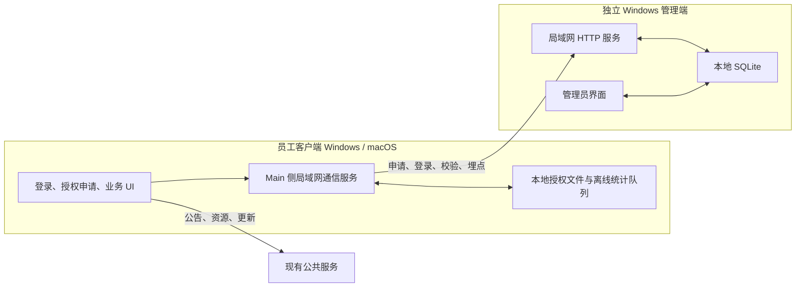

# OpenJatobid 第二轮二开实施计划

> 依据：`docs/secondary-development/prd/openjatobid-phase2-ui-lan-management-prd.md`（v0.5 批准稿）  
> 状态：管理员认证修订计划已批准并完成 T32—T36/CP7；下一阶段为 T30 实体双机验收。  
> 范围：保留已完成的客户端 UI、局域网授权与统计成果，只重做独立 Windows 管理端的管理员认证、首次设置和交付验证。

## 1. 目标与完成标准

本轮交付必须同时满足以下结果：

1. 保持客户端现有菜单、页面结构、功能流程和主要布局，仅将视觉语言统一替换为 Ant Design System v6 风格；不引入 Ant Design React，不重写现有 Radix 组件体系。
2. 文本模型、生图模型的“金龙中转站”名称和 API 获取链接按 PRD 修改；“关于”页隐私声明全文按 PRD 落地。
3. 客户端启动后先进入登录页；已授权员工使用姓名、手机号登录，新用户通过左下角“授权申请”打开独立弹窗并填写姓名、手机号、服务器 IP。
4. 姓名 + 手机号 + 当前设备构成授权主体；每台设备单独审批，每名员工最多 3 台有效设备；授权期 1 年；本地授权可离线使用，但至少每 30 天成功连接管理端校验一次。
5. 客户端的授权请求和埋点完全改为连接登录页配置的局域网管理端，不再向 `analytics.agnet.top` 发送 `/track` 或授权请求；公告、资源、更新检查仍沿用现有公共服务。
6. 独立 Windows 管理端继续支持授权审批/撤销、客户端与 AI 用量统计；管理员认证改为私有构建配置注入内置初始凭据、首次登录强制改密、登录后主动改密，不提供注册、SMTP 或忘记密码。
7. 不迁移历史统计和授权记录；第二轮上线前的旧数据不导入管理端。
8. 客户端继续支持 Windows/macOS；管理端仅支持 Windows。
9. 所有授权规则、时间规则、设备上限、统计传输和管理员认证状态都有自动化测试；管理端重新构建和打包，并完成受影响的运行时验收。

## 2. 约束与不在范围内事项

- 不改变客户端现有信息架构、导航位置、页面内容组织和业务工作流。
- 不在客户端引入 `antd` 依赖；通过设计令牌、全局 CSS 和现有 Radix 基础组件实现 Ant Design v6 视觉语言。
- 不将管理端嵌入客户端，也不复用同一个安装包或用户数据目录。
- 不迁移 Cloudflare Analytics 中的历史数据、历史授权或离线激活记录。
- 不删除公告、资源、更新检查等仍需访问公共服务的能力。
- 不添加 PRD 未要求的组织架构、角色权限、多管理员、云同步或公网穿透能力。
- 不保留 SMTP、恢复邮箱、临时密码或忘记密码入口；不添加新的自助恢复或技术支持后门。
- 不实现公司网络识别、第二管理端检测或外部运行技术阻断；单管理端和禁止外带由公司负责人通过人防制度执行。
- 不执行 `git pull`、`git push`、`git merge`、`git rebase`、`git reset` 等受保护 Git 操作。

## 3. 当前代码基线

- 客户端位于 `client/`，Electron Main/preload 使用 CommonJS，Renderer 使用 React + TypeScript + Vite。
- 客户端 UI 使用全局 CSS 与 Radix；现有布局样式包含较多硬编码渐变、阴影和尺寸，需要先建立令牌，再按页面分批替换。
- 当前授权服务位于 `client/electron/services/licenseService.cjs`，包含公共授权接口、离线激活导入和本地签名授权文件。
- 当前埋点分散在 Renderer、AI 服务和 OpenCode Runtime 服务中，并直接调用公共 `/track` 地址。
- `analytics/` 是 Cloudflare Worker + Dashboard，不能直接作为离线 Windows 管理端打包；需保留其统计维度和查询含义，在新管理端中实现本地等价能力。
- 仓库没有客户端 lint/test 脚本；现有强制验证入口为 `client/npm run build`，Electron CJS 使用 `node --check`。
- 根目录已有旧的 `task_plan.md` 和 `progress.md`，本轮不覆盖，使用 `tasks/` 目录独立维护。
- 修订实施前的管理端曾实现被 PRD 0.5 否决的 SMTP 发件配置、固定恢复邮箱、邮件临时密码和仅密码登录；当时 `admin_auth` 没有用户名，系统设置入口仍禁用。
- 修订实施前 `nodemailer` 是正式依赖，SMTP 授权码保存在 SQLite 设置中；T32—T36 已同步清除代码、依赖、持久配置和 UI 中的旧方案，并仅在迁移清理与回归测试中保留旧字段名。
- 当前 LAN API、员工授权、统计、托盘和打包能力不因管理员认证修订改变；本轮不得重写这些已通过的链路。

## 4. 待确认的实施假设

以下选项用于把 PRD 中仍开放的设计点收敛为可编码方案。批准本计划即视为同意这些默认值；若需调整，请在批准前指出。

| 编号 | 默认方案 | 影响 |
|---|---|---|
| A1 | 管理端采用纯 Electron 托盘应用；Windows 用户退出登录或系统关机后不继续服务，重新登录后由开机自启动恢复。 | 若要求“用户注销后仍服务”，必须改为 Windows Service + 管理界面双进程，工作量和安装权限显著增加。 |
| A2 | 管理端产品名为“Jato AI BID 管理端”，内部目录 `management/`，建议 appId `com.jiatu.aibid.management`。 | 决定安装包、进程和配置目录命名。 |
| A3 | 登录/申请页的服务器地址使用单一“服务器 IP”输入框，兼容 `IP` 与 `IP:端口`；默认端口 `47821`，管理端首次设置可修改。 | 避免额外增加端口字段，同时支持非默认端口。 |
| A4 | 管理端首次启动生成本地 ECDSA P-256 签名密钥；客户端首次获得有效授权时绑定该管理端公钥，后续更换公钥必须清除本机授权并重新申请。 | 保留本地离线验签能力，避免内置所有企业共用私钥。 |
| A5 | 设备标识沿用“系统机器标识 + 网卡信息 + 客户端持久 ID”的组合；重装系统或清除客户端数据可能被视为新设备，管理员可撤销旧设备后重新申请。 | 不新增复杂设备迁移功能。 |
| A6 | 老版本公共授权、离线激活码在升级后不继续有效，员工需向局域网管理端重新申请；现有 `analytics_client_id` 保留，以减少同一安装实例被误识别为全新客户端。 | 符合“不迁移历史数据”，同时保留客户端本地连续性。 |
| A7 | 管理员续期行为为“从续期成功时起再授权 1 年”；拒绝申请无需填写原因。 | 决定授权状态机和管理端操作。 |
| A8 | 在线客户端定义为最近 10 分钟内有登录、校验或埋点心跳；离线埋点本地队列最多保存 30 天或 10,000 条，先达到任一限制即丢弃最旧记录。 | 控制统计口径和本地存储增长。 |
| A9 | 管理端统计数据默认保留 24 个月，管理员可手动清理指定日期之前的数据；授权主体和设备记录不随统计清理自动删除。 | 决定数据库清理能力与磁盘容量。 |
| A10 | 管理端 UI 与客户端使用同一套 Ant Design v6 视觉令牌，但代码与构建保持独立。 | 保持两套软件视觉一致。 |
| A11 | 单一管理员账号；内置初始凭据首次登录后强制改密，登录后可用当前密码主动改密；不提供注册、SMTP、忘记密码或自助恢复。 | 决定管理员认证状态与界面。 |
| A12 | 不单独采集定时“心跳”事件；在线状态由登录、授权校验和已有业务埋点共同刷新。 | 避免新增无业务价值的高频请求。 |
| A13 | 初始用户名和密码从被 Git 忽略的私有构建配置注入；生成模块只包含用户名、随机盐、密码摘要和凭据版本，缺失配置时开发启动和打包失败。 | 安装包内置凭据，但公开仓库不保存明文密码。 |
| A14 | 同一公司局域网只部署一个管理端；安装包、凭据和服务器由公司负责人保管，外部运行风险采用人防，不增加网络或设备技术封锁。 | 明确部署边界和已接受残余风险。 |

## 5. 目标架构

关键边界：

- 客户端 Renderer 不直接访问网络或 Node；登录、授权和埋点统一通过 preload/IPC 进入 Electron Main。
- 管理端 Renderer 不直接读写 SQLite、签名密钥或管理员密码摘要；全部由管理端 Main 服务负责。
- 局域网接口只承担健康检查、授权申请/查询/登录校验和埋点接收。
- 管理端私钥和管理员密码摘要只存放在管理端服务器本地，不返回客户端；私有构建配置不进入仓库和普通构建输出。
- 客户端只保存服务器地址、员工身份信息、管理端公钥、签名授权和有界离线埋点队列。

## 6. 局域网接口草案

接口最终在任务 T10 中形成独立契约文档并冻结；下表仅用于确定任务边界。

| 方法与路径 | 用途 | 主要结果 |
|---|---|---|
| `GET /api/v1/health` | 测试服务器可达性 | 管理端版本、服务状态、服务器时间 |
| `POST /api/v1/authorization/applications` | 新用户/新设备提交申请 | 申请 ID、当前状态 |
| `GET /api/v1/authorization/applications/:id` | 客户端查询审批状态 | pending/approved/rejected |
| `POST /api/v1/authorization/login` | 已授权员工登录当前设备 | 签名授权、到期日、下次最晚校验日 |
| `POST /api/v1/authorization/verify` | 定期或联网触发校验 | 有效/撤销/过期状态及新签名授权 |
| `POST /api/v1/analytics/events` | 批量提交埋点 | 已接收事件 ID 列表 |

所有请求使用 JSON；客户端只在输入层校验姓名、手机号、服务器地址，软件内部数据层遵循项目“本地层级相互信任”的约束。埋点事件携带客户端生成的唯一事件 ID，便于离线重试时去重。

## 7. 分阶段任务

### 阶段 0：决策冻结与基线

#### T00 确认计划与记录架构决策 — S

- 内容：历史阶段确认 A1–A12；PRD 0.5 追加确认 A13–A14，并修订管理员认证 ADR。
- 验收：PRD 与 ADR 无互相冲突的开放项；所有后续任务都能引用明确决定。
- 预计文件（≤3）：
  - `docs/secondary-development/prd/openjatobid-phase2-ui-lan-management-prd.md`
  - `docs/secondary-development/adr/phase2-lan-management.md`
  - `tasks/todo.md`
- 验证：人工逐项核对 A1–A14 与 PRD 0.5、ADR 和任务计划；检查 Markdown 链接有效。
- 依赖：人工批准本计划。

#### T01 建立可复现的视觉基线与令牌映射 — M

- 内容：记录当前关键页面固定尺寸截图；将 Figma Ant Design v6 参考中的颜色、字号、圆角、间距、阴影映射为项目 `--yb-*` 令牌；列出必须保留的布局尺寸。
- 验收：至少覆盖启动/主壳、模型配置、关于、技术方案、知识库；令牌表明确现值、目标值和适用组件。
- 预计文件（≤4）：
  - `docs/secondary-development/design/phase2-visual-baseline.md`
  - `docs/secondary-development/design/phase2-ant-v6-token-map.md`
  - `client/src/styles/tokens.css`
  - `tasks/todo.md`
- 验证：`cd client; npm run dev` 后按清单人工截图；`cd client; npm run build`。
- 依赖：T00。

### 阶段 1：低风险客户端内容与视觉基础

#### T02 修改模型配置文案、链接与隐私声明 — S

- 内容：更新文本/生图模型供应商名称、API 获取链接、隐私声明 01–04；删除关于页离线激活入口文案，但授权逻辑移除留到 T18。
- 验收：两类模型配置均显示“金龙中转站”；获取按钮跳转新链接；隐私声明逐段与 PRD 一致且排版可读。
- 预计文件（≤3）：
  - `client/src/features/settings/SettingsPage.tsx`
  - `client/src/styles/feature-settings.css`
  - `tasks/todo.md`
- 验证：`cd client; npm run build`；开发环境逐项点击链接并核对页面文案。
- 依赖：T00。

#### T03 实现客户端全局 Ant v6 视觉令牌与主壳样式 — L

- 内容：替换全局颜色、排版、圆角、阴影、控件状态和主壳视觉；保持现有侧栏宽度、菜单顺序、内容区结构和工具条位置。
- 验收：主壳无旧渐变/重阴影；所有页面继续保持内部滚动；键盘焦点和禁用态清晰；布局尺寸与 T01 基线一致。
- 预计文件（≤5）：
  - `client/src/styles/tokens.css`
  - `client/src/styles/layout-app-shell.css`
  - `client/src/styles/shared-components.css`
  - `client/src/app/AppShell.tsx`
  - `client/src/app/Sidebar.tsx`
- 验证：`cd client; npm run build`；在 1440×900 与 1920×1080 检查主壳、菜单、滚动、焦点态。
- 依赖：T01。

#### T04 统一共享弹窗、表单、提示与 Markdown 视觉 — M

- 内容：对现有 Radix Dialog/Select/Toast、表单控件、空状态、Markdown 展示应用统一 Ant v6 风格，不改变组件接口。
- 验收：共享控件在设置、知识库、检查页呈现一致；错误/警告/成功状态可区分；无 `alert`。
- 预计文件（≤5）：
  - `client/src/styles/shared-dialog.css`
  - `client/src/styles/shared-toast.css`
  - `client/src/styles/shared-markdown.css`
  - `client/src/styles/shared-components.css`
  - `tasks/todo.md`
- 验证：`cd client; npm run build`；逐类打开 Dialog、Select、Toast、长 Markdown 内容。
- 依赖：T03。

### 阶段 2：独立管理端基础

#### T05 创建管理端独立工程与构建配置 — M

- 内容：建立 `management/` 独立 package、TypeScript、Vite、Electron Builder 配置和入口，不引用 `client/` 构建产物。
- 验收：管理端可单独安装依赖、构建 Renderer 和启动 Electron；产品名/appId/用户数据目录与客户端不同。
- 预计文件（≤5）：
  - `management/package.json`
  - `management/package-lock.json`
  - `management/tsconfig.json`
  - `management/vite.config.ts`
  - `management/src/main.tsx`
- 验证：`cd management; npm ci; npm run build`。
- 依赖：T00。

#### T06 实现管理端窗口、preload 与托盘生命周期 — M

- 内容：创建 Main 窗口、托盘菜单、关闭到托盘、显式退出、单实例和 preload 最小 API；按 A1 配置 Windows 登录后自启动。
- 验收：关闭窗口后服务进程继续运行；托盘可打开/退出；二次启动聚焦已有窗口；Renderer 无 Node 权限。
- 预计文件（≤5）：
  - `management/electron/main.cjs`
  - `management/electron/preload.cjs`
  - `management/src/shared/ipc.ts`
  - `management/assets/tray.ico`
  - `management/package.json`
- 验证：`node --check management/electron/main.cjs`; `node --check management/electron/preload.cjs`; `cd management; npm run build`; 手工验证托盘生命周期。
- 依赖：T05。

#### T07 实现管理端本地数据库与迁移 — M

- 内容：建立 SQLite 连接、schema 版本、事务和迁移；包含管理员配置、服务配置、员工、设备、申请、授权、统计事件和去重键。
- 验收：空目录首次启动自动建库；重复启动迁移幂等；授权主体与最多 3 台有效设备规则具备数据库约束/事务保护。
- 预计文件（≤5）：
  - `management/electron/services/databaseService.cjs`
  - `management/electron/services/migrations.cjs`
  - `management/electron/services/databaseService.test.cjs`
  - `management/package.json`
  - `tasks/todo.md`
- 验证：`cd management; node --test electron/services/databaseService.test.cjs`; `npm run build`。
- 依赖：T05。

#### T08/T09 原管理员认证实现 — 历史记录，已被 PRD 0.5 否决

- T08/T09 曾实现 SMTP 配置、固定恢复邮箱、邮件临时密码和强制改密 UI。
- 该历史实现不再是目标状态；不得以其已完成状态证明 PRD 0.5 通过。
- 新认证方案由 T32—T36 完整取代，并要求删除旧服务、依赖、持久配置、IPC、界面和测试。

### 阶段 3：局域网授权纵向闭环

#### T10 冻结局域网 API 契约并实现 HTTP 服务骨架 — M

- 内容：形成请求/响应/错误码契约；实现 bind IP/端口、健康检查、JSON 路由、优雅停止和端口占用错误反馈。
- 验收：局域网另一台机器可访问健康检查；管理端界面显示真实监听地址和失败原因；接口契约可供客户端与管理端共同测试。
- 预计文件（≤5）：
  - `docs/secondary-development/api/lan-management-v1.md`
  - `management/electron/services/httpServerService.cjs`
  - `management/electron/services/httpRouter.cjs`
  - `management/electron/services/httpServerService.test.cjs`
  - `management/electron/main.cjs`
- 验证：`cd management; node --test electron/services/httpServerService.test.cjs`; `node --check` 相关 CJS；从第二台设备调用 `/api/v1/health`。
- 依赖：T07、T08。

#### T11 实现授权申请、审批、拒绝、撤销与续期领域服务 — L

- 内容：实现员工去重、设备绑定、3 台上限、申请状态机、1 年授权、撤销、续期、签名授权生成和事务一致性。
- 验收：并发审批不能突破 3 台；每台设备必须独立审批；撤销/过期/拒绝状态准确；签名载荷包含员工、设备、签发/到期/最晚校验时间和管理端标识。
- 预计文件（≤5）：
  - `management/electron/services/authorizationService.cjs`
  - `management/electron/services/signingService.cjs`
  - `management/electron/services/authorizationService.test.cjs`
  - `management/electron/services/signingService.test.cjs`
  - `management/electron/services/httpRouter.cjs`
- 验证：`cd management; node --test electron/services/authorizationService.test.cjs electron/services/signingService.test.cjs`; `npm run build`。
- 依赖：T10。

#### T12 实现管理端授权管理界面 — L

- 内容：实现待审批申请、员工、设备、授权状态、到期时间、批准、拒绝、撤销、续期和筛选；展示 3 台上限占用情况。
- 验收：管理员可完成全部授权操作并看到即时结果；危险操作有确认；拒绝不要求原因；无历史迁移入口。
- 预计文件（≤5）：
  - `management/src/features/authorization/AuthorizationPage.tsx`
  - `management/src/features/authorization/ApplicationTable.tsx`
  - `management/src/features/authorization/EmployeeDeviceDrawer.tsx`
  - `management/src/features/authorization/authorization.css`
  - `management/src/App.tsx`
- 验证：`cd management; npm run build`; 手工覆盖第 1–4 台设备、拒绝、撤销、续期和过期状态。
- 依赖：T09、T11。

#### T13 建立客户端局域网配置与授权 IPC 契约 — M

- 内容：在 Main 侧保存服务器地址、姓名、手机号和管理端公钥；定义 Renderer 可用的申请、查询、登录、校验、状态和服务器测试 IPC；不暴露 Node/文件系统。
- 验收：配置写入 Electron `user_config.json`；preload 与 TS 类型一致；服务器输入标准化兼容 `IP`/`IP:端口`。
- 预计文件（≤5）：
  - `client/electron/services/configStore.cjs`
  - `client/electron/ipc/licenseIpc.cjs`
  - `client/electron/preload.cjs`
  - `client/src/shared/types/ipc.ts`
  - `client/electron/services/lanServerAddress.cjs`
- 验证：对所有修改的 CJS 执行 `node --check`; `cd client; npm run build`；为地址标准化运行 `node --test`（测试文件在 T14 一并加入）。
- 依赖：T10。

#### T14 重写客户端授权服务与本地离线校验 — L

- 内容：用局域网申请/登录/校验替换公共授权与离线激活；验证管理端签名；保存授权和最后成功校验时间；实现 1 年到期、30 天离线、撤销与 3 台上限响应。
- 验收：只有管理端成功响应才刷新 `lastVerifiedAt`；断网 30 天内可用，超过 30 天暂停；撤销后下次成功联网立即失效；服务器不可达与未授权状态可区分。
- 预计文件（≤5）：
  - `client/electron/services/licenseService.cjs`
  - `client/electron/services/lanManagementClient.cjs`
  - `client/electron/services/licenseService.test.cjs`
  - `client/electron/services/lanServerAddress.test.cjs`
  - `client/electron/ipc/licenseIpc.cjs`
- 验证：`cd client; node --test electron/services/licenseService.test.cjs electron/services/lanServerAddress.test.cjs`; 对 CJS 执行 `node --check`; `npm run build`。
- 依赖：T11、T13。

#### T15 实现客户端启动登录页与授权申请弹窗 — L

- 内容：新增启动门禁；登录页显示姓名、手机号、服务器 IP 与“登录”；左下角“授权申请”打开同页独立弹窗，弹窗字段为姓名、手机号、服务器 IP，主按钮“提交授权申请”。
- 验收：未登录不能进入主应用；申请弹窗不跳转页面；登录和申请互不混用；手机号、必填和服务器地址错误在输入层提示；授权通过后可登录。
- 预计文件（≤5）：
  - `client/src/features/auth/StartupAuthPage.tsx`
  - `client/src/features/auth/AuthorizationRequestDialog.tsx`
  - `client/src/features/auth/startup-auth.css`
  - `client/src/App.tsx`
  - `client/src/styles.css`
- 验证：`cd client; npm run build`; 手工覆盖未授权登录、申请、待审批、拒绝、批准后登录、错误 IP 和手机号。
- 依赖：T03、T14。

#### T16 实现授权生命周期触发与状态提示 — M

- 内容：在登录、应用启动、网络恢复、系统休眠恢复时触发校验；展示离线剩余天数、即将到期、已过期、已撤销和服务器不可达状态。
- 验收：触发器不会并发重复请求；失败不错误延长离线期；在线校验成功后即时更新；暂停使用时仍可返回登录页修改服务器地址。
- 预计文件（≤5）：
  - `client/electron/main.cjs`
  - `client/electron/services/licenseService.cjs`
  - `client/electron/ipc/licenseIpc.cjs`
  - `client/src/shared/ui/LicenseStatusPrompt.tsx`
  - `client/src/App.tsx`
- 验证：对 CJS 执行 `node --check`; `cd client; node --test electron/services/licenseService.test.cjs`; `npm run build`; `npm run dev` 手工测试断网/恢复/休眠恢复。
- 依赖：T15。

#### T17 清除旧公共授权与离线激活界面/接口 — S

- 内容：删除 `importOfflineLicense`、`activateOffline` 及相关 UI/IPC；确保代码中不再出现公共授权 URL 和旧离线激活入口。
- 验收：Renderer 类型、preload、IPC、设置页均无离线激活；全仓搜索不再存在旧授权端点；保留新的本地签名授权文件机制。
- 预计文件（≤5）：
  - `client/src/shared/ui/LicenseStatusPrompt.tsx`
  - `client/src/shared/types/ipc.ts`
  - `client/electron/preload.cjs`
  - `client/electron/ipc/licenseIpc.cjs`
  - `client/src/features/settings/SettingsPage.tsx`
- 验证：`rg "activateOffline|importOfflineLicense|license/activate" client`; 对 CJS 执行 `node --check`; `cd client; npm run build`。
- 依赖：T16。

### 阶段 4：局域网统计等价迁移

#### T18 建立客户端 Main 侧统一埋点服务与离线队列 — L

- 内容：将端点、批量提交、事件 ID、失败重试、队列上限和 30 天清理集中到 Main 服务；Renderer 只经 IPC 发送事件。
- 验收：服务不可达不阻塞业务；恢复后按顺序批量补发且管理端可去重；队列边界符合 A8；不记录文档原文、文件名、路径、API Key 或用户输入。
- 预计文件（≤5）：
  - `client/electron/services/analyticsService.cjs`
  - `client/electron/services/analyticsQueueStore.cjs`
  - `client/electron/services/analyticsService.test.cjs`
  - `client/electron/ipc/analyticsIpc.cjs`
  - `client/electron/preload.cjs`
- 验证：`cd client; node --test electron/services/analyticsService.test.cjs`; 对 CJS 执行 `node --check`; `npm run build`。
- 依赖：T13、T14。

#### T19 迁移 Renderer 埋点到统一 IPC — M

- 内容：保留现有事件名、页面维度、配置维度和资源点击维度，将 `fetch /track` 改为 preload IPC；删除 Renderer 中公共统计端点。
- 验收：`app_open`、`page_view`、`config_usage`、`resource_click` 等维度保持；Renderer 无直接 `/track` 请求；公告/资源下载地址不受影响。
- 预计文件（≤4）：
  - `client/src/shared/analytics/analytics.ts`
  - `client/src/shared/types/ipc.ts`
  - `client/electron/preload.cjs`
  - `client/electron/main.cjs`
- 验证：`rg "analytics\.agnet\.top|/track" client/src`; 对 CJS 执行 `node --check`; `cd client; npm run build`；管理端查看页面访问事件。
- 依赖：T18。

#### T20 迁移 AI 与 Agent Runtime 埋点到统一服务 — M

- 内容：让 AI 请求与 OpenCode Runtime 复用 Main 侧埋点服务，保留模型、Token、成功失败、耗时、Agent Runtime 等现有统计字段。
- 验收：AI/Agent 不再直接访问公共 `/track`；失败不会影响模型调用；原统计维度可在管理端还原。
- 预计文件（≤5）：
  - `client/electron/services/aiService.cjs`
  - `client/electron/services/opencodeRuntimeService.cjs`
  - `client/electron/services/analyticsService.cjs`
  - `client/electron/services/analyticsService.test.cjs`
  - `client/electron/main.cjs`
- 验证：`rg "analytics\.agnet\.top|/track" client/electron`; 对 CJS 执行 `node --check`; `cd client; node --test electron/services/analyticsService.test.cjs`; `npm run build`；实际发起一次文本模型和 Agent 请求。
- 依赖：T18。

#### T21 实现管理端埋点接收、去重、聚合与清理 — L

- 内容：接收批量事件，按事件 ID 去重，保存原有非涉密维度，提供时间范围/客户端/IP/模型/配置/Agent 聚合查询和 24 个月清理。
- 验收：重复批次不重复计数；查询口径与现有 Analytics Dashboard 对齐；IP 使用管理端实际看到的局域网来源地址；无业务涉密字段落库。
- 预计文件（≤5）：
  - `management/electron/services/analyticsIngestService.cjs`
  - `management/electron/services/analyticsQueryService.cjs`
  - `management/electron/services/analyticsService.test.cjs`
  - `management/electron/services/httpRouter.cjs`
  - `management/electron/ipc/analyticsIpc.cjs`
- 验证：`cd management; node --test electron/services/analyticsService.test.cjs`; 对 CJS 执行 `node --check`; `npm run build`。
- 依赖：T10、T18。

#### T22 实现管理端统计总览与客户端/IP 页面 — L

- 内容：实现总览、在线客户端、客户端列表、局域网 IP、访问趋势与时间范围筛选；沿用现有统计含义。
- 验收：管理员可查看活跃频次、在线客户端总数、IP 和趋势；在线口径在界面说明为最近 10 分钟；空数据与加载失败状态明确。
- 预计文件（≤5）：
  - `management/src/features/analytics/AnalyticsOverviewPage.tsx`
  - `management/src/features/analytics/ClientAnalyticsPage.tsx`
  - `management/src/features/analytics/analytics.css`
  - `management/src/shared/ipc.ts`
  - `management/src/App.tsx`
- 验证：`cd management; npm run build`; 用固定测试数据核对总数、去重客户端、IP 和时间筛选。
- 依赖：T09、T21。

#### T23 实现管理端 AI、配置、Agent 与最新事件统计 — L

- 内容：实现 AI 请求数、Token、模型、配置使用、Agent Runtime 和最新事件页面；支持 PRD 要求的无业务内容统计。
- 验收：模型/Token 聚合结果与测试数据一致；最新事件不展示文档原文、文件名、路径、API Key、用户输入或业务产出。
- 预计文件（≤5）：
  - `management/src/features/analytics/AiUsagePage.tsx`
  - `management/src/features/analytics/ConfigUsagePage.tsx`
  - `management/src/features/analytics/AgentRuntimePage.tsx`
  - `management/src/features/analytics/LatestEventsPage.tsx`
  - `management/src/features/analytics/analytics.css`
- 验证：`cd management; npm run build`; 用固定事件集核对 Token、模型、配置、Agent 和敏感字段缺失。
- 依赖：T21、T22。

#### T24 验证公共统计/授权完全切断且公共内容服务保留 — S

- 内容：全仓审计并移除客户端对公共 `/track` 和授权接口的访问；明确保留公告、资源、更新检查的公共端点；记录“不迁移历史数据”的上线行为。
- 验收：抓包时客户端授权/埋点只访问配置的局域网地址；公告/资源/更新仍可用；升级后无历史导入任务。
- 预计文件（≤4）：
  - `client/electron/services/licenseService.cjs`
  - `client/electron/services/analyticsService.cjs`
  - `docs/secondary-development/phase2-migration-notes.md`
  - `tasks/todo.md`
- 验证：`rg "analytics\.agnet\.top" client`; 逐一判断剩余命中只能属于公告/资源/更新；使用网络面板/代理观察运行时请求。
- 依赖：T17、T19、T20、T21。

### 阶段 5：完整 UI 换肤

#### T25 迁移技术方案与工作区页面视觉 — M

- 内容：应用已冻结令牌，替换技术方案步骤、卡片、进度、编辑器和导出状态的旧视觉，不改变步骤流或数据权威来源。
- 验收：Step01–04 功能、滚动、生成进度、Markdown/Mermaid 预览和工具条位置不变；视觉与主壳一致。
- 预计文件（≤3）：
  - `client/src/styles/feature-technical-plan.css`
  - `client/src/styles/shared-markdown.css`
  - `tasks/todo.md`
- 验证：`cd client; npm run build`; 手工完成导入、生成、编辑、预览、导出主流程。
- 依赖：T04。

#### T26 迁移查重与废标检查页面视觉 — M

- 内容：统一上传区、检查结果、风险级别、筛选、详情和操作按钮视觉，不改变检查算法和内容。
- 验收：查重/废标结果层级清晰；颜色不仅作为唯一状态信息；长列表内部滚动正常。
- 预计文件（≤3）：
  - `client/src/styles/feature-duplicate-check.css`
  - `client/src/styles/feature-rejection-check.css`
  - `tasks/todo.md`
- 验证：`cd client; npm run build`; 使用已有样例覆盖空态、运行中、成功、警告、失败和长列表。
- 依赖：T04。

#### T27 迁移知识库、模板、资源、设置与开发者页面视觉 — L

- 内容：分区统一剩余页面的列表、表单、标签、表格、空态和详情视觉；保持模型配置和关于页内容修改。
- 验收：所有主菜单页面都使用同一令牌体系；无旧紫色渐变/玻璃拟态残留；页面布局和功能入口不变。
- 预计文件（≤5）：
  - `client/src/styles/feature-knowledge-base.css`
  - `client/src/styles/feature-resources.css`
  - `client/src/styles/feature-export-format.css`
  - `client/src/styles/feature-settings.css`
  - `client/src/styles/feature-developer.css`
- 验证：`cd client; npm run build`; 按菜单逐页检查表单、弹窗、空态、长内容与滚动。
- 依赖：T02、T04。

#### T28 完成客户端响应式、可访问性与视觉回归 — M

- 内容：修复换肤后在支持尺寸下的溢出、焦点、对比度和键盘操作问题；按 T01 固定视口做前后对比。
- 验收：1440×900 与 1920×1080 无非预期布局变化；登录页 1280×720 可完整操作；Tab 顺序和焦点环可见；主内容区无 body 滚动依赖。
- 预计文件（≤5）：
  - `client/src/styles/layout-app-shell.css`
  - `client/src/styles/tokens.css`
  - `client/src/features/auth/startup-auth.css`
  - `docs/secondary-development/design/phase2-visual-regression.md`
  - `tasks/todo.md`
- 验证：`cd client; npm run build`; 固定视口截图；键盘走查登录、申请、设置和至少一个业务主流程。
- 依赖：T15、T25、T26、T27。

### 阶段 6：集成、打包与交付

#### T29 管理端打包、安装与数据目录验证 — M

- 内容：完成 Windows NSIS 安装包、图标、版本信息、自启动、卸载行为和本地数据保留策略；不影响客户端打包配置。
- 验收：生成独立管理端安装包；与客户端可同时安装运行；升级保留数据库和配置；卸载行为在文档中说明。
- 预计文件（≤5）：
  - `management/package.json`
  - `management/assets/icon.ico`
  - `management/electron/main.cjs`
  - `management/README.md`
  - `tasks/todo.md`
- 验证：`cd management; npm run build; npm run dist:win`; 在干净 Windows 环境安装、升级、卸载并验证客户端共存。
- 依赖：T12、T23。

#### T30 完成局域网双机端到端验收 — L

- 内容：在一台 Windows 服务器运行管理端，另一台 Windows/macOS 运行客户端，覆盖管理员登录/改密、员工申请、审批、登录、离线、恢复、撤销、续期、3 台上限和埋点补发。
- 验收：PRD 第 13 节所有验收条件通过；断网 30 天边界用可控时钟自动测试，手工环境验证短时断网与恢复；没有公共 `/track`/授权流量。
- 预计文件（≤4）：
  - `docs/secondary-development/test-reports/phase2-integration-test-report.md`
  - `management/electron/services/authorizationService.test.cjs`
  - `client/electron/services/licenseService.test.cjs`
  - `client/electron/services/analyticsService.test.cjs`
- 验证：运行两端全部自动测试、构建和双机手工用例；保存关键截图与网络请求证据。
- 依赖：T24、T28、T29、T36。

#### T31 完成最终构建、代码审查与交付文档 — M

- 内容：执行客户端/管理端全量构建、CJS 语法检查、依赖审计、Windows 打包；按正确性、安全边界、性能、可维护性和 PRD 一致性进行代码审查；更新使用/部署说明。
- 验收：无 P0/P1 审查问题；所有验收项有证据；管理端部署、私有凭据构建、初始登录、主动改密、端口、防火墙、备份、恢复和员工使用流程有文档。
- 预计文件（≤5）：
  - `docs/secondary-development/test-reports/phase2-final-test-report.md`
  - `docs/secondary-development/phase2-client-guide.md`
  - `docs/secondary-development/phase2-management-guide.md`
  - `docs/secondary-development/prd/openjatobid-phase2-ui-lan-management-prd.md`
  - `tasks/todo.md`
- 验证：
  - `cd client; npm ci; npm run build; npm audit; npm run dist:win`
  - 对所有改动的 `client/electron/**/*.cjs` 执行 `node --check`
  - `cd management; npm ci; npm test; npm run build; npm audit; npm run dist:win`
  - 对所有改动的 `management/electron/**/*.cjs` 执行 `node --check`
- 依赖：T30。

### 阶段 6A：PRD 0.5 管理员认证修订（当前增量）

> T08/T09 的 SMTP 方案保留为历史实施记录，但已被 PRD 0.5 否决。T32—T36 已按批准范围实施完成，未修改客户端、LAN API、授权领域或统计口径。

#### T32 私有构建凭据注入与产物边界 — M / 高风险

- 目标：让负责人提供的初始用户名和密码在构建时进入管理端，但公开仓库、文档、普通日志和生成模块均不保存明文密码。
- 内容：新增被 Git 忽略的私有凭据文件入口和无真实值示例；准备脚本读取私有配置，生成用户名、随机盐、密码摘要和凭据版本；生成模块写入 `electron/generated/`，并由 electron-builder `files` 显式包含；根目录私有配置不进入 `files`；开发启动与 Windows 打包在缺失/无效配置时失败，不使用默认凭据回退；移除打包过程中可能输出凭据的日志。
- 预计范围：
  - `.gitignore`
  - `management/initial-admin.private.example.json`
  - `management/scripts/prepare-initial-admin-credential.cjs`
  - `management/scripts/prepare-initial-admin-credential.test.cjs`
  - `management/package.json`
- 验收：私有文件和生成模块均被 Git 忽略；生成模块不含明文密码；缺失、字段为空、密码不足 8 位时准备步骤失败；有效输入可供开发启动和打包；打包后的 ASAR 包含生成摘要模块但不包含私有配置文件。
- 验证：使用临时测试凭据运行脚本测试；`node --check`；`git status --short`；检查 electron-builder 文件清单/ASAR；对源码、文档、构建日志和打包清单扫描真实明文密码，结果为 0。
- 决策门：T32 通过前不得修改运行时登录流程或生成正式安装包。

#### T33 内置凭据接管与旧认证数据迁移 — L / 高风险

- 目标：空数据库和现有 SMTP 认证数据库都进入一次性初始凭据接管状态，同时保留员工、设备、授权、统计和签名身份。
- 内容：新增管理员用户名和凭据状态；认证服务接收生成的摘要材料；空库初始化为必须改密；旧认证数据首次升级时替换旧管理员摘要、清空临时密码并删除 SMTP 设置；负责人完成改密后标记为已接管，后续启动不得被安装包初始摘要覆盖。
- 预计范围：
  - `management/electron/services/migrations.cjs`
  - `management/electron/services/databaseService.cjs`
  - `management/electron/services/adminAuthService.cjs`
  - `management/electron/services/adminAuthService.test.cjs`
  - `management/electron/services/databaseService.test.cjs`
- 验收：用户名错误、密码错误均拒绝；初始凭据正确时返回强制改密；改密后初始密码与旧密码均失效；当前密码校验和主动改密正确；迁移重复执行幂等；业务数据和签名设置不丢失。
- 验证：固定时钟/内存数据库测试覆盖空库、旧 SMTP 数据库、已接管数据库、重复启动和改密；相关 CJS `node --check`。
- 恢复：执行迁移前备份完整管理端 `userData`；迁移失败时停止启动，不创建第二套数据库、不清空业务表。

#### T34 首次登录—强制改密—服务器设置纵向流程 — L

- 目标：公司负责人首次启动时先用内置用户名和密码登录，完成强制改密后才能设置服务器并进入管理界面。
- 内容：调整 setup/auth IPC 和 preload 类型；登录输入改为用户名 + 密码；拆分“凭据已接管”和“服务器已配置”状态；首次强制改密只接受新密码/确认密码；首次设置页只保留监听地址和连通性，不再包含管理员密码或 SMTP。
- 预计范围：
  - `management/electron/ipc/adminIpc.cjs`
  - `management/electron/preload.cjs`
  - `management/src/shared/ipc.ts`
  - `management/src/App.tsx`
  - `management/src/features/auth/AdminLoginPage.tsx`
  - `management/src/features/setup/SetupPage.tsx`
- 验收：未登录、未改初始密码时不能进入设置或业务页；强制改密成功后进入服务器设置；服务器设置成功后进入管理端；重启后使用当前用户名/密码登录；没有忘记密码入口。
- 验证：管理端服务/IPC 聚焦测试、`npm run build`、Electron 开发运行逐步操作并记录状态截图和控制台结果。
- 依赖：T32、T33。

#### T35 登录后主动改密与 SMTP 全量移除 — M

- 目标：负责人可在系统设置主动修改密码，且旧 SMTP/找回密码方案在产品、依赖和持久状态中完全消失。
- 内容：启用“系统设置”并加入修改密码表单；要求当前密码、新密码、确认密码；成功后旧密码立即失效；删除 forgot-password IPC、SMTP 服务/测试和 Renderer 类型；删除 `nodemailer` 依赖与锁文件记录；迁移/启动清理旧 `smtp_config`。
- 预计范围：
  - `management/src/features/settings/SystemSettingsPage.tsx`
  - `management/src/App.tsx`
  - `management/electron/ipc/adminIpc.cjs`
  - `management/electron/services/smtpService.cjs`（删除）
  - `management/electron/services/smtpService.test.cjs`（删除）
  - `management/package.json`、`management/package-lock.json`
- 验收：错误当前密码不能改密；新密码不足 8 位或两次不一致不能提交；成功后旧密码不能登录、新密码可以；源码、IPC、UI、依赖和数据库设置中不再有 SMTP、恢复邮箱、临时密码或忘记密码能力。
- 验证：认证服务/IPC 测试、`npm test`、`npm run build`、`npm audit`；目标 `rg` 扫描；Electron 运行时主动改密后退出并重新登录。
- 依赖：T34。

#### T36 认证修订交付、打包与回归证据 — M

- 目标：用私有构建配置生成新的管理端安装包，并证明管理员认证改动没有破坏 LAN 授权、统计、托盘和数据。
- 内容：更新管理端 README、部署/备份说明、迁移说明和测试报告；重跑管理端全部测试、构建、依赖审计、CJS 检查、Windows 打包和解包运行；更新产物哈希；回归真实本机 HTTP 集成链路。
- 预计范围：
  - `management/README.md`
  - `docs/secondary-development/phase2-management-guide.md`
  - `docs/secondary-development/phase2-migration-notes.md`
  - `docs/secondary-development/test-reports/phase2-integration-test-report.md`
  - `docs/secondary-development/test-reports/phase2-final-test-report.md`
  - `tasks/todo.md`
- 验收：两套软件仍独立；管理端新安装包通过解包运行；LAN 申请—审批—登录—埋点—撤销链路通过；打包产物不含私有明文密码文件；工作树无生成凭据、测试数据库或 SMTP 凭据。
- 验证：`cd management; npm ci; npm test; npm run build; npm audit; npm run dist:win`；全部相关 CJS `node --check`；打包运行时冒烟；SHA-256；`git diff --check` 和凭据/SMTP 静态扫描。
- 依赖：T35。

## 8. 依赖顺序与检查点

主路径：

历史主路径：`T00 → … → T29/T31`。PRD 0.5 当前路径：

`T32 → T33 → T34 → T35 → T36 → T30 → CP6`

建议检查点：

- CP1（T00）：需求和架构冻结，允许开始编码。
- CP2（T04 + T09）：客户端视觉基础与管理端首次设置可演示。
- CP3（T17）：申请—审批—登录—离线校验—撤销形成授权闭环。
- CP4（T24）：统计迁移闭环且公共内容服务边界验证完成。
- CP5（T28）：客户端所有页面 UI 换肤与视觉回归完成。
- CP6（T30）：在 CP7 后完成实体双机验收、安装/升级/卸载验证、抓包和最终发布确认。
- CP7（T36）：管理员认证修订、SMTP 全量移除、迁移、管理端新打包和本机回归完成，允许进入实体双机最终验收。

每个检查点完成后才进入下一高风险阶段；若验收失败，只修复该阶段相关文件，不顺带重构。

## 9. 风险与应对

| 风险 | 应对 |
|---|---|
| 管理端纯托盘应用在 Windows 用户注销后停止 | 在 T00 明确 A1；若必须持续运行，先改架构计划，不在实现中临时加 Service。 |
| 客户端首次绑定错误或伪造的管理端公钥 | 首次登录/批准时显示管理端标识；服务器变更和公钥变更必须重新申请，不静默替换。 |
| 同一员工并发审批突破 3 台 | 在 SQLite 事务内完成计数与审批，使用并发测试验证。 |
| 离线时钟被修改导致 30 天校验错误 | 签名载荷保存服务端时间与本地最后成功校验时间；自动测试覆盖回拨/快进，具体策略在 ADR 固定。 |
| 埋点补发导致重复计数 | 客户端生成事件 ID，管理端唯一索引去重；测试重复批次。 |
| UI 全量替换引入布局回归 | 先固定基线和令牌，分页面迁移，每阶段固定视口截图与业务流程走查。 |
| 私有凭据文件误入仓库或构建日志 | `.gitignore` + 构建前检查 + 明文扫描；生成模块只保留随机盐和摘要。 |
| 旧 SMTP 数据库升级后重复覆盖负责人密码 | 一次性凭据状态迁移；负责人接管后后续启动不得重新播种初始摘要。 |
| 负责人忘记修改后密码 | 不提供技术后门；执行前建立凭据保管和完整 `userData` 备份制度，重新初始化必须提示数据与签名影响。 |
| 管理端被复制到外部网络或重复部署 | 用户已选择人防；由负责人保管安装包、凭据和指定服务器，软件不作无法兑现的技术阻断承诺。 |
| 管理端数据库损坏或服务器迁移 | 文档化关闭应用后备份整个管理端数据目录；本轮不增加云备份或自动迁移工具。 |

## 10. Definition of Done

本轮只有同时满足以下条件才算完成：

- PRD 0.5 所有必须项和批准后的 A1–A14 均实现，无未说明偏差。
- 客户端布局/流程不变，全部主页面完成 Ant v6 风格统一并通过固定视口回归。
- 管理端和客户端是两个可独立安装、运行、升级、卸载的软件个体。
- 授权与统计只连接配置的局域网管理端；公告、资源、更新公共能力保留。
- 自动化测试覆盖授权状态机、3 台上限、1 年期、30 天离线、撤销、签名、埋点队列/去重、内置凭据接管、首次强制改密和主动改密。
- 客户端和管理端构建、相关 CJS 语法检查、依赖审计、Windows 打包全部通过。
- 局域网双机验收报告、客户端使用说明、管理端部署说明齐全。
- 最终代码审查无 P0/P1 问题；工作树中没有本任务生成的私有凭据、生成凭据模块、测试数据库、密钥或 SMTP 配置。

## 11. 阶段 6B：第三轮调试、关于页与图标优化

#### T37 两端浏览器调试入口与真实 Electron 调试命令 — M

- 目标：浏览器可独立检查两端登录页及指定页面，真实 Electron 可从授权门禁开始调试。
- 内容：客户端增加开发预览入口和关于页直达参数；管理端增加开发态内存桥接；两端增加 `dev:browser`、`dev:inspect`，客户端增加 `dev:licensed`。
- 验收：5173 不再无限读取授权；5174 不再报告桥接缺失；浏览器模拟不进入生产数据链路；Electron 远程调试端口可用。

#### T38 关于页登录账号与退出登录 — S

- 目标：员工可在关于页查看当前账号和授权期限，并退出当前界面会话。
- 内容：增加第三张账号卡片，贯通 App—Router—Settings 的退出回调。
- 验收：退出后返回登录页，不删除、不撤销本机授权。

#### T39 隐私声明响应式横向布局 — S

- 目标：消除三列换行导致的失衡留白。
- 内容：宽屏四列、中屏两列、小屏一列，卡片顶部对齐。
- 验收：正文不变，固定视口布局符合 PRD。

#### T40 Windows 应用身份与托盘图标 — S

- 目标：任务栏、窗口和托盘使用公司 Logo。
- 内容：设置 AppUserModelID；管理端托盘改读 ICO；管理端构建包含运行时图标。
- 验收：开发运行和打包运行均显示正确图标。

#### T41 构建与运行验收 — M

- 目标：为第三轮改动形成可复核证据。
- 验证：两端构建、CJS 语法检查、浏览器页面检查、Electron 授权门禁检查及图标截图。
